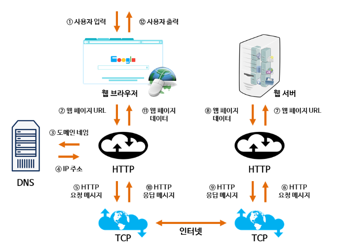
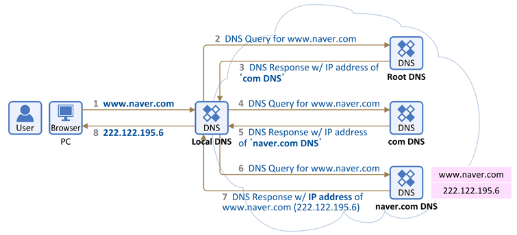
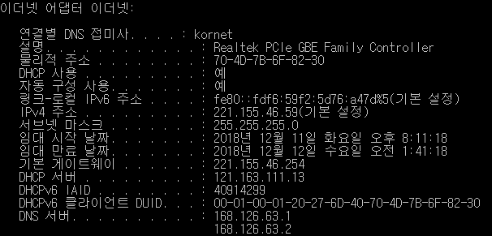

2020.10.07 최형동

## **Domain Name**

- **큰 의미** : 도메인 네임은 네트워크상에서 컴퓨터를 식별하는 호스트명입니다.
- **좁은 의미** : 도메인 레지스트리에 등록되어 있으며 숫자로 된 IP 주소를 사람이 이해하기 쉬운 문자 형태로 표현 한 것입니다.

<table>
    <thead>
        <tr>
            <th rowspan=2>IP:Domain Name</th>
            <th>1:N</th>
            <th>N:1</th>
        </tr>
        <tr>
            <td>가상 호스트</td>
            <td>서브 도메인</td>
        </tr>
    </thead>
    <tbody>
    </tbody>
</table>

도메인 네임은 역트리 구조로, 3단계 계층으로 이루어져 있다.

- 1차 도메인 : 일반 최상위 도메인 혹은 국가 최상위 도메인, .kr은 한국의 국가 최상위 도메인
- 2차 도메인 : 도메인의 성격
- 3차 도메인 : 도메인 등록자가 원하는 이름

---

도메인 네임은 알파벳, 숫자, 하이픈의 조합으로 구성되어 있다.  `'.'`(dot)을 통해 3단계의 계층을 구분한다. `front-end.co.kr`을 예로 들자면,  `front-end` 는 3차 도메인, `.co` 는 2차 도메인, `.kr` 은 1차 도메인으로 구분된다.  1차 도메인은 **최상위 도메인**으로 `국가 최상위 도메인(ccTLD)`, `일반 최상위 도메인(gTLD)`으로 나누어진다  `국가 최상위 도메인`은 각 국가를 나타내고, `일반 최상위 도메인`에는 '.com', '.org', '.net' 등이 있다. 2차 도메인은 도메인의 성격(예를 들면, 기관 분류)을 나타낸다. 3차 도메인은 도메인 등록자가 원하는 이름을 설정할 수 있다. 1차 도메인이 일반 최상위 도메인인 경우에 2차 도메인에서 원하는 이름을 설정할 수 있다. 1차 도메인이 국가 최상위 도메인인 경우 국가 도메인을 관리하는 국가의 정책에 따라 2차 도메인에서도 등록자가 원하는 이름을 설정할 수 있다.

  

---

## **웹 어플리케이션의 동작 원리**

웹브라우저 주소창에 `naver.com` 이라는 도메인 네임을 쳤을때, 진짜 저장소의 IP 주소를 찾아가야 합니다. IP를 찾으려면 **Domain Name System Server(DNS)** 를 거쳐야 합니다. 전화번호부 같은 역할을 하는 DNS는 `naver.com` 을 진짜 IP 주소로 변환하고 사용자가 진짜 주소에서 자원을 받아 사용할 수 있게 해 줍니다.

  

---

## **DNS (Domain Name System) 정의 및 동작원리**

- DNS (Domain Name System)는 특정 컴퓨터 또는 네트워크로 연결된 임의의 장치의 주소를 찾기 위해, 사람이 이해하기 쉬운 도메인 이름을 숫자로 된 IP 주소로 변환해주는 시스템입니다. DNS는 흔히 `"전화번호부"`로 비유할 수 있습니다. DNS는 아래와 같은 방식으로 동작합니다.

- PC 내 host 파일을 확인하고, host 파일에 도메인이 있는지 확인합니다. 만약 host 파일에 `"www.naver.com"` 도메인의 ip가 명시되있다면 바로 반환합니다. 그렇지 않을 경우에는 아래 순서를 반복합니다.

- Local DNS에 `"www.naver.com"` 의 IP 주소를 요청합니다.  Local DNS에 도메인의 ip가 있다면 바로 반환합니다. Local DNS에 없다면, 다음 단계로 넘어갑니다.
    
  
  DNS 서버가 2개인 이유는, 다른 DNS 서버가 동작하지 않을 경우를 대비해서 두개의 DNS 서버가 할당됩니다.

- Local DNS에 없다면, Root DNS에 요청을 합니다. Local DNS에는 전세계 모든 DNS에 대한 정보를 보유하고 있는 특별한 DNS 입니다.
  Root DNS에는 `"www.naver.com"`에 대한 정보는 없지만, ".com" 도메인을 관리하는 서버에 대한 정보를 알려줍니다.

- `".com"` DNS에 `"www.naver.com"` 를 요청 합니다. `".com"` DNS는 `"naver"` 도메인을 관리하고 있는 네임서버에 대한 정보를 알려줍니다.

- `"naver.com"` 네임서버에 `"www.naver.com"` 를 요청합니다. 네임서버는 `"www.naver.com"` ip를 반환한다.

- Local DNS가 클라이언트에게 `"www.naver.com"` Ip 주소를 전달해줍니다.

---

  

## **호스팅**

- 호스팅은 웹 어플리케이션을 만들기 위해 서버의 운영을 대행 해주는 행위입니다.
- 호스팅에는 웹호스팅과 서버호스팅이 있습니당!

**호스팅의 필요성**

- 직접 24시간 서버 유지 관리를 하려면 큰 비용이 듬
- ex) 인터넷, 하드웨어, 보안시스템, 유지보수

**호스팅의 단점**

- 업체로부터 사용할 수 있는 자원이 제한적이다.

  

---

### 참고 사이트

- https://lkhlkh23.tistory.com/76
- https://velog.io/@brviolet/%EB%A1%9C%EB%93%9C%EB%A7%B5-%EA%B8%B8%EB%A7%8C-%EA%B1%B8%EC%96%B4%EC%9A%94-DNS-Domain-Name-Hosting
