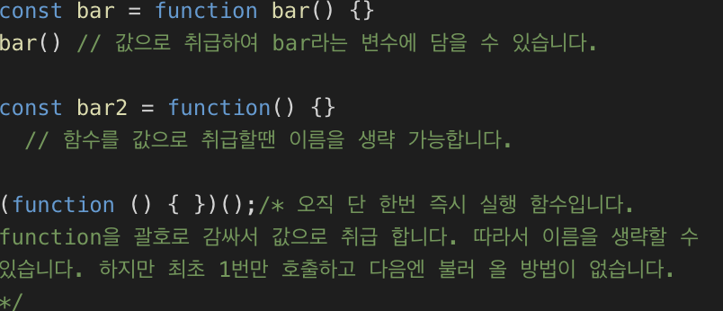
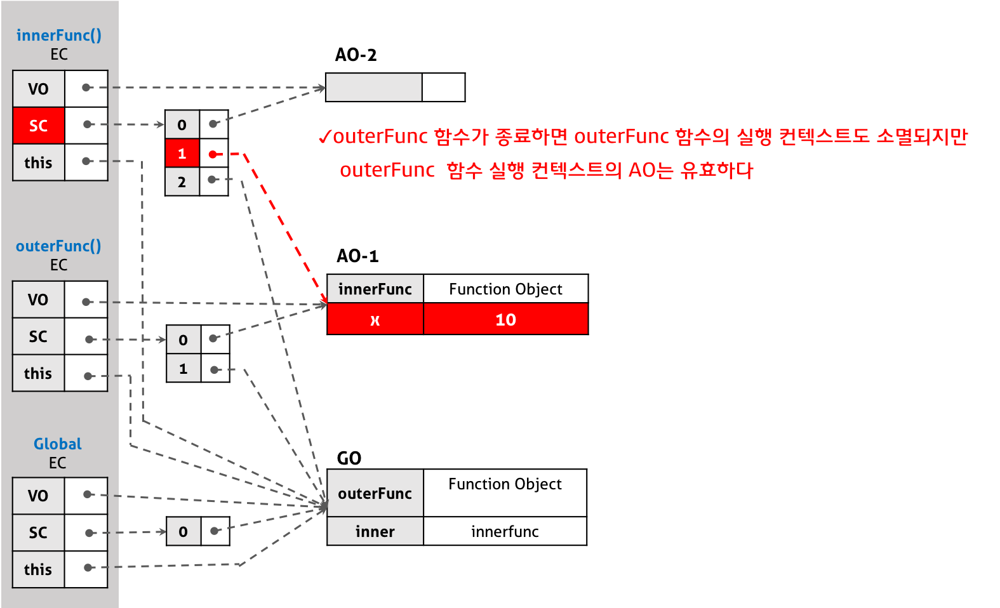

## **강의 요약**

Javascript A to Z 흐름파악<br/>
상태관리자 Redux 직접 만들어 보기
<br/><br/>

## **함수**

자바스크립트는 값으로 취급하는 것들을 변수에 담을 수 있다.<br/>
자바스크립트에서는 함수도 값으로 취급한다.<br/>
함수가 값으로 취급될 때에는 이름을 생략할 수 있다 (이름없는 함수)
자바스크립트 함수는 무조건 '값'을 반환합니다. (undefined 도 값으로 취급).



### **callback function**

어떤 함수에게 함수를 값으로 넘겨주어 함수 호출을 위임한다.

```javascript
function foo(x) {
  x()
  return function() {} // 함수를 반환함.
}

foo(function() {}) // 함수 또한 파라미터로 넘길 수 있다 이떄 넘겨주는 함수가 callback function.
```

함수를 리턴하는 함수는 해당 함수에서 끝맺음을 지을 수 없고, 추가적인 작업이 필요할 때 사용됩니다.<br/>
입력 컴포넌트가 좀더 향상된 컴포넌트로 출력되어 나오는 React의 HoC와 비슷한 경우입니다.

### **재귀 호출 함수**

```javascript
const foo = function foo(x) {
  foo(x) // 재귀호출 시, function으로 선언한 함수의 이름을 넘겨 받는다.
}
```

무조건 함수의 이름이 없진 않습니다. 위 경우처럼 재귀호출 경우엔 이름이 필요합니다.<br/>
따라서 arrow function은 재귀호출이 불가능합니다.

### **arrow function (ES6)**

```javascript
const foo = x => {
  return x * 2
}
const foo2 = x => {
  return x * 2
} // 단일 인자의 경우 괄호를 생략할 수 있습니다.
const foo3 = x => x * 2 // 한줄의 경우 return 구문이 빠질 수 있습니다.
```

### **식과 문**

모든 자바스크립트 코드는 식과 문으로 나뉩니다.<br/>
결과로 값이 나오면 '식' 입니다.<br/>
결과로 값이 나오지 않으면 '문' 입니다. ex) if문 (조건문) , while,for문 (반복문)<br/>
'문' 뒤에는 세미콜론을 붙이지 않습니다.

### **new 연산자**

```javascript
function foo() {
  this.name = '이름'
}

const obj = new foo()
/*
obj = foo {name: "이름", constructor: Object}
*/

if (obj instanceof foo) {
  /* Do Validation */
}
```

new 연산자는 인스턴스 객체를 생성합니다.<br/>
literal 생산보다 인스턴스 객체가 쓰이는 이유는, `if(obj instanceof foo)`로 객체가 어떤 함수에서 만들어졌는지 확인을 통해 유효성을 확인할 수 있습니다. <br/>일종의 객체를 확인하는 작업의 위임 입니다.

이를 좀 더 명시적으로 한 것이 class 입니다.

## **ES6 Class**

```javascript
function foo() {
  this.name = '이름'
}

class bar {
  constructor() {
    this.name = 10
  }
}

console.log(new bar())
```

함수로 작성된 코드 보다 더 명시적으로 생성자임을 보입니다.<br/>
class 의 경우는 new로 호출하지 않으면 오류가 발생합니다.<br/>
함수인 foo()는 new 연산자를 붙이지 않아도 오류가 나지 않습니다.<br/>
함수는 new 호출에 대해 강제할 수 없기 때문에 초기엔 new 연산자로 호출하기 원하는 함수의 첫글자는 대문자로 하자는 룰이 있었습니다.

### **this**

this 는 실행 컨텍스트 이다. 이말은 즉 호출자가 누구냐는 것과 같습니다.

```javascript
const person = {
  name: 'aju',
  getName: function() {
    return this.name
  },
}

console.log(person.getName()) // aju

const man = person.getName
console.log(man() /* window */)
```

위 코드에서 `person.getName()`은 소유자가 person 이므로 `aju`를 출력합니다.<br/>
`man` 은 `person.getName` 을 꺼내온 것이기 때문에 더이상 소유자가 person이 아닌 전역객체인 window 입니다.<br/>

명시적으로 this를 바꾸는 함수 메서드 bind, call, apply를 사용하면 this가 객체를 가리킵니다.

```javascript
man() // Window
man.bind(person).call() // person
man.call(person) // person
man.apply(person) // person
```

```javascript
button.addEventListener('click', person.getName) // 소유자가 벗겨짐
button.addEventListener('click', person.getName.bind(person)) // 소유자 고정
```

## **클로저(closure)**

`클로저는 반환된 내부함수가 자신이 선언됐을 때의 환경(Lexical environment)인 스코프를 기억하여 자신이 선언됐을 때의 환경(스코프) 밖에서 호출되어도 그 환경(스코프)에 접근할 수 있는 함수’.`<br/>

즉, 클로저는 자신이 생성될 때의 환경(Lexical environment)을 기억하는 함수다 라고 말할 수 있습니다.

```javascript
function outter() {
  let text = 'variable 1'
  return function() {
    return text
  }
}

var closure = outter()
console.log(closure()) // 'variable 1'
```

outter는 내부함수를 반환하고 그 결과가 변수 closure에 담깁니다.<br/> outter 함수는 실행이 끝났기 때문에, 이 함수의 지역변수는 소멸되는 것이 자연스럽습니다.<br/>
하지만 함수 closure 를 실행했을 때 'variable 1' 이 출력된 것은 외부함수의 지역변수 text가 소멸되지 않았다는 것을 의미합니다. <br/>이처럼 자신을 포함하고 있는 외부함수보다 내부함수가 더 오래 유지되는 경우, 외부 함수 밖에서 내부함수가 호출되더라도 외부함수의 지역 변수에 접근할 수 있는데 이러한 함수를 클로저(Closure)라고 부릅니다.<br/>

외부함수가 이미 반환되었어도 외부함수 내의 변수는 이를 필요로 하는 내부함수가 하나 이상 존재하는 경우 계속 유지됩니다.<br/>
`실행 컨텍스트의 관점에 설명하자면, 내부함수가 유효한 상태에서 외부함수가 종료하여 외부함수의 실행 컨텍스트가 반환되어도, 외부함수 실행 컨텍스트 내의 활성 객체(Activation object)(변수, 함수 선언 등의 정보를 가지고 있다)는 내부함수에 의해 참조되는 한 유효하여 내부함수가 스코프 체인을 통해 참조할 수 있는 것을 의미합니다.`<br/>
이때 내부함수가 외부함수에 있는 변수의 복사본이 아니라 실제 변수에 접근한다는 것에 주의하여야 합니다. <br/>
클로저는 각자의 환경을 가집니다. 이 환경을 기억하기 위해서는 당연히 메모리가 소모될 것이고 클로저 사용이 끝나면 참조를 제거하는 것이 좋숩나더.


[출처] https://poiemaweb.com/js-closure
<br/><br/>

`외부함수가 실행될 때마다 새로운 지역변수를 포함하는 클로저가 생성됩니다.`

```javascript
let base = 'Hello, '
function sayHelloTo(name) {
  let text = base + name
  return function() {
    console.log(text)
  }
}

var hello1 = sayHelloTo('형동')
var hello2 = sayHelloTo('민성')
var hello3 = sayHelloTo('지환')
hello1() // 'Hello, 형동'
hello2() // 'Hello, 민성'
hello3() // 'Hello, 지환'
```

hello1()과 hello2(), hello3()은 서로 다른 환경을 가지고 있습니다.<br>
text라는 변수 자체가 여러번 생선된 것입니다.

**클로저를 통한 은닉화**

```javascript
let base = 'Hello, ';
function sayHelloTo(name) {
  return {
    getName(){
      return base+name;
    }
    setName(_name){
      name=_name;
    }
  }
}

let hello1 = sayHelloTo('형동');
console.log(hello1.getName()); // 형동
hello1.setName('민성');
console.log(hello1.getName()); // 민성
```

name은 객체의 메소드에서만 접근 할 수 있는 값이다. <br/>이 말은 name의 값을 읽고 수정 할 수 있는 것은 `sayHelloTo` 메소드를 통해서 만들어진 객체 뿐이라는 의미다. 위의 코드에선 `getName()`과 `setName()` 이 여기에 해당한다. JavaScript는 기본적으로 Private한 속성을 지원하지 않는데, 클로저의 이러한 특성을 이용해서 Private한 속성을 사용할 수 있게된다.

<br/>

## **Javascript 동기 & 비동기**

**동기 VS 비동기**<br/>
동기 : 요청을 보낸 후 해당 응답을 받아야 다음 동작을 실행(ex.은행)<br/>
비동기 : 요청을 보낸 후 응답에 관계 없이 다음 동작을 실행(ex.카페)

**자바스크립트는 Single Thread이다.**<br/>
즉, 이벤트를 처리하는 Call Stack이 하나뿐인 언어입니다.
따라서 여러가지 이벤트를 처리할 때에 동기적으로 처리하게 된다면 하나의 이벤트가 모두 처리될 때까지 다른 어떤 업무도 수행하지 못하는 현상이 일어나게 됩니다. <br/>

**비동기처리란?**<br/>
클라이언트에서 서버로 데이터를 요청 했을 때 처럼 요청에 대한 응답을 언제 줄지도 모르는데 마냥 기다릴 수 없는 것 처럼 비동기처리가 필요합니다.<br/>(즉시 처리하지 못하는 이벤트들을 Web API를 이용하여 콜백큐로 보내서 이벤트루프를 통해 콜스택이 비었을 경우 실행)

```javascript
console.log('1')
setTimeout(function() {
  console.log('2')
}, 3000)
console.log('3')
// 1->3->2 순으로 출력
```

위의 코드에서 `setTimeout은` 비동기 함수 이므로, 인자로 받은 콜백함수와 함께 3초 타이머가 Web API (Background)에 넘어가 독립적으로 시간을 count 하고 아래 코드는 순차적으로 신행됩니다. <br/>
3000ms 만큼 기다렸다가 Task Queue (=Callback Queue)에 콜백함수를 넘겨줍니다.


이벤트 루프는 이벤트 루프는 항상 대기하고 있다가 **Call Stack이 비워지면** <br/> Callback Queue 에서 함수를 하나씩 Call Stack 으로 밀어 올립니다. <br/><br/>
따라서
Web API 로 들어오는 순서는 중요하지 않고, 어떤 이벤트가 먼저 처리되어 Callback Queue에 담기는지가 중요하다. 실행 순서가 불명확한 비동기!

## **비동기 이벤트들의 순서가 중요한 경우 처리**

### **콜백함수**

```javascript
doSomething(function(result) {
  doSomethingElse(
    result,
    function(newResult) {
      doThirdThing(
        newResult,
        function(finalResult) {
          console.log('Got the final result: ' + finalResult)
        },
        failureCallback
      )
    },
    failureCallback
  )
}, failureCallback)
```

함수의 반환 값을 받아서 다음 비동기 처리를 해야하는 경우에 위와 같이 다음 함수를 콜백으로 받아 비동기 처리를 할 수 있습니다.<br/>

- 콜백함수 단점
  - 비동기 처리가 많아질 경우 가독성이 매우 떨어집니다.
  - 에러처리를 한다면 모든 콜백에서 각각 에러 핸들링을 해주어야 합니다.
    <br/><br/><br/>

### **Promise 객체**

Promise 객체는 **비동기 작업이 맞이할 미래의 완료 또는 실패와 그 결과 값**을 나타냅니다.

**Promise의 상태 값**<br/>

Pending: 아직 결과 값이 반환되지 않은 진행 중인 상태<br/>
fulfilled: 성공<br/>
Rejected: 실패<br/>
Settled: 결과 값이 성공 혹은 실패로 반환된 상태<br/><br/>
상태 값은 크게 Pending과 Settled로 나눌 수 있으며,
Settled은 다시 fulfilled와 Rejected로 나누어 진다.

**한번 Setteld된 값은 재실행 할 수 없다.**

```javascript
const promise = new Promise(function(resolve, reject) {
  setTimeout(function() {
    // 비동기로 진행되는 코드
    resolve(111)
    reject('error!')
  }, 1000)
})

promise.then(res => console.log(res)).catch(err => console.error(err))
```

`resolve` 는 비동기 처리 성공 시 호출되며 `reject`는 비동기 처리 실패시 호출 됩니다.<br/>
`resolve` 되는 값은 then 메소드의 인자로 넘어갑니다.<br/>
`reject` 되는 값은 catch 메소드의 인자로 넘어가서 에러 핸들링을 할 수 있습니다.
<br/><br/>
여기서 **then 메소드는 다시 Promise를 반환합니다** <br/>
따라서 then, catch메소드를 사용할 수 있다는 것을 뜻하며, 이를 통해 연속적으로 then메소드를 사용하여 Promise chaining이 가능하다는 것을 의미한다.
<br/><br/>

### **async & await**

async function 선언은 AsyncFunction객체를 반환하는 하나의 비동기 함수를 정의합니다. 비동기 함수는 이벤트 루프를 통해 비동기적으로 작동하는 함수로, 암시적으로 Promise를 사용하여 결과를 반환합니다.
비동기 함수를 사용하는 코드의 구문과 구조는, 표준 동기 함수를 사용하는것과 많이 비슷합니다.

-> **async & await 구문은 Promise를 기반으로 사용되는데 위의 설명과 같이 비동기 코드를 좀 더 동기적인 코드처럼 작성할 수 있게끔 한다**

```javascript
const delay = ms => new Promise((resolve, reject) => setTimeout(resolve, ms))

async function main() {
  console.log('1')
  await delay(2000) // 2 second delay
  console.log('2')
}

async function main2() {
  console.log('1')
  try {
    //Promise에서 resolve를 호출하는 경우
    const result = await delay(2000) // resolve된 값을 할당한다
  } catch (e) {
    //Promise에서 reject를 호출 하는 경우
    //reject
    console.error(e)
  }
  console.log('2')
}

main() // 1을 찍은 후 2초 딜레이 후에 2를 출력합니다.
```

<br/><br/><br/>

## **Redux**

Redux는 상태 관리 라이브러리입니다.<br/>
수많은 UI 요소 들이 중첩되어 있는 구조에서, 서로의 data가 필요할때가 있습니다. <br/>이떄 하나의 상태 관리해주는 부분이 몽땅 관리를 하고, 필요한 것을 가져다 쓰는 방식을 사용합니다.<br/>
하지만 가져다 쓰는 과정에서 일부 값이 변경되면 확인이 필요 하므로 전체를 다시 render 해야 해서 전체 화면이 깜빡 거리는 경우가 발생합니다.<br/>
React는 이러한 점을 보완한 VDOM을 사용합니다.<br/>
JSX가 바뀌는 경우, 새로운 VDOM을 만들어 비교하고 다른 것만 DOM 에 반영하는 방식을 사용합니다. 이 React VDOM 알고리즘은 빠르게 설계되어 있어서 속도도 빠릅니다.

## **직접 만들어본 Redux**

```javascript
/* index.js */
import { createStore } from './redux'

const INCREMENT = 'increment'
const RESET = 'reset'

function reducer(state = {}, action) {
  if (action.type === INCREMENT) {
    return {
      ...state,
      count: state.count ? state.count + 1 : 1,
    } // 새로운 객체의 반환
  } else if (action.type === RESET) {
    return {
      ...state,
      count: action.resetCount,
    }
  }
  return state
}

const store = createStore(reducer)

function update() {
  console.log(store.getState())
}

store.subscribe(update)

function actionCreator(type, data) {
  return {
    ...data,
    type: type,
  }
}

function increment() {
  store.dispatch(actionCreator(INCREMENT)) // {count:+1}
}

function reset() {
  store.dispatch(actionCreator(RESET, { resetCount: 10 }))
}

increment()
increment()
increment()
reset()
```

```javascript
/* redux.js */
export function createStore(reducer) {
  let state
  const listeners = []

  const getState = () => {
    return { ...state }
  }

  const dispatch = action => {
    state = reducer(state, action)
    listeners.forEach(func => func())
  }

  const subscribe = func => {
    listeners.push(func)
  }

  return {
    getState,
    dispatch,
    subscribe,
  }
}
```
