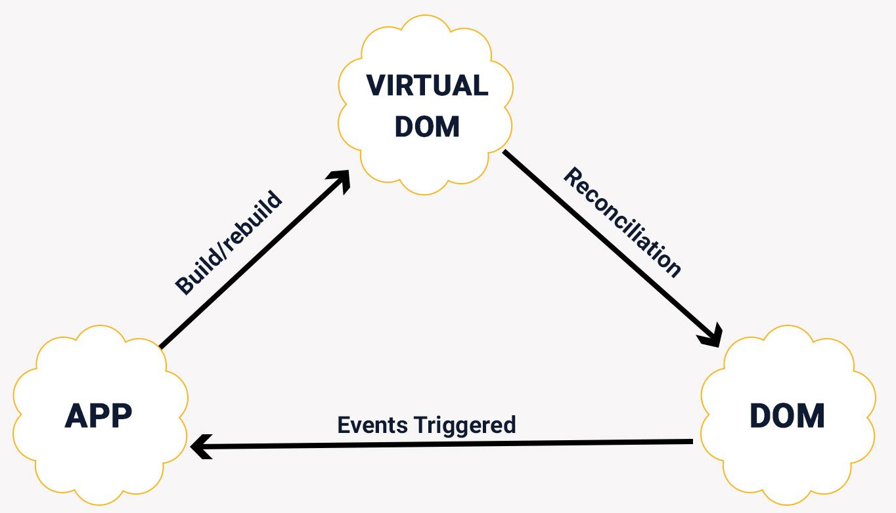

## **강의 요약**

· React 만들어보기

· React를 사용만 하지말고 왜 그렇게 만든지 이해하기
<br/><br/><br/>

### **여러 가지 상황들이 고려되지 않은 간단한 기본 코드**

```javascript
const list = [
  { title: 'React에 대해 알아봅시다' },
  { title: 'Redux에 대해 알아봅시다' },
  { title: 'Typescript에 대해 알아봅시다' },
]

const rootElement = document.getElementById('root')
function app(items) {
  rootElement.innerHTML = `
 <ul>
 ${items.map(item => `<li>${item.title}</li>`).join('')}
 </ul>
 `
} // 순수 함수 (외부에 영향을 받지 않는 함수)
app(list)
```

<br/><br/>

## **Real DOM & Virtual DOM ?**

리얼돔은 가상돔에 비해 더 Low 레벨이라 복잡도가 높습니다.
그래서 리얼돔이 직접적으로 다루게 된다면, 성능 저하가 매우 큽니다.<br/>
(다루기 어려운 것을 직접 다루면 같이 까다로워진다)

여려운 구조를 직접 다루기보단 좀더 다루기 쉬운구조를 통하여 접근하여 보자!<br/>
ex) 브라우저에서 문자열을 직접 다루기 보단, DOM Tree를 이용한다.<br/>

React 에서는 Real DOM을 좀더 다루기 쉬운 **VDOM**을 만들어 사용합니다.<br/>
<br/>

<br/><br/>
Virtual DOM 은 JS와 DOM 사이에서 양쪽에 관하여 잘 알고있는 구조 입니다. <br/>
JSX에서 무엇인가 변경되면 `새로운 Virtual DOM 트리`를 만들고 기존 Virtual DOM과 비교하는 알고리즘을 통해 변경점을 찾고, 실제 DOM 변경에 필요한 최소한의 변경만을 수행합니다. `(React의 트리 변경 알고리즘의 시간복잡도는 O(n)입니다.)` React가 빠른 이유는 이런 구조 때문입니다.<br/>
React는 기본적으로 Virtual DOM이 1개만 있는 구조입니다.<br/>
Day 1 에서 다루었던 `React.createElement`가 바로 Virtual DOM을 만드는 함수 입니다.

### **React에서 사용자 컴포넌트는 대문자로 시작하자!**

`jsx에서 대문자로 시작되는 것은 createElement에 문자열이 아닌, 함수 자체로 들어간다.`

```javascript
function App() {
  return <h1 id="header">Tech Hello!</h1>
}
```

\<h1\> tag가 바벨을 통하여 변경된 모습.

```javascript
function App() {
  return /*#__PURE__*/ _react.default.createElement(
    'h1',
    {
      id: 'header',
    },
    'Tech Hello!'
  )
}
```

```javascript
function StudyList() {
  return (
    <ul>
      <li>React</li>
    </ul>
  )
}
function App() {
  return <StudyList className="??" id="header" />
}
```

대문자로 된 함수형 컴포넌트가 바벨로 변경된 모습

```javascript
function StudyList() {
  return /*#__PURE__*/ _react.default.createElement(
    'ul',
    null,
    /*#__PURE__*/ _react.default.createElement('li', null, 'React')
  )
}

function App() {
  return /*#__PURE__*/ _react.default.createElement(StudyList, {
    className: '??',
    id: 'header',
  })
}
```

대문자로 된것은 문자열이 아닌, 함수자체로 들어가는 것을 확인할 수 있습니다.
<br/><br/><br/>

## **Virtual DOM 만들어보기**

"@jsx Something"라는 주석을 다는 경우 직접적인 함수의 이름을 설정할 수 있습니다.<br/>

저는 createElement라는 함수를 만들어 사용할 것 이기 때문에
`@jsx createElement`를 위에 주석으로 추가 해 줍니다.

```javascript
/* @jsx createElement */
import React from 'react'
import ReactDOM from 'react-dom'

function App() {
  return (
    <div>
      <h1>Hello</h1>
      <ul>
        <li>React</li>
        <li>Redux</li>
        <li>TypeScript</li>
      </ul>
    </div>
  )
}

ReactDOM.render(<App />, document.getElementById('root'))
```

변경된 모습을 확인할 수 있습니다.

```javascript
/* @jsx createElement */
function App() {
  return createElement(
    'div',
    null,
    createElement('h1', null, 'Hello'),
    createElement(
      'ul',
      null,
      createElement('li', null, 'React'),
      createElement('li', null, 'Redux'),
      createElement('li', null, 'TypeScript')
    )
  )
}
```

만들기에 앞서 알아본 Virtual Dom의 대략적인 구조 입니다.<br/>

```javascript
const vdom = {
  type: 'ul',
  props: {},
  children: [
    { type: 'li', props: { className: 'item' }, children: 'React' },
    { type: 'li', props: { className: 'item' }, children: 'Redux' },
    { type: 'li', props: { className: 'item' }, children: 'Typescript' },
  ],
}
```

vdom 형식에 맞는 객체를 반환하는 createElement를 직접 만들어 보겠습니다.

```javascript
function createElement(type, props = {}, ...children) {
  if (typeof type === 'function') {
    return type.apply(null, [props, ...children])
  } //컴포넌트가 함수자체로 넘어왔을때
  return { type, props, children }
}
```

<br/><br/>

## **나만의 리액트 완성하기**

직접 만들어본 render 함수

```javascript
function render(vdom, container) {
  container.appendChild(renderElement(vdom))
  // real dom을 리턴 받아 appendChild를 한다.
}
```

직접 만들어본 real dom을 리턴해주는 renderElement 함수

```javascript
function renderElement(node) {
  if (typeof node === 'string') {
    return document.createTextNode(node)
  }
  const el = document.createElement(node.type)

  const props = Object.keys(node.props)
  props.forEach(prop => {
    el[prop] = node.props[prop]
  }) //className, id 등등의 속성을 적용.

  node.children.map(renderElement).forEach(element => {
    el.appendChild(element)
  })

  return el
}
```

type에 해당하는 element를 만들고 포함된 자식들을 appendChild로 붙이는 함수입니다. A의 자식인 B에도 자식이 딸려 있을수 있으므로, 재귀를 통한 깊이 우선 탐색 방식으로 각각의 노드는 모든 하위노드의 자식들이 포함된 element를 받습니다.<br/><br/>
객체가 직접 가지고 있는 Object.keys() 메서드를 통해서 props객체의 key값을 배열로 받아온 후 생성한 element의 속성으로 넣어준다.

`완성된 코드`

```javascript
/* @jsx createElement */

function renderElement(node) {
  if (typeof node === 'string') {
    return document.createTextNode(node)
  }
  const el = document.createElement(node.type)
  const props = Object.keys(node.props)

  props.forEach(prop => {
    el[prop] = node.props[prop]
  }) //className, id 등등의 속성을 적용.

  node.children.map(renderElement).forEach(element => {
    el.appendChild(element)
  })
  return el
}

function render(vdom, container) {
  container.appendChild(renderElement(vdom))
  // real dom을 리턴 받아 appendChild를 한다.
}

/* babel 트랜스 파일링 단계에서 호출되는 함수 */
function createElement(type, props = {}, ...children) {
  if (typeof type === 'function') {
    return type.apply(null, [props, ...children])
  }
  return { type, props, children }
}

function Row(props) {
  return <li className="MyName">HyeoungDong</li>
}

function StudyList(props) {
  return (
    <ul className="Test">
      <li className="test1" id="day1">
        React
      </li>
      <li className="test2" id="day2">
        Redux
      </li>
      <li className="test3" id="day3">
        TypeScript
      </li>
      <Row />
    </ul>
  )
}

function App() {
  return (
    <div>
      <h1>Hello</h1>
      <StudyList />
    </div>
  )
}

console.log(<App />)
render(<App />, document.getElementById('root'))
```


