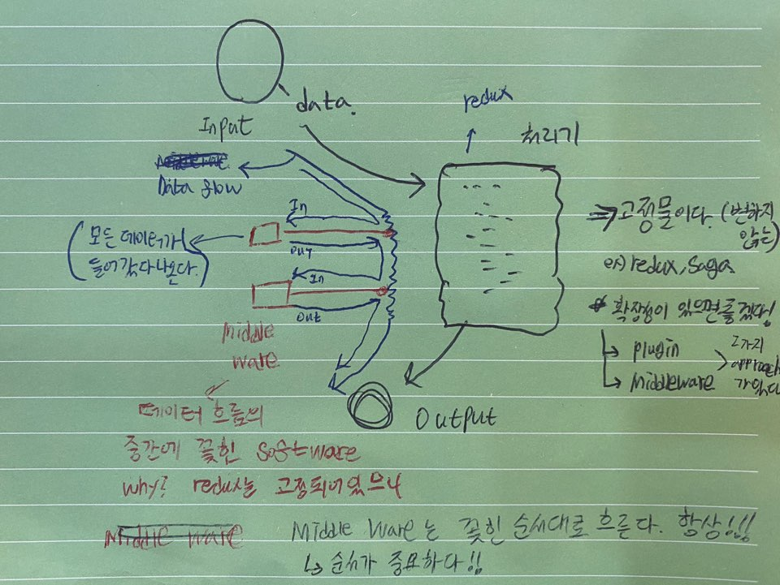

# **MiddleWare**

Redux, Saga 같은 처리기는 변하지 않는 고정물 입니다. <br/>
상황에 맞는 확장성이 필요할때 사용하는 2가지 접근 방법이 있습니다. <br/>

1. plugin
2. middleware

이번 강의 에서는 2번 middleware에 관하여 다루어 보았습니다.

`Flow`



모든 Data는 처리기를 거쳐야 합니다.<br/>
Data가 흐르는 과정에서 추가로 처리할 작업이 있을때, Redux를 수정할 수는 없기 때문에, `MiddleWare`방식을 사용합니다.<br/>
그림에서 Data Flow의 중간에 꽂혀 있는 SoftWare를 미들웨어라고 합니다.<br/>
그림에서는 빨간색 박스에 해당하며, 모든 Data 는 처리기를 통과함과 동시에,<br/>모든 미들웨어도 들어갔다 나와야 합니다. <br/>
`MiddleWare`는 항상 꽂힌 순서대로 흐르기 때문에, 순서가 중요합니다.

<br/><br/>

## **MiddleWare 직접 만들어 보기**

```javascript
const myMiddleware = store => next => action => {
  next(action)
}

myMiddleware(store)(store.dispatch)({ type: 'inc' })
```

이게 미들웨어 입니다. 미들웨어는 reducer 가 못하는 모든것을 할 수 있다.<br/>

미들웨어를 직접만들어 보는이유! -> 지연호출에 대한 개념을 알기 위해!!
알고 있으면 굉장히 유용하다!!<br/>

Redux 공식문서의 미들웨어 편에 설명이 잘 되어있다. 참고하자!!

```javascript
function ourMiddleware(store, next, action) {
  next(action)
} //함수 하나에 인자 N개받는 것

ourMiddleware(store, store.dispatch, { type: 'inc' })

function yourMiddleware(store) {
  return function(next) {
    return function(action) {
      next(action) //클로저 때문에 실행가능합니다!
    }
  }
}
```

yourMiddleware 는 myMiddleware를 풀어쓴것, 문법만 다르고 똑같습니다.<br/>
인자 하나 하나 하나를 받는 중첩 되어있는 함수<br/>
인사 N개를 함수 N개를 쪼개는 기법 -> `커링 기법`.<br/>
`커링`은 인자와 인자사이에 사용자가 간섭할 수 있게 해주는 프로그래밍 테크닉 입니다, **지연호출도 가능해 진다.**

<br/>

`app.js`

```javascript
import { createStore, actionCreator } from './redux-middleware'

function reducer(state = {}, { type, payload }) {
  switch (type) {
    case 'init':
      return {
        ...state,
        count: payload.count,
      }
    case 'inc':
      return {
        ...state,
        count: state.count + 1,
      }
    case 'reset':
      return {
        ...state,
        count: 0,
      }
    case 'fetch-user':
      api('/api/testing/1', users => {
        return { ...state, ...users }
      })
    default:
      return { ...state }
  }
}

const logger = store => next => action => {
  console.log('logger: ', action.type)
  next(action)
} // MiddleWare

const monitor = store => next => action => {
  setTimeout(() => {
    console.log('monitor: ', action.type)
    next(action)
  }, 2000)
} // MiddleWare

const store = createStore(reducer, [logger, monitor]) //미들웨러를 인자로 함께 넘겨준다.

store.subscribe(() => {
  console.log(store.getState())
})

store.dispatch({
  type: 'init',
  payload: {
    count: 1,
  },
})

store.dispatch({
  type: 'inc',
})

const Reset = () => store.dispatch(actionCreator('reset'))
const Increment = () => store.dispatch(actionCreator('inc'))

Increment()
Reset()
Increment()
```

위으 코드에서 `reducer`는 순수한 작업 입니다. 즉, Input이 동일하면 Output도 항상 동일 합니다.<br/>
reducer 는 반드시 동기적으로 돌아야 하기 때문에, 비동기 작업과 같은 사이드 이펙트가 있는 작업은 reducer 코드만으론 부족합니다.<br/>
그래서 순수하지 않은 작업은 reducer 밖에서 미들웨어 라는 방식으로 진행합니다.

`redux-middleware.js`<br/>
미들웨어를 적용한 redux 코드 입니다. <br/>

```javascript
export function createStore(reducer, middlewares = []) {
  let state
  const listeners = []
  const publish = () => {
    listeners.forEach(({ subscriber, context }) => {
      subscriber.call(context)
    })
  }

  const dispatch = action => {
    state = reducer(state, action)
    publish()
  }

  const subscribe = (subscriber, context = null) => {
    listeners.push({
      subscriber,
      context,
    })
  }

  const getState = () => ({ ...state })
  const store = {
    dispatch,
    getState,
    subscribe,
  }

  middlewares = Array.from(middlewares).reverse()
  let lastDispatch = store.dispatch

  middlewares.forEach(middleware => {
    lastDispatch = middleware(store)(lastDispatch)
  })

  return { ...store, dispatch: lastDispatch }
}

export const actionCreator = (type, payload = {}) => ({
  type,
  payload: { ...payload },
})
```

<br/><br/><br/>

**`미들웨어는 항상 꽂힌 순서대로 흐르기 때문에, 순서가 중요합니다`**

```javascript
middlewares = Array.from(middlewares).reverse()
let lastDispatch = store.dispatch

middlewares.forEach(middleware => {
  lastDispatch = middleware(store)(lastDispatch)
})

return { ...store, dispatch: lastDispatch }
```

데이터가 꽂혀있는 미들웨어 순서대로 흐르도록 만드는 코드 입니다.
<br/>
A,B,C 라는 3개의 미들웨어를 통과해야 한다고 생각해 봅시다. <br/>
만약 우리가 원하는 통과 순서가 A -> B -> C 라면, <br/>
C -> B -> A 순으로 reverse() 하여 forEach문을 돌립니다. (위의 코드 참조)<br/>

A -> B -> C 순으로 통과하고 싶은데 왜 `reverse()` 하여주는 걸까요?
<br/><br/>
위에서 본 `Middleware` 구조와 함께 다시 보겠습니다.

```javascript
const A = store => next => action => {
  //Do something
  next(action)
}
const B = store => next => action => {
  //Do something
  next(action)
}
const C = store => next => action => {
  //Do something
  next(action)
}

// middlewares = [A, B, C]
middlewares = Array.from(middlewares).reverse()
// middlewares = [C, B, A]
let lastDispatch = store.dispatch

middlewares.forEach(middleware => {
  lastDispatch = middleware(store)(lastDispatch)
})

return { ...store, dispatch: lastDispatch }
```

위에서 `lastDispatch` 의 처음 값은 실제 store에 dispatch하는 dispatch 함수 입니다.
`reverse()` 된 C - B - A 순서로 코드가 돌아간다고 생각해 봅시다.

- C 차례 `C MiddleWare`의 `next(action)` 은 처음 `lastDispatch` 값인,
  실제 store에 dispatch 하는 작업입니다. 즉, `C`의 할일 (Do something을) 모두 마친 후 `next(action)`로 store에 dispatch 합니다.<br/>
  하지만 코드에서 `C`는 `C(store)(lastDispatch)` 로 호출 되었으므로, 2번째 인자를 갖고 있는 함수 까지만 실행을 하고, 3번째 `action`의 인자를 받는 함수는 지연되어 호출되지 않은 상태입니다. <br/>`(커링 기법의 지연호출 기법)`

- 다음으로 B 차례, 코드에서 보이듯이 `lastDispatch` 의 값은 바로 전 작업에서의 `C(store)(lastDispatch)` 로 업데이트 됩니다.<br/>
  이 과정에서 `B`의 `next(action)`은 <br/>
  `C(store)(lastDispatch)(action)` 과 같습니다.<br/>
  즉, `B`의 할일 (Do something)을 끝내고 `next(action)` 으로 지연되어 있던 C의 마지막 함수를 호출하여 줍니다.<br/>
  하지만 `B`역시 `B(store)(lastDispatch)` 로 호출 되었으므로, 3번째 `action` 의 인자를 받는 함수는 지연되어 호출되지 않은 상태입니다.

- 마지막으로 A 차례 `lastDispatch`의 값은 바로 전 작업에서의 <br/>`B(stroe)(lastDispatch)` 로 업데이트 됩니다.
  이 과정에서 `A`의 `next(action)`은 `B(store)(lastDispatch)(action)`과 같습니다.<br/>
  즉, `A`의 할일 (Do something)을 끝내고 `next(action)` 으로 지연되어 있던 B의 마지막 함수를 호출하여 줍니다. <br/>
  하지만 `A`역시 `A(store)(lastDispatch)` 로 호출되었으므로, 3번째 `action` 의 인자를 받는 함수는 지연되어 호출되지 않은 상태입니다.

- 결국 `return` 되는 `dispatch(dispatch:lastDispatch)` 값을 풀어 써보면, `A(store)( B(store)( C(store)(next) ) )` 가 됩니다. <br/> 최종적으로 우리가 `dispatch(action)` 을 통하여 호출 하면,

  - 먼저 지연되어 있던 A의 마지막 함수가 실행됩니다.
    <br/> A의 마지막 함수는 A의 할일을 처리한 후 `next(action)` 을 호출 합니다. A의 `next(action)`은
    <br/>`B(store)(C(store)(next))(action)` 를 호출합니다.

  - 위의 호출로 인해 지연되어 있던 B의 마지막 함수가 실행됩니다.
    <br/>B의 마지막 함수는 B의 할일을 처리한 후 `next(action)` 을 호출 합니다. B의 `next(action)` 은 <br/> `C(store)(next)(action)` 를 호출합니다.

  - 위의 호출로 인해 지연되어 있던 C의 마지막 함수가 실행됩니다.
    <br/>C의 마지막 함수는 C의 할일을 처리한 후 `next(action)` 을 호출 합니다. C의 `next(action)` 은 store에 dispatch 합니다.

위 의 과정처럼 C -> B -> A 처럼 역순으로 넣어야 원하는 A -> B -> C 순으로 미들웨어를 거치는 것을 확인할 수 있었습니다.

[**미들웨어 동작방식 확인하기 - Redux 공식 홈페이지**](https://dobbit.github.io/redux/advanced/Middleware.html)
