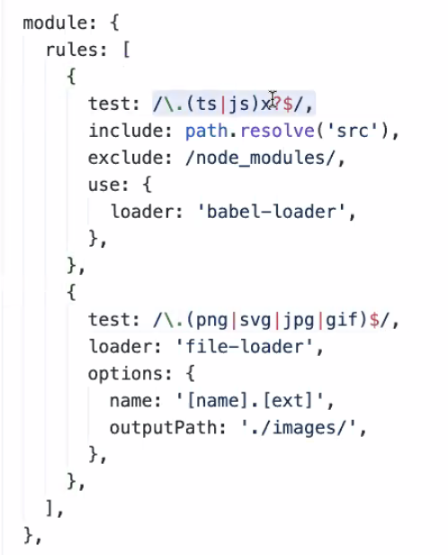

# **WebPack**

`웹 팩은 플랫폼이고 하위로 추가적인 기능들이 붙을 수 있습니다.`

웹팩은 굉장히 거대한 놈 입니다. 사실상 웹팩이 해주는일은 그렇게 많지 않습니다.<br/>
말하자면 플랫폼 같은 느낌 입니다. ex) 기차역<br/>
역만 제공하는 것이고, 기차도 지나다니고 여러 상점들이 들어 설 수 있습니다.<br/> `(입주하는 software들이 있다.)`<br/>
그래서 문제가 생기면 웹팩의 문제가 아닌, 안에 들어온 것의 문제인 경우가 많습니다.<br/>
들어온 software 에게 물어봐야 하는 경우 무엇이 문제인지 찾기가 힘듭니다. 그래서 문제가 생기면 웹팩이 욕을 거의 먹습니다.<br/>

웹팩에서 중요한 것들 몇가지를 알아 보겠습니다.

## **Loader**


Redux의 middleware에 해당하는 것이라 생각하면 됩니다.<br/><br/>
`module`- 로더를 기술하는 부분이다. N개라서 배열로 되어있다.<br/>
`rules` - 로더 하나하나를 정의를 한다.<br/>
`test` - 어떤 확장자의 파일만 받을거야 라고 기술합니다. 정규식조건(js나 jsx 파일)에 부합하는 파일들을 loader에 지정한 로더가 컴파일해줍니다<br/>
`include` - 꼭 이 로더를 사용해서 컴파일할 것들을 지정해줄 수도 있습니다.<br/>
`exclude` - 제외할 폴더나 파일로, 바벨로 컴파일하지 않을 것들을 지정해줍니다. 바벨로는 컴파일하지 않지만 웹팩으로는 컴파일합니다. <br/>
`use & loader` - 읽은 파일을 던져줄 곳.<br/>

### 로더는 `컨버팅` 입니다. - 소스코드에 조작질을 하는 것

## **Plugin**

실제 로더보다 훨씬 복잡합니다.<br/>
웹팩의 안쪽에 있는 로우레벨 기능들을 플러그인에 노출시키고, 하고싶은거 하라는 방식 입니다. <br/>
플러그인이 훨씬더 많은 것을 할 수 있다.<br/>
보통의 플러그인은 로더의 프로세싱이 다끝난다음 실행되는 애들 입니다.<br/> 로더의 결과물을 쓸 수도있고 안쓸 수도 있습니다.

어떤 로더, 플러그인을 쓰냐에 따라 다른 설정들이 잔뜩 나온다.

왜 잘게 잘게 쪼갤까? -> 앱을 만들때 컴포넌트를 만드는 것처럼, 플러그인도 한가지 일만 하게끔 분리 해서 사용하는것이 유지에 좋습니다.

### 플러그인은 `후 처리` - 조작이 끝난 코드들을 어떻게 처리할까? (후 처리)

<br/>

# **Saga의 사용**

```javascript
/* src/index.tsx */
import * as React from 'react'
import { render } from 'react-dom'
import { Provider } from 'react-redux'
import { createStore, applyMiddleware } from 'redux'
import { StoreState } from './types'
import reducer from './reducers'
import createSagaMiddleware from 'redux-saga'
import rootSaga from './sagas'
import App from './App'

const sagaMiddleware = createSagaMiddleware()
const store: StoreState = createStore(reducer, applyMiddleware(sagaMiddleware))
const rootElement: HTMLElement = document.getElementById('root')

sagaMiddleware.run(rootSaga)

render(
  <Provider store={store}>
    <App />
  </Provider>,
  rootElement
)
```

```javascript
import createSagaMiddleware from "redux-saga";
import rootSaga from "./sagas";
...

const sagaMiddleware = createSagaMiddleware();
const store: StoreState = createStore(reducer, applyMiddleware(sagaMiddleware))
...
sagaMiddleware.run(rootSaga);
```

`import rootSaga from "./sagas";` 의 명령어를 통해 saga를 호출합니다.<br/>

`createStore`의 2 번째 인자로 넣어줌으로써 미들웨어로 사용 합니다.<br/>

또 밑에서 `sagaMiddleware.run(rootSaga);` 명령어로 호출된 saga를 실행시켜줍니다.

```javascript
import { Provider } from 'react-redux'
import { render } from 'react-dom'
...
const rootElement: HTMLElement = document.getElementById('root')
...

render(
  <Provider store={store}>
    <App />
  </Provider>,
  rootElement
)
```

`Provider`<br/>
Provider는 어렵게 생각할거 없이 단순한 하나의 컴포넌트 입니다.<br/>react로 작성된 컴포넌트들을 Provider안에 넣으면 하위 컴포넌트들이 Provider를 통해 redux store에 접근이 가능해집니다.
<br/><br/>

`src/index.tsx` 에서 rootSaga로 쓰이게될 코드 입니다.<br/>

```javascript
/* src/sagas/index.ts */
import { fork, all, take, race, delay, put } from 'redux-saga/effects'
import { getType } from 'typesafe-actions'
import * as Actions from '../actions'

function* monitoringWorkflow() {
  while (true) {
    yield take(getType(Actions.startMonitoring))

    let loop = true

    while (loop) {
      yield all([
        put({ type: getType(Actions.fetchSuccess) }),
        put({ type: getType(Actions.fetchFailure) }),
      ])

      const { stoped } = yield race({
        waitting: delay(200),
        stoped: take(getType(Actions.stopMonitoring)),
      })

      if (stoped) {
        loop = false
      }
    }
  }
}

export default function*() {
  yield fork(monitoringWorkflow)
}
```

<br/><br/>
엄청 많은 action이 들어올 것인데 일일이 다 정의하기엔 힘들다.<br/> 이것을 `typesafe-actions` 라이브러리를 사용하자.

```javascript
import { createAction } from 'typesafe-actions'

export const startMonitoring = createAction(
  '@command/monitoring/start',
  resolve => {
    return () => resolve()
  }
)

export const stopMonitoring = createAction(
  '@command/monitoring/stop',
  resolve => {
    return () => resolve()
  }
)

export const fetchSuccess = createAction('@fetch/success', resolve => {
  return () => resolve()
})

export const fetchFailure = createAction('@fetch/failure', resolve => {
  return () => resolve()
})
```

어떤 문자열의 action은 어떤 규격이야! 이런 것이 있어야한다. 하지만 action마다 규격이 다르다.<br/>
default 액션이 @로 시작한다. grouping을 해놓으니 괜찮다! `@`는 아무 의미 없습니다.

첫번째 인자인 @문자열이 상수를 대신해줍니다. 상수만드는게 스킵됩니다.<br/>
2 번째 인자인 함수는 1 번째 인자인 문자열을 액션 타입으로 한다.<br/>

Action의 문자열을 뽑아와야합니다. 상수를 만들지 않았지만, `getType`이라는 헬퍼함수로 인해서
액션 타입을 뽑아 올 수 있다.

**`redux-saga 제공함수`**

```javascript
/* src/sagas/index.ts */
import { fork, all, take, race, delay, put } from 'redux-saga/effects'
```

**`fork`**

```javascript
yield fork(monitoringWorkflow);
```

Type : function

인자 : function, ... args

역할 : 별거 아니다. 그냥 객체를 만들어 준다.<br/>
새로운 하위 saga 태스크를 생성하는 effect 이다.

fork 는 블럭되지 않으며 호출 시점에 호출자는 부모 task 가 되고 fork 된 saga 는 자식 task 가 된다. 부모 task 가 취소되면 자식 task 도 취소된다.

**`all`**

```javascript
// Test Code
yield all([/* 1 code */, /* 2 code */]);
```

Type : function

인자 : Array[... effects]

역할 : Array에 있는 모든 코드가 병렬로 실행되고, 모두 완료될 때까지 기다립니다. 동시에 여러개의 action을 dispatch 하고싶으면, 사용.

**`put`**

```javascript
    put({ type: getType(Actions.fetchSuccess) }),
    put({ type: getType(Actions.fetchFailure) }),
```

Type : function

인자 : Object ( disaptch)

역할 : Store에 Dispatching을 수행합니다.<br/>
put이 오면 할일을 하고 자동으로 next 해줍니다.

**`take`**

```javascript
yield take(getType(Actions.startMonitoring));
```

Type : function

인자 : pattern

역할 : 패턴에 일치한다면, 실행됩니다. 해당 action이 들어오면 나를 불러달라는 의미.

**`race`**

```javascript
yield race({
  waitting: delay(200),
  stoped: take(getType(Actions.stopMonitoring))
});
```

Type : function

인자 : Object

역할 : Object에 담긴 코드들이 병렬 실행이 됩니다 최초로 완료된 코드가 반환됩니다. 이후에 코드들은 버려집니다.

객체를 줄텐데, 객체안의 각각의 값들은 또 saga한테 뭔가를 시키는 일이다.<br/>

우리는 여러 태스크를 병렬로 시작하지만, 그 태스크들을 전부 기다리고 싶지는 않을 때가 있습니다.<br/>

ex) 안에 여러가지 작업이 있고, 그 안에 먼저 응답이 오는것을 채택함. 한마디로 경주 시키는 것.<br/>

먼저 도착한 key는 boolean true 값이고, 나머지는 false 이다.

**`delay`**

```javascript
waitting: delay(200),
```

Type : function

인자 : Number

역할 : 인자로 넘겨진 millisecond 만큼 delay를 겁니다.
일종의 프로미스 객체 입니다.

`saga 한테 내가 이런일을 하고싶어! 라는 정보를 saga한테 전달 해 주는것. saga는 어떤 일을 할때 어떤 형태 모양을 만들어 받아야 하는데, 위의 것 들은 그 객체 형태를 만들어 주는 도움 함수 입니다.`
