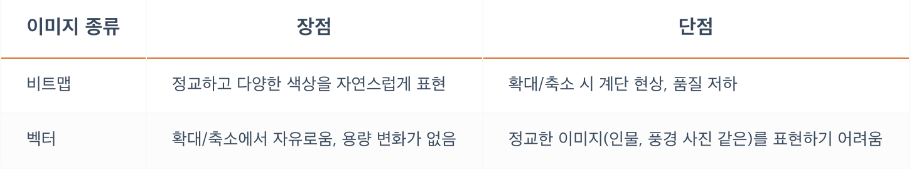

## **웹(Web)을 구성하는 HTML, CSS, JS**
---
HTML, CSS, JS의 이해와 학습은 단순히 기술을 배우는 것으로 그치지 않고 웹과 모바일 그리고 IT 전반의 과거, 현재, 미래를 이해하는 데 많은 도움을 줍니다.

HTML, CSS, JS 는 각각의 역할들이 다릅니다.

HTML(Hyper Text Markup Language)은 페이지에 제목, 문단, 표, 이미지, 동영상 등을 정의하고 그 구조와 의미를 부여하는 정적 언어로 웹의 구조를 담당합니다.
즉 `구조화 하는 역할`을 합니다.

일종의 튼튼한 구조(Semantic), 뼈대를 만드는 일이지, 화면을 꾸밀 수는 없습니다.

CSS(Cascading Style Sheets)는 마크업 언어(HTML, XML 등)가 실제 표시되는 방법(색상, 크기, 폰트, 레이아웃 등)을 지정하여 콘텐츠 구조를 꾸며주는 정적 언어로 웹의 시각적인 표현을 담당합니다. 
`예쁘게 만드는 용도`로만 사용됩니다.

JS(JavaScript)는 콘텐츠를 바꾸고 움직이는 등 페이지를 동적으로 꾸며주는 역할을 하는 프로그래밍 언어로 웹의 동적 처리를 담당합니다.
JS는 HTML과 CSS를 동원해서 그들의 업무(구조, 시각적 표현 등)도 담당할 수 있지만, 그들만큼 잘하진 못하기 때문에(성능적으로) 되도록 동적 처리에만 집중해야 합니다.

  

## **웹 표준**
---
웹 표준(Web Standard)이란 ‘웹에서 사용되는 표준 기술이나 규칙’을 의미하며 W3C의 권고안에서 나온 기술들이 여기에 해당합니다.

대부분의 경우 표준화 제정 단계의 ‘권고안(REC)’에 해당하는 기술을 표준이라고 생각하시면 쉽습니다.

## **크로스 브라우징**
---
내가 만든 홈페이지가, 각각의 브라우저에서 다르게 표현 될수가 있습니다.
이러한 문제는 사용자에게 각각 다른 경험을 주게 됩니다.
이런 문제를 최소화 하기 위해 크로스 브라우징 기술을 통하여 각각의 브라우저에서 동일한 결과를 볼수있게 합니다. 

**크로스 브라우징(Cross Browsing)** 은 위에서 설명한 것처럼 조금은 다르게 구동되는 여러 브라우저에서 동일한 사용자 경험(같은 화면, 같은 동작 등)을 줄 수 있도록 제작하는 기술, 방법 등을 말합니다.

 MSIE(마이크로소프트 인터넷 익스플로어) 브라우저는 제멋대로 만들어져 있기 때문에 여러 의미에서 표준화하기 쉽지 않은 브라우저입니다. 그래서 같은 사이트라도 다르게 표현되는 부분들이 상당히 많습니다.

   

## **웹 접근성**
---
웹 접근성이란 정상적인 웹 콘텐츠 사용이 가능한 일반 사용자부터 고령자, 장애인 같은 신체적, 환경적 조건에 제한이 있는 사용자를 포함해 모든 사용자들이 동등하게 접근할 수 있는 웹 콘텐츠를 제작하는 방법을 말합니다.

ex) 청각 장애인을 위한 영상 자막, 키보드를 통한 웹 이용, 이미지에 대체 텍스트 제공

  

## **웹에서 사용하는 이미지**
---
이미지(그래픽)는 크게 **비트맵**과 **벡터**로 구분됩니다.

- 비트맵
    - 각 픽셀이 모여 만들어진 정보의 집합으로 **레스터(Raster)** 이미지라고도 부릅니다.
    - 픽셀 단위로 화면에 렌더링합니다.
    - jpeg, gif, png 등 대부분의 이미지가 비트맵 형식 입니다.

- 벡터
    - 이미지가 가지고 있는 점, 선, 면의 위치(좌표), 색상 등의 정보를 온전히 가지고 있으며 그를 화면에 렌더링합니다.
    - 좀 더 많은 연산을 해야 하지만, 대신 해상도(픽셀)에 영향을 비트맵 이미지와 달리 해상도로부터 자유롭게 렌더링할 수 있습니다.
    - 수학적 정보만을 가지고 있기 때문에 이미지 확대/축소에 따른 용량 변화가 없습니다.
    - .svg 등의 파일

 

### **JPG**
- 손실 압축
- 저장할때마다 손실된다. 여러번 저장하면 원본보다 확실하게 손상되어 보입니다.
- 손실 압축 방법을 사용하여 용량이 적습니다.
- 높은 압축률!(적은 용량).

### **PNG**
- Gif의 대체 포맷.
- 비손실 압축.
- 비손실 압축이어서 용량을 획기적으로 줄이기에는 문제가 있습니다.
- Alpha Channel 지원(투명도) -> 가장 큰 장점중 하나.
- JPG는 투명한 부분 지원 X
- W3C 권장 포맷!

### **GIF**
- 이미지 파일 내에 이미지 및 문자열 같은 정보들을 저장할 수 있습니다.
- 비손실 압축
- 여러장의 이미지를 한 개의 파일에 담을 수 있음.(움짤, 애니메이션).

### **WEBP**
- JPG, PNG, GIF를 모두 대체할 수 있는 구글이 개발한 이미지 포맷입니다.
- 완벽한 손실/비손실 압축 지원 두가지 동시에 활용 가능.
- GIF 같은 움짤, 애니메이션 지원.
- Alpha Channel 지원(손실, 비손실 모두).
- 지원하는 브라우저에 한계가 있습니다.

### **SVG**
- SVG(Scalable Vector Graphics)는 마크업 언어(HTML/XML) 기반의 벡터 그래픽을 표현하는 포맷입니다.
- 해상도의 영향에서 자유로움.
- CSS로 Styling 가능. 완벽하게 만드는 것은 안되지만, 색상을 입히는 부분 등은 가능.
- JavaScript로 Event Handling 가능.
- 코드 혹은 파일로 사용 가능.