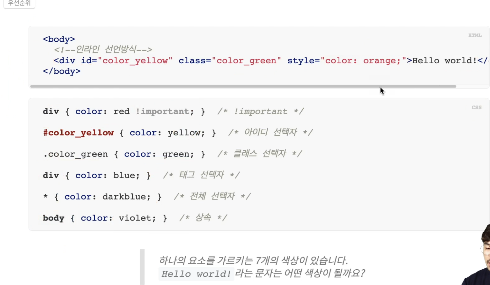

<br/>

### **선언방식 - @import 방식**
- at import 방식
- css `@import` 를 이용하여 외부 문서로 css를 불러와 적용하는 방식 입니다.
- `<link>`는 html에서 외부에 있는 css를 가져 오는 방식이고 `@import`는 css에서 외부에 있는 css를 가져 오는 것 입니다.
- css가 css를 가지고 오는 방법 입니다.
- `<link>` 태그는 병렬적으로 호출 합니다. `@import` 방식은 이전 것의 호출이 끝나야 다음 것을 호출하는 직렬적인 방식으로 호출 합니다.
그래서 `@import` 방식은 잘못 사용하면 시간적으로 비효율적일 수 있기 때문에 주의해서 사용해야 합니다.
- `@import` 방식은 1번 호출이 끝나고 setting이 되어 있어야지만 2번 동작에 문제가 없는 경우에 사용하기 유용합니다.

```css
@import url("./common2.css");
```
<br/>

## **기본 선택자(Basic Selectors)**
---
1. **전체 선택자(Universal Selector)**
    - (요소 내부의)모든 요소를 선택
    - `*`
2. **태그 선택자(Type Selector)**
    - 태그 이름이 `E`인 요소 선택
    - `E`
3. **클래스 선택자(Class Selector)**
    - HTML `class` 속성의 값이 `E`인 요소 선택
    - `.E`
4. **아이디 선택자(ID Selector)**
    - HTML `id` 속성의 값이 `E`인 요소 선택
    - `#E`


<br/>

## **복합 선택자(Combinators)**
---
1. **일치 선택자(Basic Combinator)**
    - `E` 와 `F` 를 동시에 만족하는 요소 선택
    - `EF`
2. **자식 선택자(Child Combinator)**
    - `E` 의 자식 요소 `F`를 선택
    - `E > F` 
3. **후손(하위) 선택자(Descendant Combinator)**
    - `E` 의 후손(하위) 요소 `F` 를 선택
    - `E F`
    - `띄어쓰기` 가 후손(하위) 선택자의 기호로 사용됩니다.
    - 자식 요소도 후손(하위)에 포함됩니다.
    - 부모 요소도 조상(상위)에 포함됩니다.
4. **인접 형제 선택자(Adjacent Sibling Combinator)**
    - `E` 의 다음 형제 요소 `F` 하나만 선택
    - `E + F`
5. **일반 형제 선택자(General Sibling Combinator)**
    - `E` 의 다음 형제 요소 `F` 모두 선택
    - `E ~ F`

<br/>

## **가상 클래스 선택자(Pseudo-Classes Selectors)**
---
- `:` 콜론기호가 1개만 있는 것을 가상 클래스 선택자 라고 합니다.
1. **Hover**
    - `E` 에 마우스(포인터)가 올라가 있는 동안에만 `E` 선택
    - `E:hover`
2. **Active**
    - `E` 를 마우스로 클릭하는 동안에만 `E` 선택
    - `E:active`
3. **Focus**
    - `대화형 콘텐츠`에서 사용가능 (input, img, tabindex)
    - `E` 가 포커스 된 동안에만 `E` 선택
    - `E:focus`
    - **`hover, active, focus` 는 선택자 이지만, 이벤트에 좀 더 가깝게 이해할 수 있습니다. 보통 이벤트는 JS로 효과적이고 자세하게 다룰 수 있습니다.**
4. **FIRST CHILD**
    - `E` 가 형제 요소 중 첫 번째 요소라면 선택
    - `E:first-child`

5. **LAST CHILD**
    - `E` 가 형제 요소 중 마지막 요소라면 선택
    - `E:last-child`

6. **NTH CHILD**
    - `E` 가 형제 요소 중 `n` 번째 요소라면 선택
    - `n` 키워드 사용시 `0` 부터 해석(Zero-base)
    - `n` 키워드 사용시 `0,1,2...` 순으로 더이상 찾을 요소가 없을 때 까지 대입. 즉, `n` 은 `0` 부터 `1` 씩 늘어나는 숫자의 개념으로 이해하면 됩니다.
    - `E:nth-child(n)` 
    - 위 3가지 xxx- child 관련 선택자 사용시 `xxx` 번째 요소가 `E`가 아니라면 선택되지 않습니다. 예로 만약 `p:first-child` 사용시 `first-child` 위치에 있는 태그가 `p` 태그가 아니라면, 선택되지 않습니다. 왼쪽 -> 오른쪽으로 해석한 **`p` 태그들 중 첫 번째 자식** 이 아닌, 오른쪽 -> 왼쪽 해석으로 **`first-child` 위치에 있는 `p`** 로 해석 해야 합니다.
    - 특정 `E`를 주지않고 `:first-child` 로만 선택자를 작성하면, 요소 조건이 사라졌으므로, `first-child` 위치에 있는 요소를, 조건에 상관없이 선택합니다. 즉, `E:first-child`에서 `E` 도 조건처럼 사용 됩니다.

7. **NTH OF TYPE**
    - `E` 의 타입(태그이름)과 동일한 타입인 형제 요소 중 `E` 가 `n` 번째 요소라면 선택
    - 쉽게 말하면, `E` 태그중 `n` 번째를 찾는다는 의미 입니다.
    - 태그의 이름으로 선택하는 개념이고 클래스와 혼용해서 쓰면 문제가 생길 수 있기 때문에, 태그를 찾는 용도로만 사용하면 좋습니다.  
    - `n` 키워드 사용시 `0` 부터 해석(Zero-base)
    - `E:nth-of-type(n)`

8. **부정 선택자(Negation Selector)**
    - `S` 가 아닌 `E` 선택
    - `E:not(S)`


<br/>

## **가상 요소 선택자(Pseudo-Elements Selectors)**
---
- `::` 콜론기호가 2개 있는 것을 가상 요소 선택자 라고 합니다.
- `:` 콜론 기호가 1개만 있는 경우도 동작은 하지만, 가상 클래스 선택자와 구분하기 위하여 2개를 사용하는 것을 표준으로 합니다.
1. **BEFORE**
    - `E` 요소 **내부의 앞**에, 내용(content)을 삽입
    - `E::before`
    - `content` 라는 속성이 무조건 있어야 합니다. 없으면 아무 효과도 적용되지 않습니다. 비어있는 값이라도, `content: ""` 로 명시해 주어야 나머지 효과가 적용됩니다.
    - - `content` 속성의 값으로 텍스트 뿐만 아니라 `url()` 함수를 이용하여 이미지도 삽입할 수 있습니다.
2. **AFTER**
    - `E` 요소 **내부의 뒤**에, 내용(content)을 삽입
    - `E::after`
    - `content` 라는 속성이 무조건 있어야 합니다. 없으면 아무 효과도 적용되지 않습니다. 비어있는 값이라도, `content: ""` 로 명시해 주어야 나머지 효과가 적용됩니다.
    - `content` 속성의 값으로 텍스트 뿐만 아니라 `url()` 함수를 이용하여 이미지도 삽입할 수 있습니다.

<br/>

## **속성 선택자(Attribute Selectors)**
---
1. **ATTR**
    - 속성 `attr` 을 포함한 요소 선택
    - `[attr]`
2. **ATTR=VALUE**
    - 속성 `attr` 을 포함하며 속성 값이 `value` 인 요소 선택
    - `[attr=value]`
3. **ATTR^=VALUE**
    - 속성 `attr` 을 포함하며 속성 값이 `value` 로 시작하는 요소 선택
    - `[attr^=value]`
4. **ATTR$=VALUE**
    - 속성 `attr` 을 포함하며 속성 값이 `value` 로 끝나는 요소 선택
    - `[attr$=value]`

<br/>

## **상속(Inheritance)**
---
- 특정한 css 속성들은 조상 요소에 지정되었지만, 모든 하위 요소에도 영향을 미칠 수 있습니다. **상속**
- 대부분 글자를 다루는 속성들은 기본으로 상속이 됩니다.
- 기본으로 상속되지 않는 속성을 `부모` 에서 `자식` 요소에 강제로 상속시킬 수 있는 개념이 있습니다. **강제 상속**
- **강제 상속** 의 경우는 `자식` 을 제외한 `후손` 에는 적용되지 않습니다. 즉, 자식만 부모의 속성 값을 상속 받을 수 있습니다.
- `attr = inherit` 속성의 값으로 `inherit` 을 사용하여 부모 요소의 값을 상속받아 사용할 수 있습니다.
- 모든 속성이 `inherit` 을 사용할 수 있는 것은 아니지만, 굉장히 많은 속성이 지원 합니다.

<br/>

## **우선순위**
---

- 우선순위 결정
    - 같은 요소가 여러 선언의 대상이 될 경우, 어떤 선언의 css속성(property)을 우선 적용할지 결정하는 방법
        - 명시도 점수가 높은 선언이 우선 **(명시도)**
        - 점수가 같은 경우, 가장 마지막에 해석(늦게 작성한)되는 선언이 우선 **(선언 순서)**
        - 명시도는 `상속` 규칙보다 우선 **(중요도)**
        - `!important` 가 적용된 선언 방식이 다른 모든 방식보다 우선 **(중요도)**


1. **가장 중요(`!important`)**
    - 모든 선언을 무시하고 가장 우선
    - 점수 : `INF` pt

2. **인라인 선언 방식(Style Attribute)**
    - 인라인 선언(HTML `style` 속성을 사용)
    - 점수 : `1000` pt
    - 점수가 굉장히 높아서, 덮어쓰기가 필요한 경우 점수 때문에 덮어쓰기가 불가능 한 경우가 있을 수 있습니다.
    - 위와 같은 이유로 유지보수에 제약이 있습니다.

3. **아이디(ID Selector)**
    - 아이디 선택자
    - 점수 : `100` pt

4. **클래스(Class Selector)**
    - 클래스 선택자
    - 점수 : `10` pt

5. **태그(Type Selector)**
    - 태그 선택자
    - 점수 : `1` pt

6. **전체(Universal Selector)**
    - 전체 선택자
    - 점수 : `0` pt

7. **상속(CSS Inheritance)**
    - 상속 받은 속성은 항상 우선하지 않음
    - 점수 : 계산하지 않음
    - `0` pt 보다 더 낮은 의미 입니다

- 가상 요소 선택자는 `태크` 선택자의 점수인 `1` pt 의 점수를 갖습니다.
- 가상 클래스 선택자는 클래스 와 마찬가지로 `10` pt 점수를 가지지만, `:not()` 부정 선택자는 예외로 점수를 갖지 않습니다.
- 속성 선택자의 경우 `10` pt 의 점수를 갖습니다.