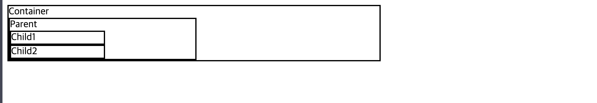
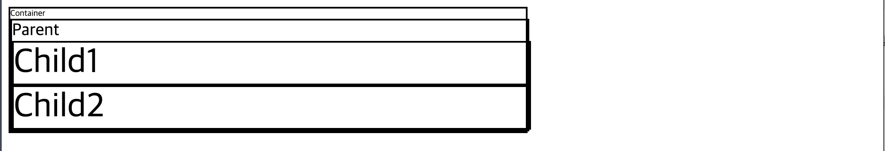

<br/>

## **px, %**
---
### **`px` 는 해상도에 따른 상대 단위 라고 부를 수 있습니다.**
```html
<div class="container">
  Container
  <div class="parent">
    Parent
    <div class="child">Child1</div>
    <div class="child">Child2</div>
  </div>
</div>
```
```css
body *{
  border: 2px solid;
}
.container{
  width: 600px;
}
.parent{
  width: 300px;
}
.child{
  width: 150px;
}
```
### **`%` 는 기본적으로 부모 요소의 영향을 받아서 단위가 완성이 되는 것 입니다.**
- 아래 예제는 위 예제와 동일한 출력을 갖습니다.
```css
body *{
  border: 2px solid;
}
.container{
  width: 600px;
}
.parent{
  width: 50%;
}
.child{
  width: 50%;
}
```


<br/>

## **em, rem**
---
### **`em` 단위는 자기 자신의 `font-size` 크기의 영향을 받습니다.<br/> `font-size` 가 변경되면 em 단위를 사용하는 부분이 같이 변경이 됩니다.**
- font-size 는 기본적으로 상속됩니다.
- 조상, 후손 관계가 깊은 경우 중간에 font-size가 변경되다 보면, 관리하기가 어려워 질수도 있습니다.
```html
<div class="container">
  Container
  <div class="parent">
    Parent
    <div class="child">Child1</div>
    <div class="child">Child2</div>
  </div>
</div>
```
```css
body *{
  border: 2px solid;
}
.container{
  width: 60em;
  font-size:10px;
}
.parent{
  width: 30em;
  /* font-size 크기가 20px 이므로 width 는 600px 만큼 늘어납니다. */
  font-size:2em;
  /* container 클래스로 부터 상속받은 10px의 2배(2em) 만큼인 20px 값을 가집니다. */
}
.child{
  width: 15em;
  /* font-size 크기가 40px 이므로 width 는 600px 만큼 늘어납니다. */
  font-size:2em;
  /* parent 클래스로 부터 상속받은 20px의 2배(2em) 만큼인 40px 값을 가집니다. */
}
```

<br/><br/>
### **`rem` 단위는 `root em` 이라는 개념입니다. 최종 조상 요소는 `html` 태그이며 `rem` 단위는 `html` 에 지정된 `font-size` 의 영향만 받습니다.**

```css
html {
  font-size:10px;
}
body *{
  border: 2px solid;
}
.container{
  width: 60rem;
  font-size:10px;
  /* root의 font-size 크기가 10px 이므로 width 는 600px 만큼 늘어납니다. */
}
.parent{
  width: 60rem;
  font-size:2em;
  /* root의 font-size 크기가 10px 이므로 width 는 600px 만큼 늘어납니다. */
}
.child{
  width: 60rem;
  font-size:2em;
  /* root의 font-size 크기가 10px 이므로 width 는 600px 만큼 늘어납니다. */
}
```


<br/>

## **vw, vh**
---
### **`vw` 는 `viewport` 의 `width` 의 영향을 받습니다.**

### **`vh` 는 `viewport` 의 `height` 의 영향을 받습니다.**
```html
<div class="container"></div>
```
```css
.container {
  width: 50vw;
  height: 50vh;
  background: yellowgreen;
  /* viewport 는 보이는 화면 전체를 의미하고, vw, vh 는 백분율과 같이 50vw, 50vh 는 viewport width, viewport height 의 절만 만큼의 값을 가집니다. */
}
```


<br/>

## **vmin, vmax**
---
### **`vmin` 는 `viewport` 의 `너비,높이` 중 더 `작은 값` 정의합니다.**

### **`vmax` 는 `viewport` 의 `너비,높이` 중 더 `큰 값` 을 의미합니다.**


- viewport 의 **너비가 더 긴 상태**일때
    - `50vamx` 는 `viewport width의 50% 값` 
    - `50vmin` 은 `viewport height의 50% 값`
- 반대로 viewport 의 **높이가 더 긴 상태**일떄
    - `50vamx` 는 `viewport height의 50% 값`
    - `50vmin` 은 `viewport width의 50% 값`

### **`vmax` 와 `vmin` 은 그때 그때 사이즈를 정의하는 기준이 달라질수 있음에 주의합시다.**