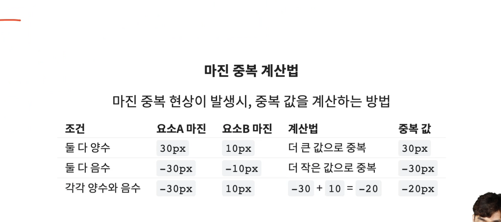
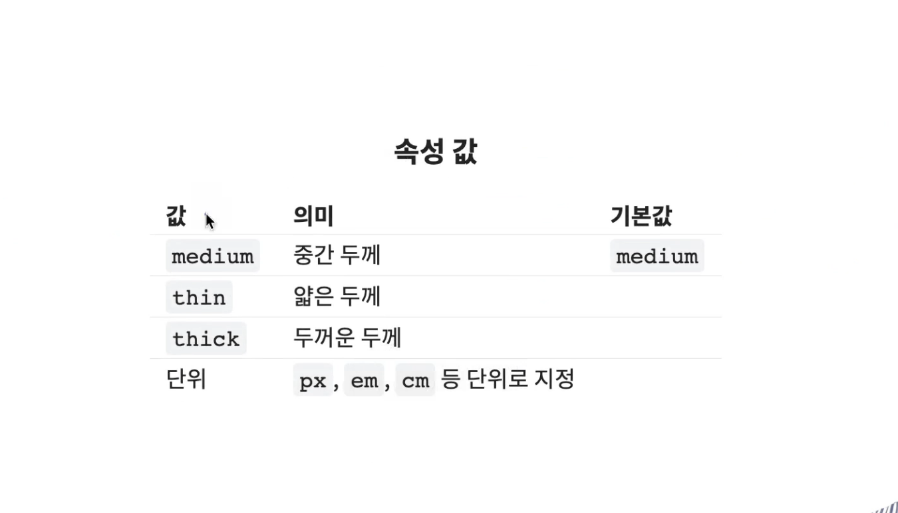
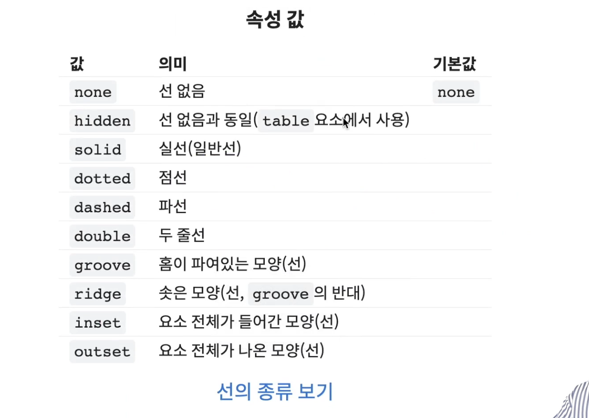
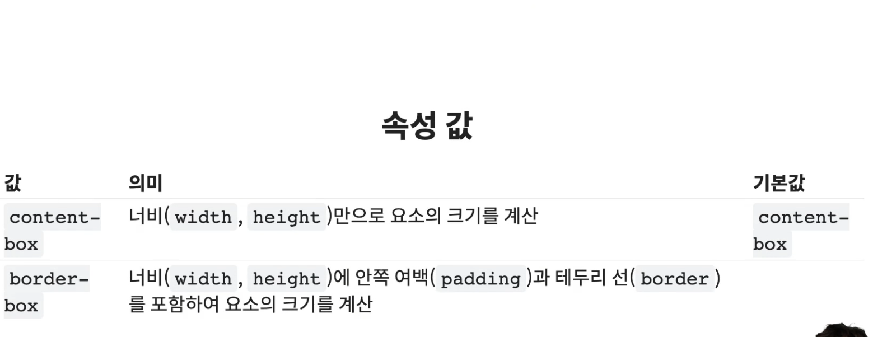
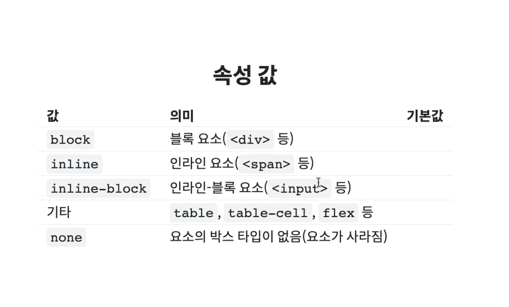
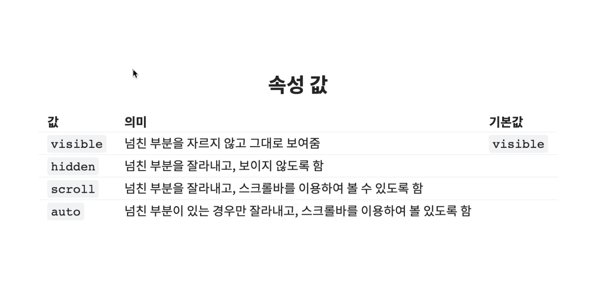

<br/>


## **width**
- 요소의 가로 너비를 지정
- block 요소에서 auto 는 `100%`
- inline 요소에서 auto 는 `0` 이며 값을 지정할 수 없습니다.

<br/>

## **height**
- 요소의 세로 너비를 지정
- block 요소에서 auto 는 `0`
- inline 요소에서 auto 는 `0` 이며 값을 지정할 수 없습니다.

<br/>

## **max-width**
- 요소의 최대 가로 너비를 지정
- 기본 값 `none`

<br/>

## **min-width**
- 요소의 최소 가로 너비를 지정
- 기본 값 `0`

<br/>

## **max-height**
- 요소의 최대 세로 너비를 지정
- 기본 값 `none`

<br/>

## **min-height**
- 요소의 최소 세로 너비를 지정
- 기본 값 `0`

<br/>

## **margin**
- 요소의 `외부(바깥) 여백` 을 지정
- 음수의 값도 사용할 수 있습니다
- `%` 단위 사용 시 부모 요소의 `width` 너비에 대한 비율로 지정 됩니다.

```css
.box {
    /* 단축 속성 */

    margin : 10px 20px 30px 40px;
    /* 상 우 하 좌 */
    margin : 10px 20px 40px;
    /* 상 (좌, 우) 하 */
    margin : 10px 40px;
    /* (상, 하) (좌, 우) */
    margin : 10px;
    /* (상, 하, 좌, 우) */
}
.box2 {

    /* 개별 속성 */

    margin-top : 10px;
    /* 상 */
    margin-right : 20px;
    /* 우 */
    margin-bottom : 30px;
    /* 하 */
    margin-left : 40px;
    /* 좌 */
}
```

<br/>

## **margin - 중복(Collapse)**
- margin 의 특정 값들이 `중복` 되어 합쳐지는 현상
    - 형제 요소들의 `margin-top` 과 `margin-bottom` 이 만났을 때
    - 부모 요소의 `margin-top` 과 자식 요소의 `margin-top` 이 만났을 때
        - 부모 요소의 `top` 부분과 자식 요소의 `top` 부분의 경계면이 겹칠때만, 중복이 발생 합니다.
    - 부모 요소의 `margin-bottom` 과 자식 요소의 `margin-bottom` 이 만났을 때
        - 부모 요소의 `bottom` 부분과 자식 요소의 `bottom` 부분의 경계면이 겹칠때만, 중복이 발생 합니다.
- `margin-right` 와 `margin-left` 사이엔 `중복` 이 발생하지 않고, 각 값을 더한만큼 적용 됩니다.
- `margin - Collapse` 는 오류, 버그가 아닙니다. 현상을 우회 하거나 응용할 수 있습니다.



<br/>

## **padding**
- 요소의 `내부(안) 여백` 을 지정
- `%` 단위 사용 시 부모 요소의 `width` 너비에 대한 비율로 지정 됩니다.

```css
.box {
    /* 단축 속성 */

    padding : 10px 20px 30px 40px;
    /* 상 우 하 좌 */
    padding : 10px 20px 40px;
    /* 상 (좌, 우) 하 */
    padding : 10px 40px;
    /* (상, 하) (좌, 우) */
    padding : 10px;
    /* (상, 하, 좌, 우) */
}
.box2 {

    /* 개별 속성 */

    padding-top : 10px;
    /* 상 */
    padding-right : 20px;
    /* 우 */
    padding-bottom : 30px;
    /* 하 */
    padding-left : 40px;
    /* 좌 */
}
```

### **크기 증가**
- 요소의 내부 여백이기 때문에 추가된 `padding` 값 만큼 요소의 크기가 증가합니다.

### **원하는 크기로 맞추기 위하여 직접 계산하는 방법**
```css
.box {
    width : 60px;
    height : 80px;
    background : red;
    padding : 10px 20px;
    /* 최종 출력 width, height 는 둘다 100px 가 됩니다. */
}
```

### **원하는 크기로 맞추기 위하여 자동으로 계산하는 방법**
- 직접 계산하지 않고 **`box-sizing:border-box`** 를 추가합니다.

```css
.box {
    width : 100px;
    height : 100px;
    background : red;
    padding : 10px 20px;
    box-sizing : border-box;
    /* 직접 계산하지 않고 box-sizing : border-box 를 추가합니다. */
    /* 최종 출력 width, height 는 둘다 100px 가 됩니다. */
}
```

<br/>

## **border**
- 요소의 `테두리 선` 을 지정합니다.
- 속성 값
    - `border-width`
        - 선의 두께(너비)
        - 기본값 : `medium`
    - `border-style`
        - 선의 종류
        - 기본값 : `none`
    - `border-color`
        - 선의 색상
        - 기본값 : `black`

```css
.box {
    /* 단축 속성 */

    border : 1px solid red;
    /* border : 두께 종류 색상; */
    /* (상, 하, 좌, 우) */
}

.box {
    /* 개별 속성 */

    border-top : 1px solid red;
    /* border-top : 두께 종류 색상; */
    border-right : 2px solid red;
    /* border-right : 두께 종류 색상; */
    border-bottom : 3px solid red;
    /* border-bottom : 두께 종류 색상; */
    border-left : 4px solid red;
    /* border-left : 두께 종류 색상; */
}
```

### **border-width**

```css
.box {
    /* 단축 속성 */

    border-width : 10px 20px 30px 40px;
    /* 상 우 하 좌 */
    border-width : 10px 20px 40px;
    /* 상 (좌, 우) 하 */
    border-width : 10px 40px;
    /* (상, 하) (좌, 우) */
    border-width : 10px;
    /* (상, 하, 좌, 우) */
}
```
```css
.box{
    /* 개별 속성*/

    border-top-width : 10px;
    border-right-width : 20px;
    border-bottom-width : 30px;
    border-left-width : 40px;
}
```
<br/>

### **border-style**


```css
.box {
    /* 단축 속성 */

    border-style : solid dotted dashed double;
    /* 상 우 하 좌 */
    border-style : solid dotted double;
    /* 상 (좌, 우) 하 */
    border-style : solid double;
    /* (상, 하) (좌, 우) */
    border-style : solid;
    /* (상, 하, 좌, 우) */
}
```
```css
.box{
    /* 개별 속성*/

    border-top-style : solid;
    border-right-style : dotted;
    border-bottom-style : dashed;
    border-left-style : double;
}
```

<br/>

### **border-color**
- 선의 색상을 지정
- 속성 값
    - 색상
        - 기본값 : `black`
    - `transparent`
        - 투명한 선(요소의 배경색이 보임)
- 마찬가지로 **`단축 속성` `개별 속성`** 모두 존재합니다.


<br/>

## **box-sizing**
- 요소의 크기 계산 기준을 지정



<br/>

## **display**
- 요소의 박스 타입(유형) 을 설정


- `inline-block` 은 `inline` 요소 처럼 수평으로 쌓이며, `block` 요소 처럼 `width, height` 값을 지정할 수 있고, `margin, padding ` 에서 상, 하 값을 지정 가능합니다.


<br/>

## **overflow**
- 요소 크기 이상으로 내용(자식요소)이 넘쳤을 때, 내용의 보여짐을 제어


- `scroll` 속성 값을 사용 시, 요소가 넘치지 않더라도 강제적으로 scroll 바를 만들어 시각적으로 불편할 수 있습니다. 이땐 `auto` 값을 사용하여, 요소가 넘친 경우에만 스크롤 바를 생성할 수 있습니다.


<br/>

## **opacity**
- 요소의 투명도를 지정
- 속성 값
    - 숫자
        - `0` 부터 `1` 사이의 소수점 숫자
        - 기본 값 `1`
- `opacity:0` 은 요소는 존재하지만, 투명해서 보이지 않는 개념
- `display:none` 은 요소가 완벽하게 사라지는 개념