<br/>


## **font**
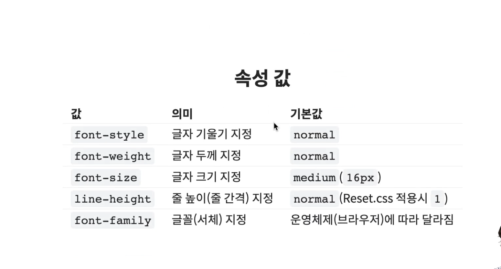
- **`font` 의 단축 속성을 사용하기 위해서는 `font-size` 와 `font-family` 를 필수로 입력해야 합니다.**
```css
.box {
    font: 기울기 두께 크기 / 줄높이 글꼴;
    
    font : italic bold 20px / 1.5 "Arial", sans-serif;

    font : 30px / 1.5;
    /* Error */
    font : bold;
    /* Error */
    font : bold sans-serif;
    /* Error */
}
```

<br/>

## **font-style**
- 글자의 스타일(기울기)을 지정

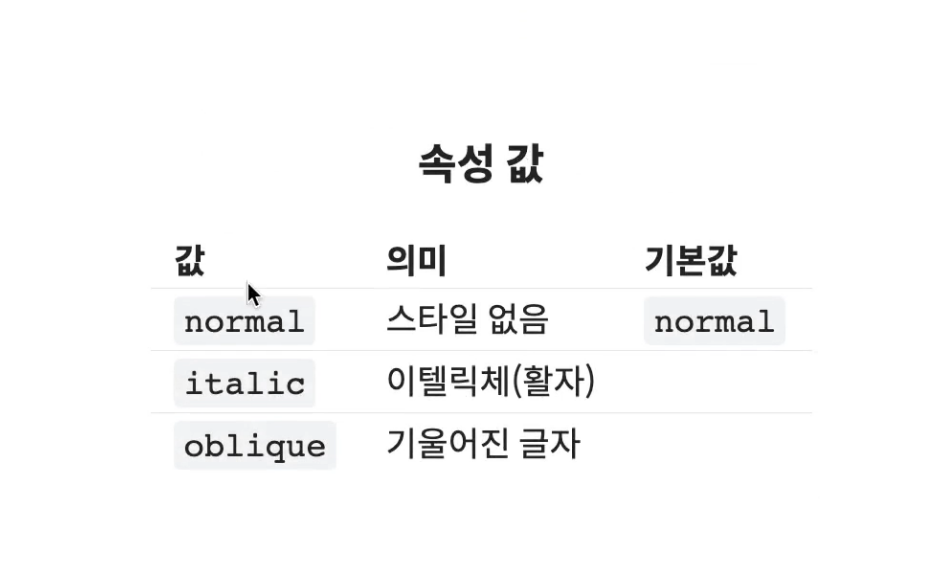

<br/>

## **font-weight**
- 글자의 두께(가중치)를 지정

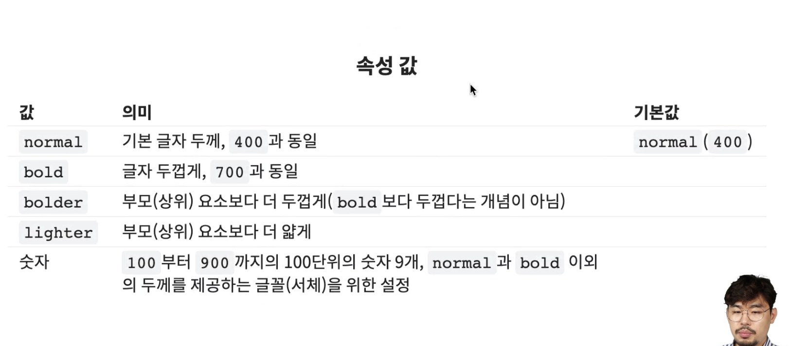
- `bolder` 와 `lighter` 는 부모요소 보다 더 굵게, 더 얇게 의 의미이지, `bold` 와 `light` 보다 더 굵고 얇다는 의미가 절대 아닙니다.
- `100 ~ 900` 까지 `100` 의 단위로 9가지 수치를 입력할 수 있습니다.

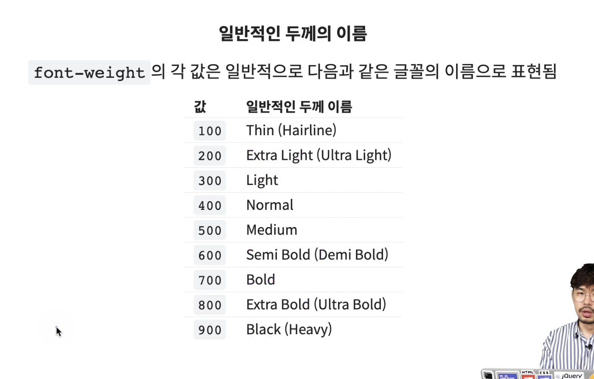
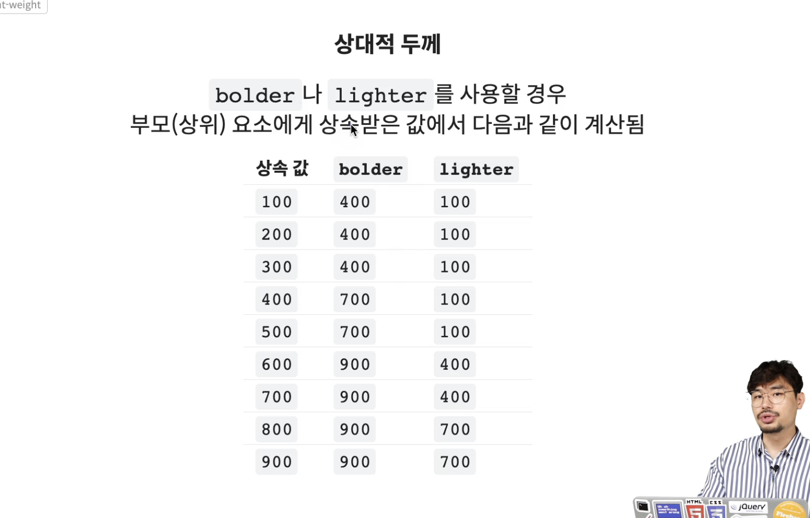
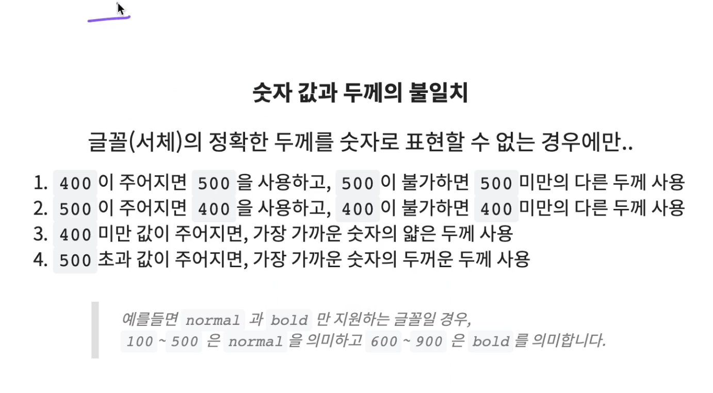

<br/>

## **font-size**
- 글자의 크기를 지정
- 여러 값이 있지만, 정확한 크기를 알 수 없기 때문에 **`단위(px,em,cm)`** 을 사용하는 것이 좋습니다.

<br/>

## **line-height**
- 줄 높이(줄 간격)를 지정
- `숫자` 만 작성하면 요소 자체 `font-size` 크기의 배수로 지정 합니다.
- `숫자` 로 작성할 때 `1.4 ~ 1.7` 값을 입력하는 것이 가장 보기에 좋습니다. `(font-size 의 1.4 ~ 1.7 배)`

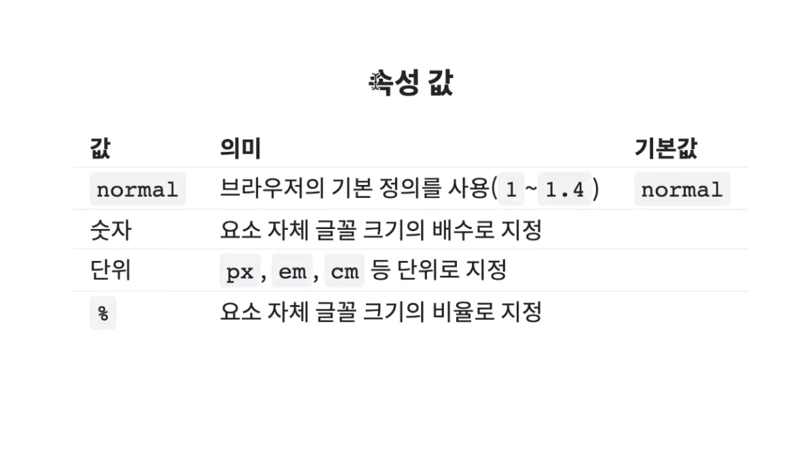


<br/>

## **font-family**
- 글꼴(서체) 지정

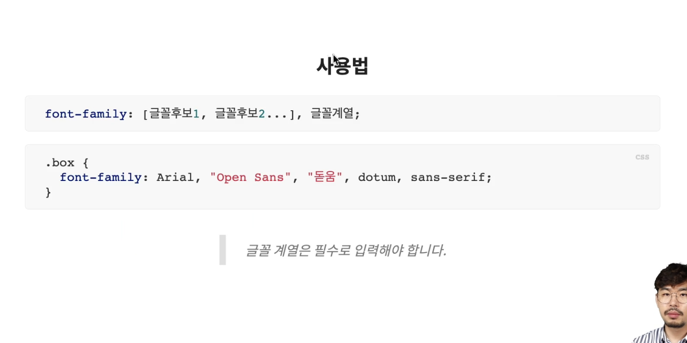
- 폰트를 브라우저가 다운로드 하게 되면 `용량도 크고 시간도 오래 걸리기 때문에`, 사용자 브라우저 환경에 설치되어 있는 것들 중 있으면 찾아 쓰는 방식을 사용 합니다.
- 후보를 주는 이유는 사용자 브라우저 환경에 후보가 없으면, 그 다음 후보를 차례로 봅니다.
- 후보가 모두 없으면 브라우저에서 글자 계열에 명시한 것을 찾아 씁니다.
- 속도가 중요시 되기 때문에 이러한 방식으로 사용 합니다.
- 기본적으로 웹 폰트를 제공하지 않으면, 사용자 환경에 있는 폰트를 사용합니다.

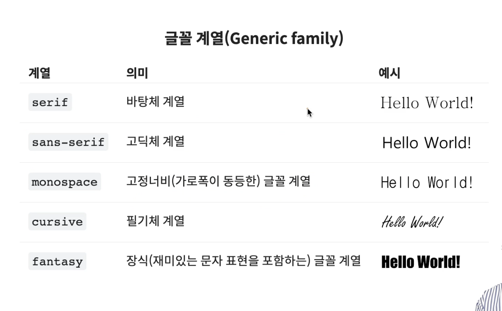
- 보통 `san-serif` 가 압도적으로 많이 사용됩니다.

<br/>

## **color**
- 문자의 색상을 지정

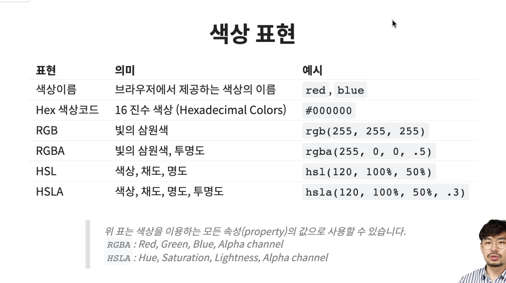

<br/>

## **text-align**
- 문자 정렬 방식을 지정

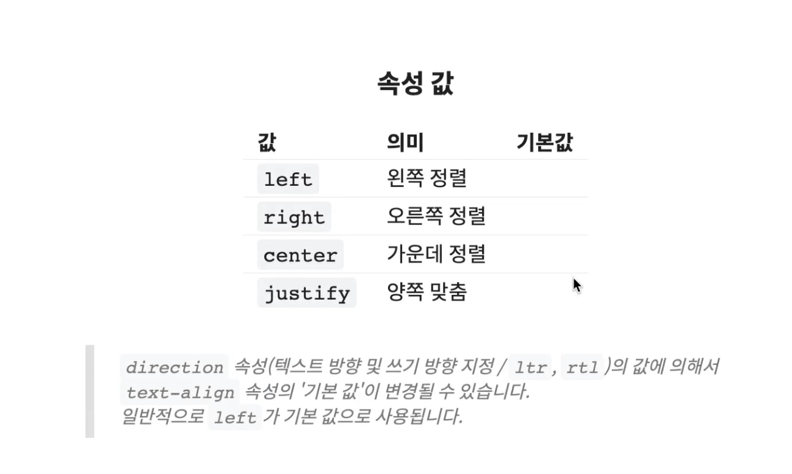
- `justify` 는 한줄에서는 적용 되지 않고 두 줄 이상일때 적용 됩니다. 줄바꿈을 강제로 한 두 줄이아닌, 칸이 모자라서 떨어진 두 줄 이상일때 적용 됩니다.

<br/>

## **text-decoration**
- 문자의 장식(line)을 설정

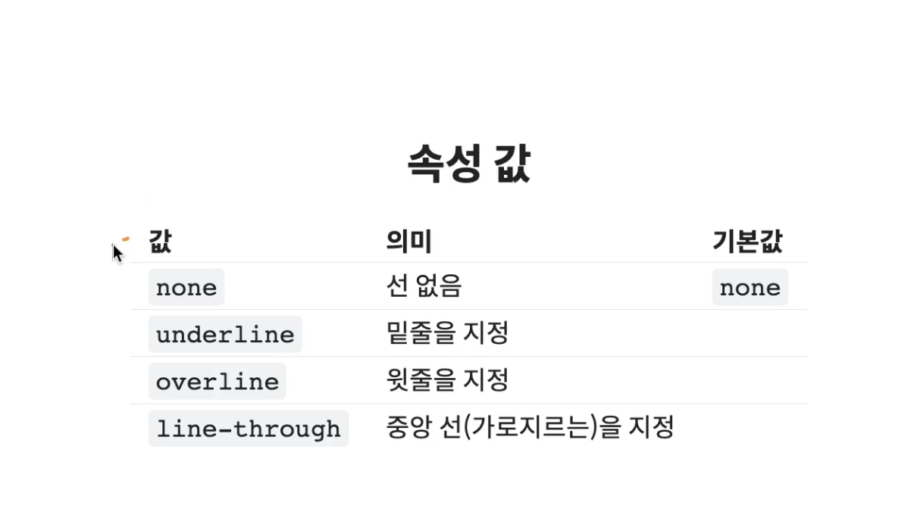

<br/>

## **text-indent**
- (첫 번째 줄의) 들여쓰기를 지정
- 음수 값을 사용할 수 있습니다. 음수 값을 사용하면 첫 째 줄은 왼쪽으로 들여쓰기(내어쓰기) 됩니다.
- `text-indent : -9999px;` 로 명시하면 텍스트를 화면 밖으로 밀어내는 개념으로 사용합니다.

<br/>

## **letter-spacing**
- 문자의 자간(글자 사이 간격)을 설정
- `단위(px, em, cm)` 으로 지정 합니다.
- 음수 값도 사용할 수 있습니다.

<br/>

## **word-spacing**
- 단어 사이(띄어쓰기)의 간격을 지정
- `단위(px, em, cm)` 으로 지정 합니다.
- `0` 값을 넣는다고 해서 띄어쓰기가 없어지지 않습니다. 기존 띄어쓰기 간격이 `0` 이 되고 넣는 값은 기본 띄어쓰기 간격에 `+` 하는 개념입니다.

