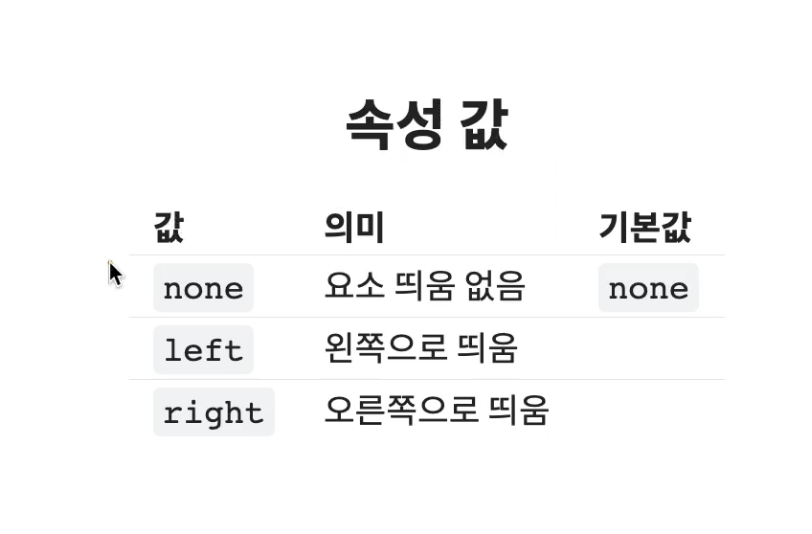
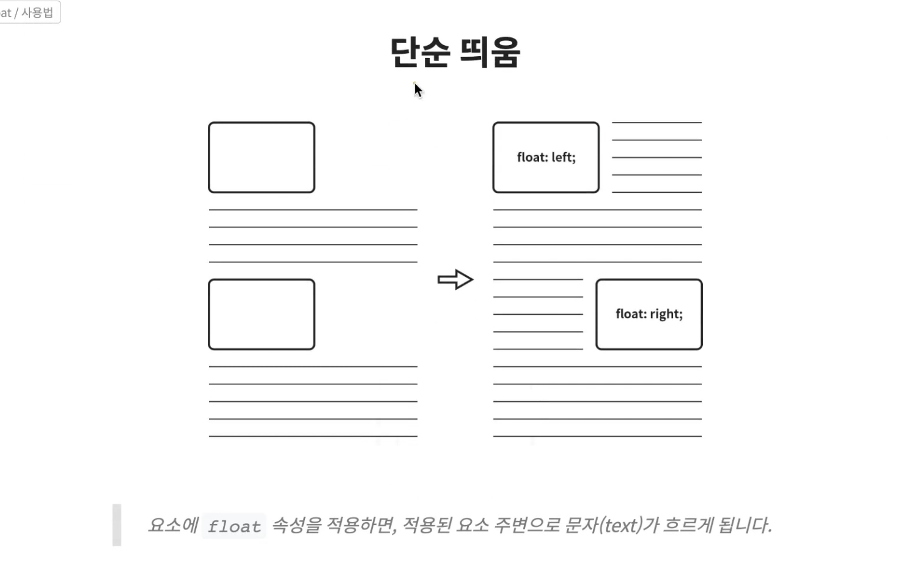
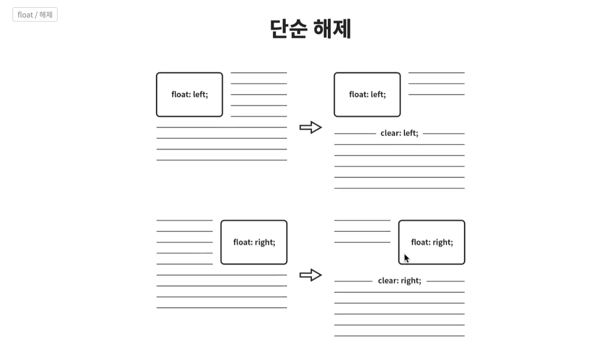
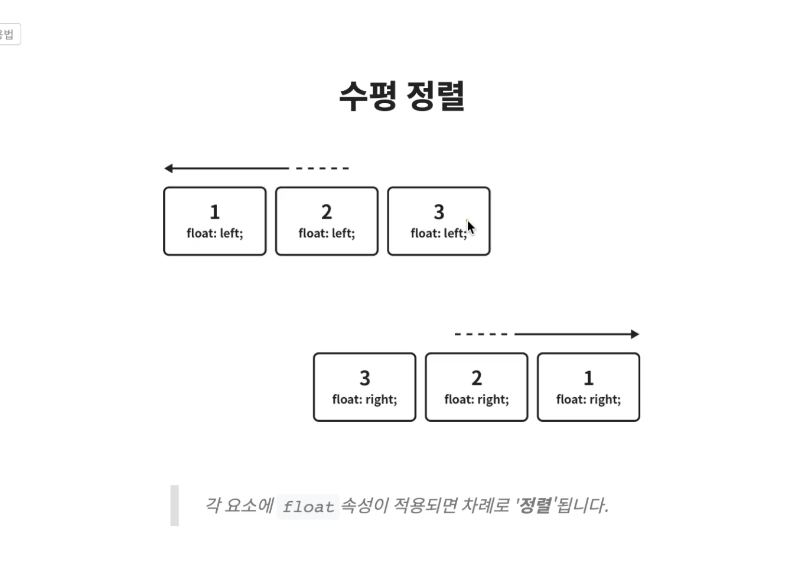
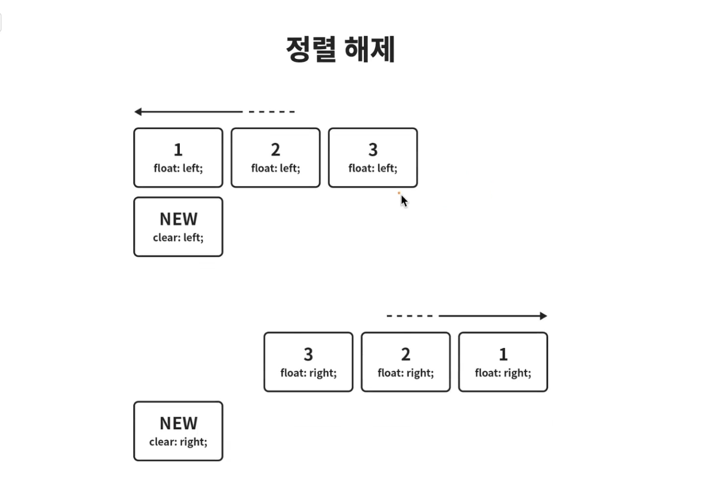
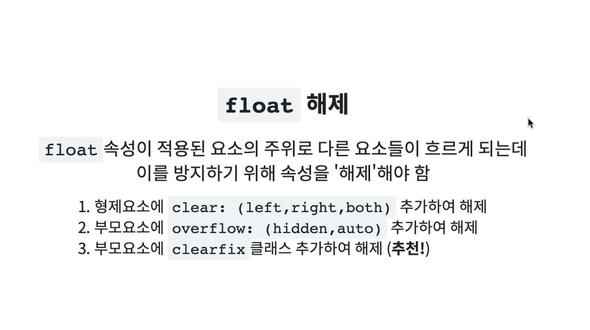
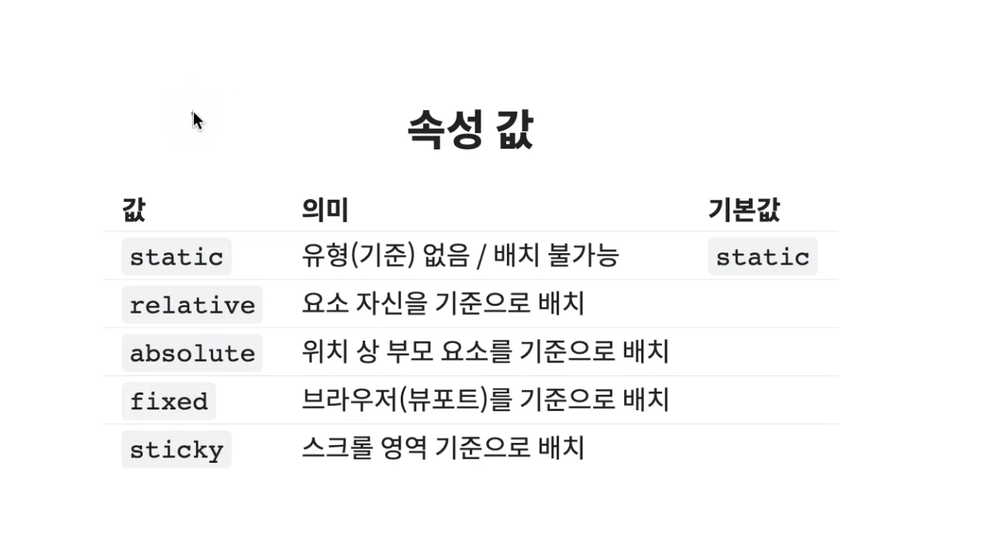
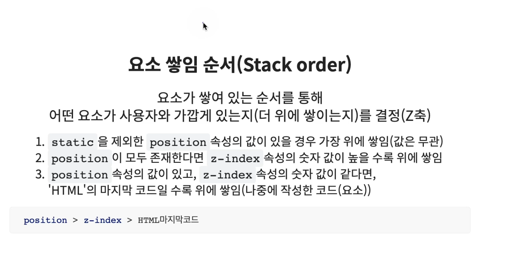

<br/>


## **float**
- 요소를 좌우 방향으로 띄움(수평 정렬)
- 정확하게는 요소를 띄우는 개념이지만 이 개념을 통해서 요소를 `수평 정렬` 할 수도 있습니다.
- `flexbox` 가 도입되면서 요즘은 `flexbox` 를 통하여 `수평 정렬` 을 합니다.



- 요소에 `float` 속성을 적용하면, 적용된 요소 주변으로 `문자(text)` 가 흐르게 됩니다.



- `clear` 속성을 적용하면, `float` 흐름을 해제 할수 있습니다.




- `clear` 사용시 `left, right, both` 로 흐름을 해제할 수 있는데, 보통 `both` 를 사용하여 간편하게 하제 합니다.
---

- `float` 은 꼭 해제를 해주어야 합니다. 방법으론 3가지가 있습니다.



### **`1`**
- 이 경우는 다음 형제요소가 있을 때는 상관없지만, 형제요소가 없을 때는 하나를 추가로 만들어 주어야 합니다.
- 해제 하는 기본 원리라고 볼 수 있습니다.

```html
<div class="float-left"></div>
<div class="float-left"></div>
<div class="next"></div>
```
```css
.float-left {
  width: 100px;
  height: 100px;
  background : red;
  float: left;
  margin : 10px;
}
.next {
  clear : both;
}
/* next 아래 라인 부터는 float 이 해제됩니다. */
```


### **`2`**
- 형제 요소 존재 유무에 상관없이, 특정 영역을 wrapping 하는 것으로 이 영역 안에서만 `float` 을 사용하겠다 라고 직관적으로 사용할 수 있습니다.
- 이 경우는 `overflow` 의 경우 `float` 이라는 속성과 아무 연관이 없음에도, `float` 을 해제하기 위하여 사용하기 때문에 편법 이라고 할 수 있습니다.

```html
<div class="parent">
  <div class="child"></div>
  <div class="child"></div>
</div>
```
```css
.parent {
  overflow : hidden; 
}
.child {
  float : left;
}
```

### **`3`**
- `float` 속성이 추가된 요소의 부모에 미리 지정된 `clearfix` 클래스를 추가 하는 방법입니다.
- `clearfix` 뒤쪽에 가상요소`(clearfix::after)`를 추가하면 이 가상요소는 영역의 맨 끝에 위치하게 됩니다. 영역의 맨 끝에서 `clear : both` 를 해주기 때문에 영역 밖에서는 흐름이 해제됩니다.
- `clearfix` 를 사용하는 요소의 자식에는 무조건 `float` 이 있는 요소만 와야 합니다.

```html
<div class="parent clearfix">
  <div class="child"></div>
  <div class="child"></div>
</div>
```
```css
.clearfix::after {
  content : "";
  clear : both;
  display : block;
}
.child {
  float : left;
}
```

<br/>


## **float - display 수정**
- `float` 속성이 추가된 요소는 `display` 속성의 값이 대부분 `block` 으로 수정됩니다.

<br/>


## **position**
- 요소의 위치 지정 방법의 유형(기준)을 설정
- `top, bottom, left, right` 를 사용하여 `position` 이 지정되어 있는 요소의 위치를 실직적으로 잡아 줄 수 있습니다. 


### **position - relative**
- 자기 위치를 기준으로 배치합니다.
- 시각 적으로 이동된 요소는 clone 입니다.
- 원래 위치해 있던 자리에 요소가 시각적으로 보이지 않지만 계속 존재합니다. (형제 요소에 영향을 미치고, 영향을 받습니다).
- 주변의 영향을 받거나 주기 때문에 주의해서 사용해야 합니다. `absolute` 를 통한 배치를 추천합니다.

### **position - absolute**
- 부모 요소를 기준으로 배치합니다.
- 여기서 이야기 하는 부모 요소는 html 구조상의 부모가 아닌 위치 상의 부모를 의미합니다.
- 위치 상의 부모란, `position` 값을 갖고 있는 조상 요소를 의미 합니다.
- 한 `depth` 위의 보모가 `position` 값을 갖고 있지 않다면, 한 `depth` 더 올라가 확인합니다.
- 모두 `position` 이 없다면, `veiwport` 가 위치상 부모가 됩니다.
- 특정 조상 요소를 기준으로 삼고 싶은데 `position` 값이 없다면 `position : relative` 를 넣어주어 기준으로 삼을 수 있습니다. `relative` 가 아니어도 되지만 다른 값을 사용하면 해당 조상 요소의 위치가 바뀔 위험이 있기 때문에 `relative` 로 설정 합니다.

### **position - fixed**
- 브라우저(=`viewport`)를 기준으로 배치합니다.
- 화면을 스크롤 하여 내리더라도 위치가 변하지 않습니다.

### **position - sticky**
- 스크롤 영역을 기준으로 배치합니다.
- `top, bottom, left, right` 값중 적어도 1가지는 꼭 있어야 동작 합니다.

### **position - 요소 쌓임 순서**
- `z-index` 속성은 `position` 속성이 있어야만 사용할 수 있습니다.



### **position - display 수정**
- `absolute, fixed` 속성 값이 적용된 요소는 `display` 속성의 값이 대부분 `block` 으로 수정됩니다. 


