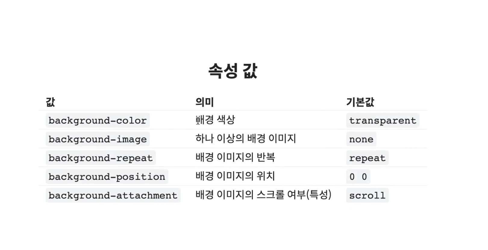
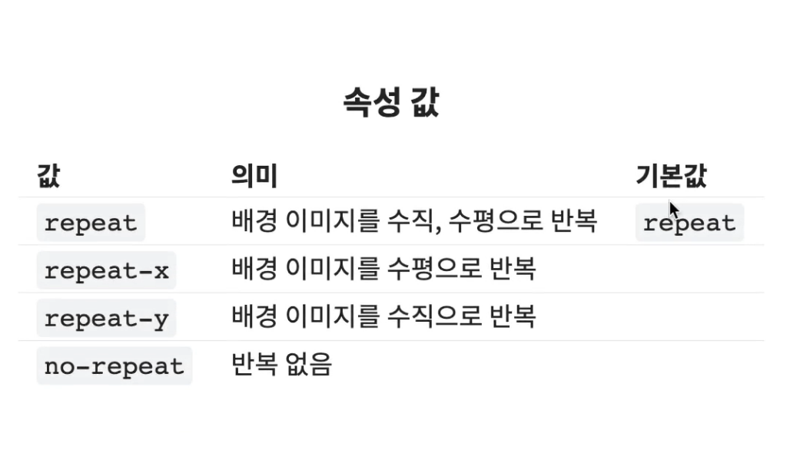
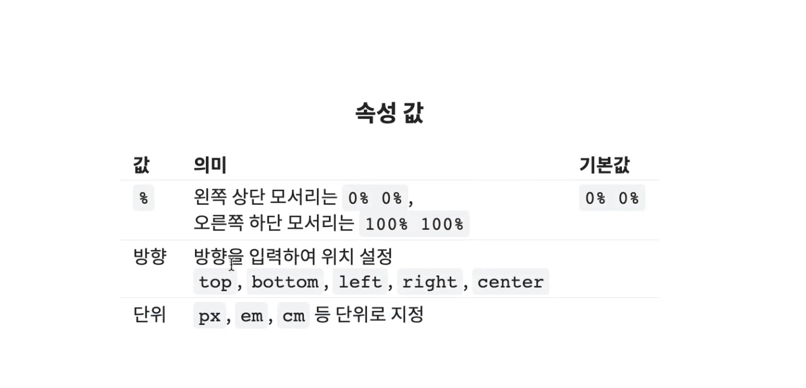
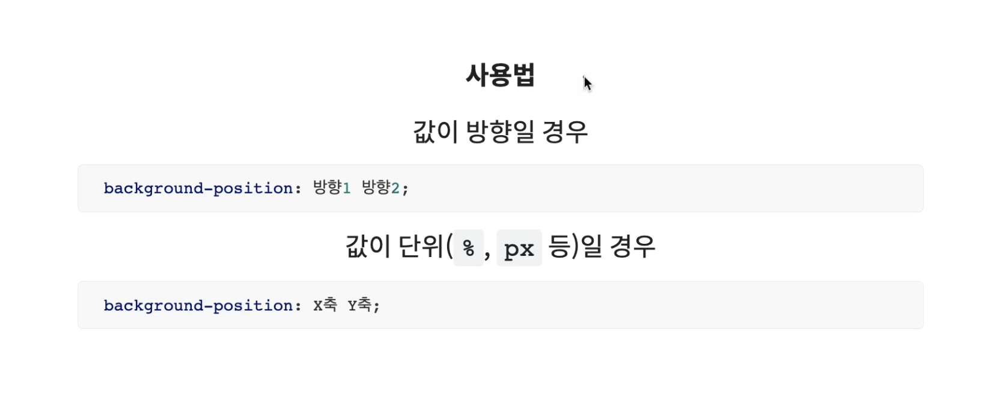
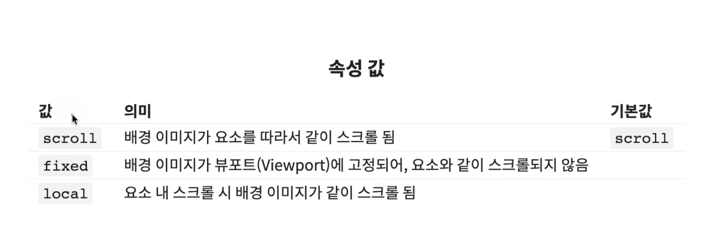
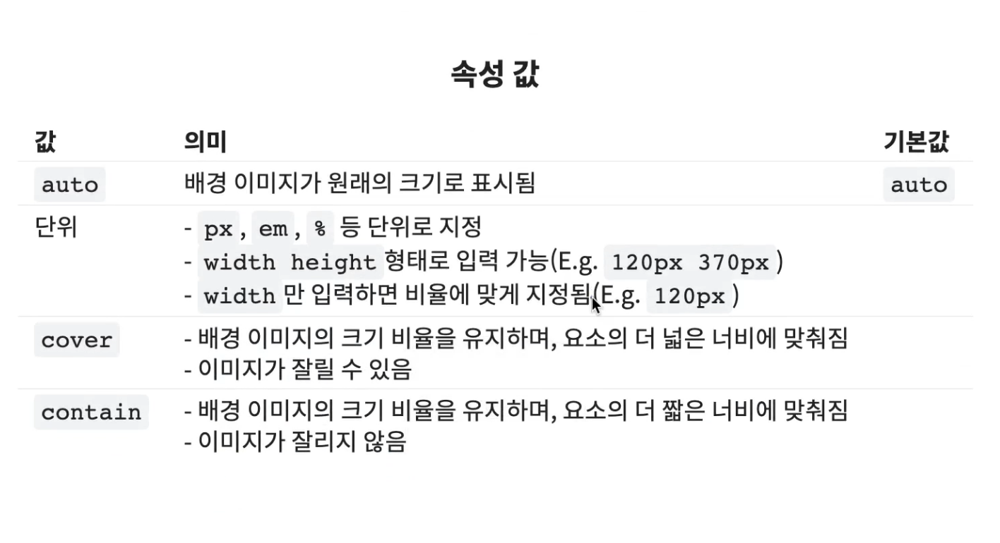

<br/>


## **background**
- 요소의 배경을 설정
- 단축 속성 사용 시 속성의 일부를 누락해도 사용 가능합니다.



```css
.box {
    background : 색상 이미지경로 반복 위치 스크롤특성;

    background : red url("./img/92.png") no-repeat left top scroll;

    background : red;

    background : url("./img/93.png") no-repeat;
}
```

<br/>


## **background-color**
- 요소의 배경 색상을 지정

<br/>


## **background-image**
- 요소의 배경에 하나 이상의 이미지를 삽입
- `url("경로")` 함수로 이미지를 삽입 합니다.
- `,` 를 통하여 여러개의 이미지를 삽입 합니다.
- 단축 속성을 사용하여 여러개의 이미지를 삽입하는 경우엔 경로만 구분하는 것이 아니라 `경로의 추가적인 옵션을 다 명시한 후` `,` 로 구분하여 작성합니다.
- 여러장 삽입하는 경우, `먼저 작성된 이미지가 맨 위에` 위치합니다.

```css
.box {
    /* 개별 속성 사용 시 */
    background : url("../img/1.png"), url("../img/2.png"), url("../img/3.png");
}
.box2 {
    /* 단축 속성 사용 시 */
    background : url("../img/1.png") no-repeat, url("../img/2.png") no-repeat 100px 200px, url("../img/3.png");
}
```

<br/>


## **background-repeat**
- 배경 이미지의 반복을 설정



<br/>


## **background-position**
- 배경 이미지의 위치를 설정
- 값이 단위인 경우는 순서를 뒤바꿀 수 없습니다.
- 값이 방향인 경우는 순서를 바꾸어도 상관 없습니다.
- 방향과 단위를 혼합하여 사용할 수도 있습니다. 이 때도 x축 y축을 잘 고려하여 작성하여야 합니다.
- `right, left` 는 `x 축` `top, bottom` 은 `y 축`




<br/>


## **background-attachment**
- 요소가 스크롤될 때 배경 이미지의 스크롤 여부(특성) 설정



<br/>


## **background-size**
- 배경 이미지의 크기를 지정
- `cover` 경우 가로, 세로 중 더 넓은 너비에 맞춰 이미지 비율을 유지하며 맞춥니다. 이미지가 잘릴 수 있지만, 배경이 가득 찬 형태 입니다.
- `containt` 경우 가로, 세로 중 더 짧은 너비에 맞춰 이미지 비율을 유지하며 맞춥니다. 이미지가 잘리진 않지만, 요소의 배경이 가득 차지 않는 경우도 있습니다.




