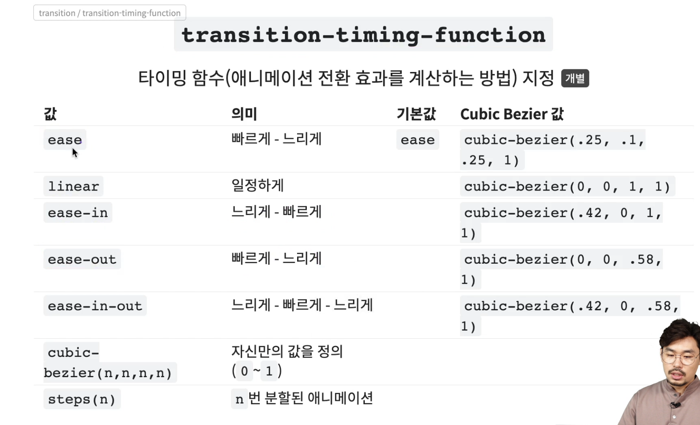

 

## **Transition**
- CSS 속성의 전환 효과를 지정
- 보통 바뀌기 전 상태에 설정하면 됩니다.
- `transition-timing-function` 은 타이밍 함수 입니다. 전환 효과가 빠르게 진행되다 천천히 끝날지, 천천히 진행되다 빠르게 끝날지, 일정하게 지속할지 를 선택합니다.
- `transition-delay` 는 얼마의 delay 후에 transition을 수행할지 설정 합니다.

 

## **Transform**
- 요소의 변환 효과(변형)를 지정
- 띄어쓰기로 구분하여 여러가지 변환함수를 적용할 수 있습니다.

 

## **Transform - 2D 속성**

- `transform` 의 `translate` 와 비슷하게 동작하는 `position` 은 애니메이션에 특화되어 있지 않습니다.
- 특화되어 있지 않은 속성들을 이용하여 `애니메이션 (ex transition)` 을 적용하게 되면 굉장히 많은 부하가 일어납니다.
- 애니메이션을 시킬때 **`transform`** 을 사용하여 최적화 시킬 수 있습니다.

 

## **Transform - 3D 속성**
- **기본적으로 `perspective(n)` 함수는 `transform` 의 가장 앞부분에 위치하여야 합니다.**

 

## **transform 변환 속성**

 

## **transform-origin 속성**

 

## **transform-style 속성**
- 기본값은 `flat` 이므로 기본적으로 `3D 변환 요소의 자식요소` 는 `3D` 변환 함수가 적용되지 않습니다.
- `3D 변환 요소의 자식요소` 도 3D 변환을 사용하려면 `preserve-3d` 를 꼭 명시해 주어야 합니다.
- `preserve-3d` 는 자식요소 까지만 적용되고 그 밑 후손에는 적용되지 않습니다, `preserve-3d` 를 계속 명시해 주어야 합니다.

 

## **transform-perspective 속성**

 

## **transform-perspective-origin 속성**

 

## **backface-visibility 속성**

