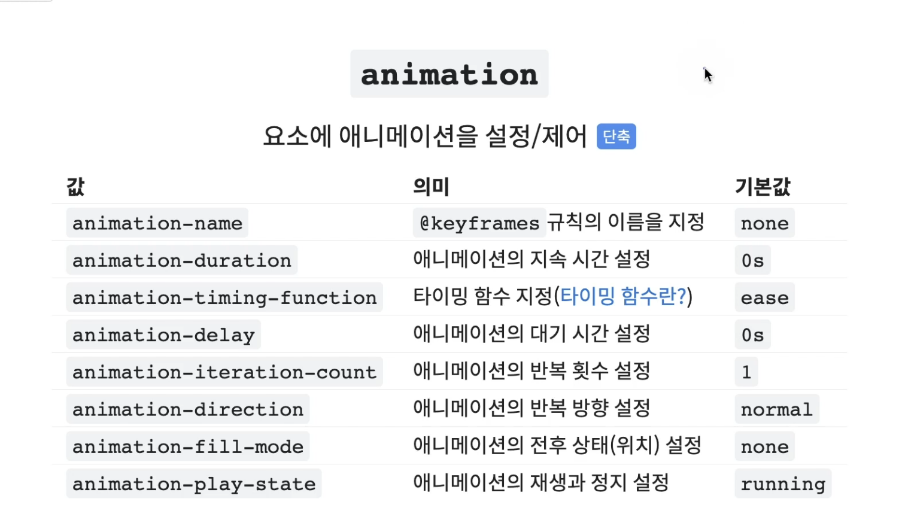
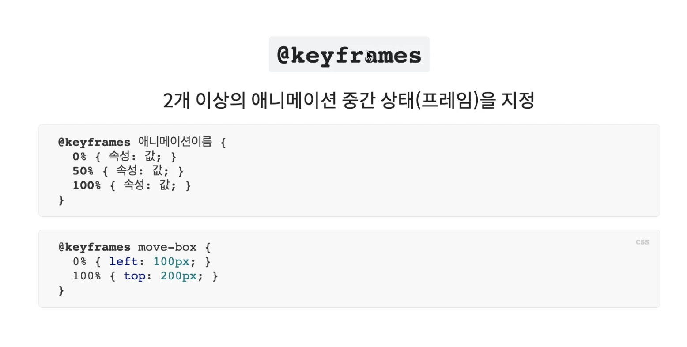
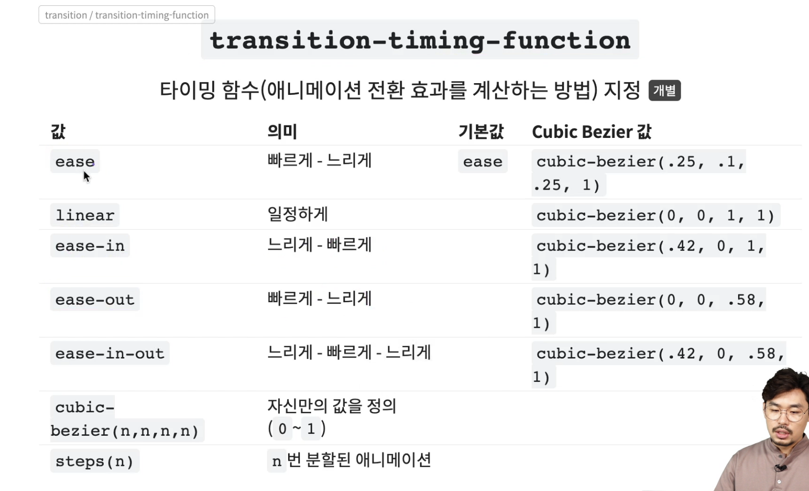
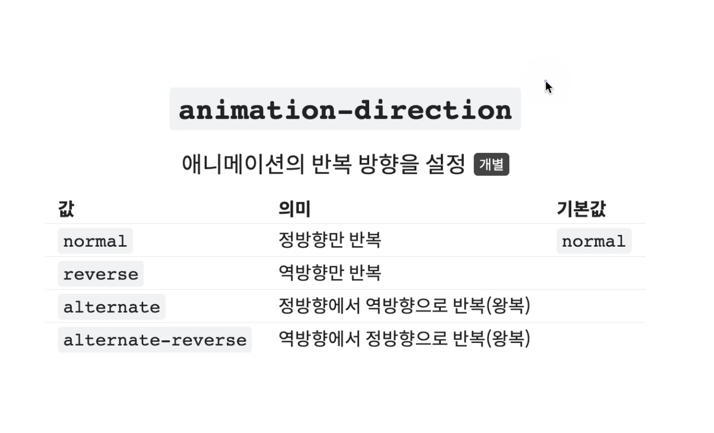
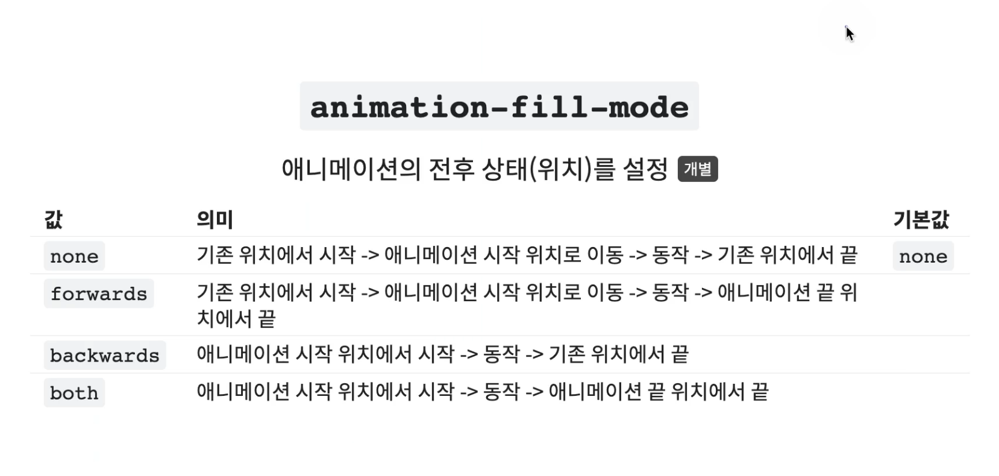
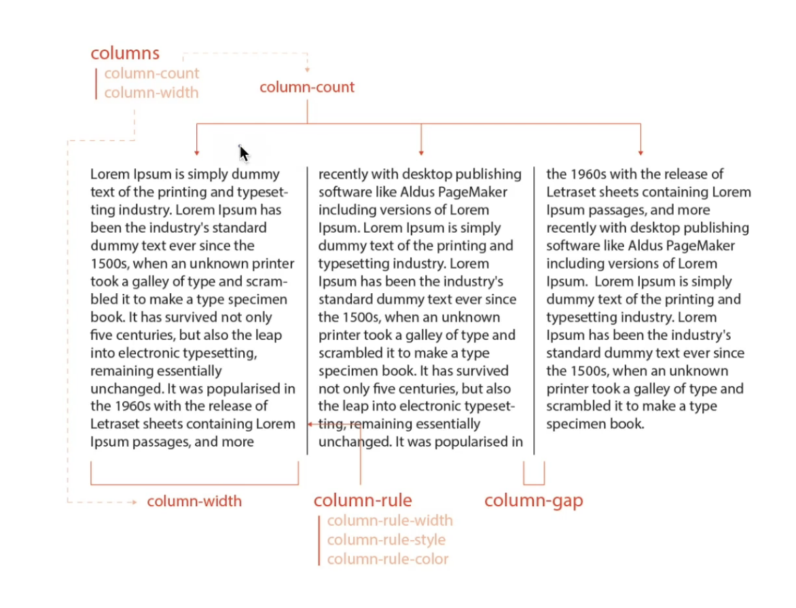
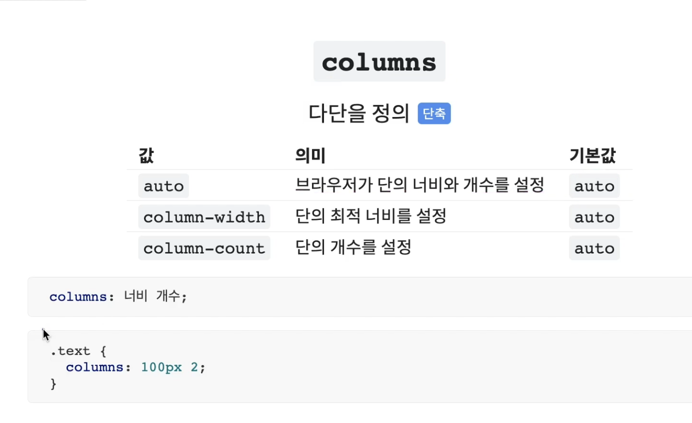
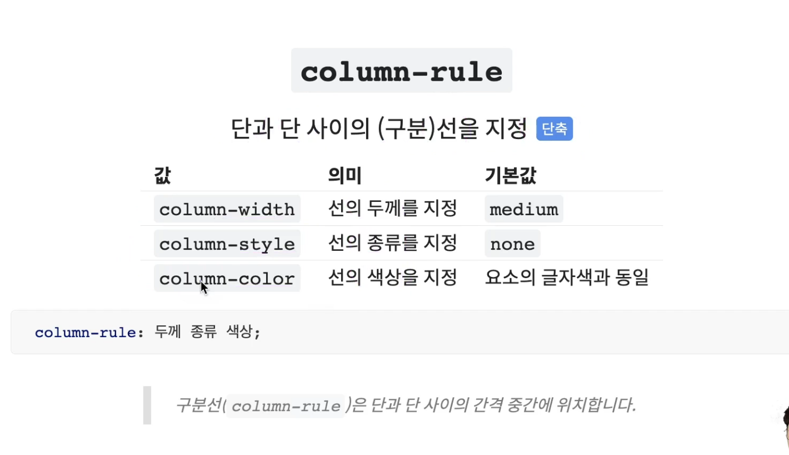

<br/>


## **animation**
- 요소의 애니메이션을 설정/제어



```css
.box {
    animation : 애니메이션이름 지속시간 [타이밍함수 대기시간 반복횟수 반복방향 전후상태 재생/정지];

    width : 100px;
    height : 100px;
    background : tomato;
    animation : hello 2s linear infinite alternate;
}
@keyframes hello {
    0% { width : 100px; }
    100% { width : 500px; }
}
```

<br/>


## **@keyframes**
- 2개 이상의 애니메이션 중간 상태(프레임)를 지정
- `transition` 사용 시에는 전, 후 상태 즉, `0%, 100%` 만 지정하는 것과 동일합니다.
- `@keyframes` 사용 시에는 중간에 다양한 단계의 애니메이션을 추가할 수 있습니다.



```css
@keyframes 애니메이션이름 {
    0% { 속성 : 값; }
    50% { 속성 : 값; }
    100% { 속성 : 값; }
}
```


<br/>


## **animation-name**
- `@keyframes` 규칙(애니메이션 프레임)의 이름을 지정,연결

<br/>


## **animation-duration**
- 애니메이션의 `지속시간` 을 설정

<br/>


## **animation-timing-function**
- 타이밍 함수(애니메이션 효과를 계산하는 방법) 지정
- `transition` 의 `timing-function` 과 동일합니다.



<br/>


## **animation-delay**
- 애니메이션의 `대기` 시간 설정
- 음수 값이 허용됩니다.
- 음수 값을 사용하게 되면 그만큼 애니메이션이 앞서 시작됩니다.
- `animation-duration : 3s, animation-delay : -1s` 인 경우 앞의 1초는 생략되고 원래 애니메이션의 `1s` 인 시점부터 `2s` 만큼만 동작합니다.

<br/>


## **animation-iteration-count**
- 애니메이션의 반복 횟수를 설정
- `반복 횟수(숫자)` or `무한 반복(infinite)` 값으로 조절

<br/>


## **animation-direction**
- 애니메이션의 반복 방향을 설정
- `alternate, alternate-reverse` 는 왕복 동작 이므로 2회의 동작으로 적용됩니다.



<br/>


## **animation-fill-mode**
- 애니메이션의 전, 후 상태(위치)를 설정



<br/>


## **animation-play-state**
- 애니메이션의 재생과 정지를 설정
- `running` : 애니메이션을 동작
- `paused` : 애니메이션 동작을 정지

<br/>


## **Multi-Columns**
- 일반 블록 레이아웃을 확장하여 여러 텍스트 다단으로 쉽게 정리하며, 가독성 확보


<br/>

### **columns**
- 다단을 정의



<br/>

### **column-width**
- 단의 최적 너비를 설정
- 요소의 너비가 가변하여 하나의 단이 `column-width` 로 설정한 최적 너비 보다 줄어들 경우 `단의 개수가 조정됩니다`.

<br/>

### **column-count**
- 단의 개수를 설정

<br/>

### **column-gap**
- 단과 단 사이의 간격 설정

<br/>

### **column-rule**
- 단과 단 사이의 선(구분)을 지정
- `comlumn-rule-width` : 선의 두께를 지정
- `comlumn-rule-style` : 선의 종류를 지정
- `comlumn-rule-color` : 선의 색상을 지정
- `comlumn-rule-color` 선의 색상의 기본 값은 요소의 글자 색에 영향을 받습니다. (요소의 글자색을 기본 값으로 갖습니다)

