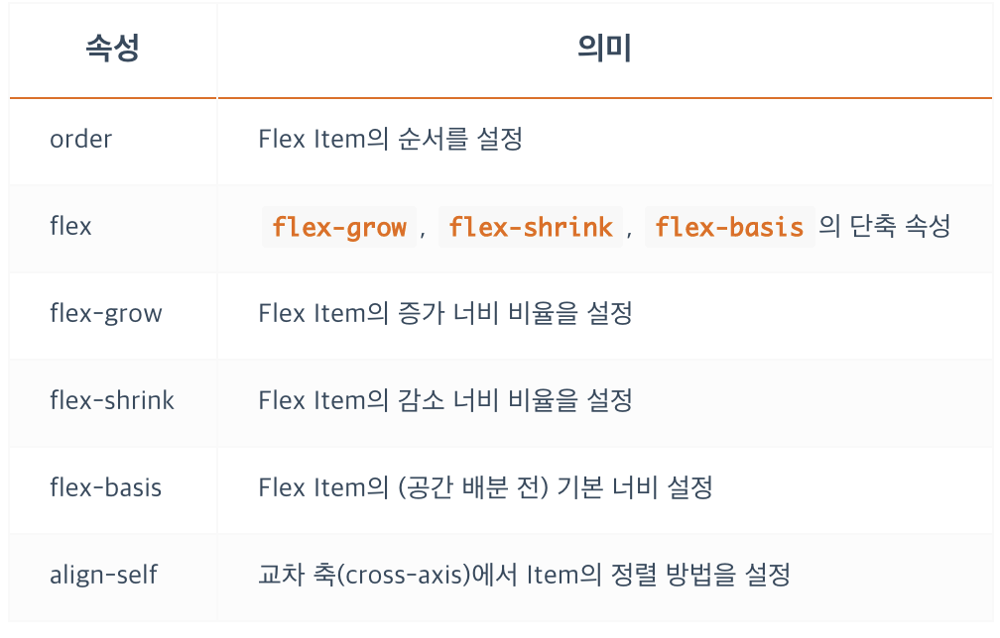

<br/>


## **flex 개요**

### **수평 구조를 만들 때 속성이 명확하지 않았기 때문에, 많은 경우 `<table>`나 `float` 혹은 `inline-block` 등의 도움을 받았습니다.**
<br/>

### **이제 우리는 Flex(Flexible Box)라는 명확한 개념(속성들)으로 레이아웃을 쉽게 구성할 수 있습니다.**
<br/>


- 우선 Flex는 2개의 개념으로 나뉩니다.
- 첫 번째는 `Container` 두 번째는 `Items` 입니다.
- 위에서 살펴본 바와 같이 Container는 Items를 감싸는 부모 요소이며, 각 Item을 정렬하기 위해선 `Container가 필수입니다.`


<br/>


## **flex container**
- Flex Container를 위한 속성들은 다음과 같습니다.


<br/>


## **flex container - `display`**
- 내부 `items` 에게는 영향을 주지 않고, container가 block 처럼 쌓일 것 인지 inline 처럼 쌓일 것인지 설정합니다.
- `display: flex;` 로 지정된 Flex Container는 Block 요소와 같은 성향(수직 쌓임)을 가지며,
- `display: inline-flex;` 로 지정된 Flex Container는 Inline(Inline Block) 요소와 같은 성향(수평 쌓임)을 가집니다.


<br/>


## **flex container - `flex-flow`**
- `flex-direction` 과 `flex-wrap` 의 단축속성 입니다.

```css
.flex-container {
  flex-flow: flex-direction flex-wrap;

  flex-flow: row-reverse wrap;
}
```

<br/>


## **flex container - `flex-direction`**
- Items의 주 축(main-axis)을 설정합니다.


<br/>


## **flex container - `주 축(main-axis), 교차 축(cross-axis)`**
- 값 row는 Items를 수평축으로 표시하므로 이때는 주 축이 수평이며 교차 축은 수직이 됩니다.
- 값 column은 Items를 수직축으로 표시하므로 주 축은 수직이며 교차 축은 수평이 됩니다.
- 방향(수평, 수직)에 따라 주 축과 교차 축이 달라집니다.


<br/>


## **flex container - `시작점(flex-start), 끝점(flex-end)`**
- 이는 주 축이나 교차 축의 시작하는 지점과 끝나는 지점을 지칭합니다.
- 방향에 따라 시작점과 끝점이 달라집니다.

### **`main-axis`**


### **`cross-axis`**


<br/>


## **flex container - `flex-wrap`**
- Items의 여러 줄 묶음(줄 바꿈)을 설정합니다.
- 기본적으로 Items는 한 줄에서만 표시되고 줄 바꿈 되지 않습니다.
- 이는 지정된 크기(주 축에 따라 width나 height)를 무시하고 한 줄 안에서만 가변합니다.
- Items 의 너비는 container 의 너비에 따라서 가변할 수 있습니다.
- Items를 줄 바꿈 하려면 값으로 wrap을 사용해야 합니다.


<br/>


## **flex container - `justify-content`**
- 주 축(main-axis)의 정렬 방법을 설정합니다.
- `space-between` 은 첫 번째, 마지막 item을 각각 시작점, 끝점에 붙이고 남은 여백을 균등하게 분배 해서 정렬합니다.
- `space-around` 은 container 한 줄에 남게되는 여백을 각각의 item들의 왼쪽과 오른쪽에 균등하게 분배 해서 정렬합니다.


<br/>


## **flex container - `align-content`**
- 교차 축(cross-axis)의 정렬 방법을 설정합니다.
- 주의할 점은 flex-wrap 속성을 통해 Items가 여러 줄(2줄 이상)이고 여백이 있을 경우만 사용할 수 있습니다.
- Items가 한 줄일 경우 `align-items` 속성을 사용하세요.
- 값 `stretch` 는 교차 축에 해당하는 `너비(속성 width 혹은 height)` 가 값이 `auto(기본값)` 일 경우 교차 축을 채우기 위해 자동으로 늘어납니다.


<br/>


## **flex container - `align-items`**
- 교차 축(cross-axis)에서 Items의 정렬 방법을 설정합니다.
- Items가 한 줄일 경우 많이 사용합니다.
- 주의할 점은 Items가 flex-wrap을 통해 여러 줄(2줄 이상)일 경우에는 align-content 속성이 우선합니다. 따라서 align-items를 사용하려면 align-content 속성을 기본값(stretch)으로 설정해야 합니다.


<br/>


## **flex items**
- Flex Items를 위한 속성들은 다음과 같습니다.



<br/>


## **flex items - `order`**
- Item의 순서를 설정합니다.
- Item에 숫자를 지정하고 숫자가 클수록 순서가 밀립니다.
- 음수가 허용됩니다.
- HTML 구조와 상관없이 순서를 변경할 수 있기 때문에 유용합니다.


<br/>


## **flex items - `flex-grow`**
- Item의 증가 너비 비율을 설정합니다.
- 숫자가 크면 더 많은 너비를 가집니다.
- Item이 가변 너비가 아니거나, 값이 0일 경우 효과가 없습니다.
- 기본 값은 `0` 입니다.
- 전체 container 의 너비를 알지 못하더라도, `flex-grow` 를 통하여 너비 비율을 설정해서 출력할 수 있습니다.


<br/>


## **flex items - `flex-shrink`**
- Item이 감소하는 너비의 비율을 설정합니다.
- 숫자가 크면 더 많은 너비가 감소합니다.
- Item이 가변 너비가 아니거나, 값이 0일 경우 효과가 없습니다.
- 기본 값은 `1` 입니다.
- 감소 너비(flex-shrink)는 요소의 너비에 영향을 받기 때문에 계산하기 까다롭습니다. 영향을 받는다는 요소의 너비는 width, height, flex-basis 등으로 너비가 지정된 경우를 의미합니다. Container의 너비가 줄어 Items의 너비에 영향을 미칠 경우, 영향을 미치기 시작한 지점부터 줄어든 거리 만큼 감소 너비 비율에 맞게 Item의 너비가 줄어듭니다.


<br/>


## **flex items - `flex-basis`**
- Item의 (공간 배분 전) 기본 너비를 설정합니다.
- 값이 auto일 경우 width, height 등의 속성으로 Item의 너비를 설정할 수 있습니다. 하지만 단위 값이 주어질 경우 설정할 수 없습니다.
- 기본 값은 `auto` 입니다.


<br/>


## **flex items - `flex`**
- Item의 너비(증가, 감소, 기본)를 설정하는 단축 속성입니다.
- 주의할점은 단축속성 사용 시, 명시적으로 `flex-basis` 값을 정의하지 않으면, 개별속성 사용과 다르게 기본 값으로 `0` 이 들어가게 됩니다.
(개별속성 사용 시 기본 값은 `auto`)


```css
.item {
  flex: 증가너비 감소너비 기본너비;


  flex: 1 1 20px;  /* 증가너비 감소너비 기본너비 */
  flex: 1 1;  /* 증가너비 감소너비  flex-basis 값으로 0 설정*/
  flex: 1 20px;  /* 증가너비 기본너비 (단위를 사용하면 flex-basis가 적용됩니다) */
}
```

<br/>


## **flex items - `align-self`**
- 교차 축(cross-axis)에서 개별 Item의 정렬 방법을 설정합니다.
- `align-items` 는 Container 내 모든 Items의 정렬 방법을 설정합니다.
필요에 의해 일부 Item만 정렬 방법을 변경하려고 할 경우 `align-self` 를 사용할 수 있습니다.
- 이 속성은 `align-items 속성보다 우선합니다.`


