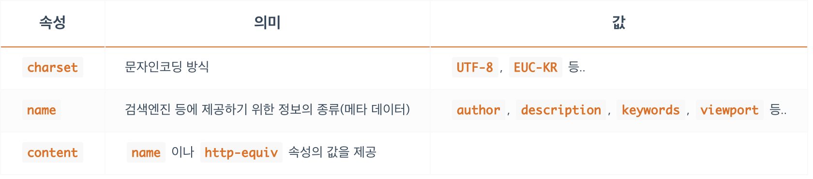
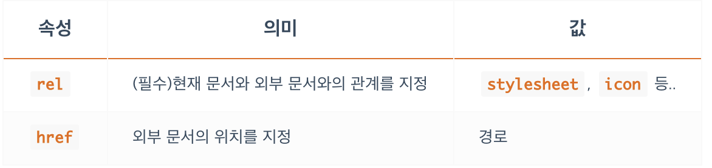
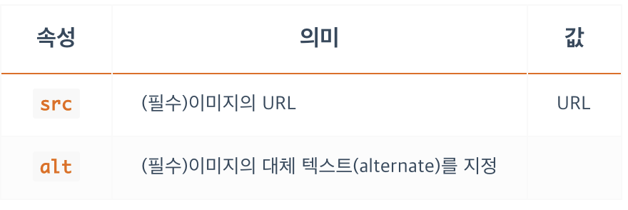

## **HTML**
---
### **태그**
태그는 각자의 의미를 가지고 있으며 다음과 같은 형태를 가집니다.
```html
<TAG></TAG>
<TAG>CONTENT</TAG>
```

또한 태그는 열리고(open) 닫히는(close) 태그 구조를 가지고 있으며 이는 한 쌍입니다.
(시작하고(start) 종료되는(end) 구조라고 부르기도 합니다)
이 구조는 태그의 범위를 만들어 줍니다.

태그와 CONTENT를 모두 포함하여 요소(Element) 라고 부릅니다.
<br/><br/>

### **부모와 자식 요소**
태그A가 태그B의 콘텐츠로 사용되면, 태그B는 태그A의 부모 요소, 태그A는 태그B의 자식 요소라고 합니다.
```html
<PARENT>
  <CHILD></CHILD>
</PARENT>
```
자식의 자식 등과 같이 자식의 이하 요소들을 후손 혹은 자손 혹은 하위요소 라고 부릅니다.

부모의 부모 등과 같이 부모의 이상 요소들은 조상 혹은 상위요소 라고 부릅니다.
<br/><br/>

### **빈 태그**
```html
<!-- `/`가 없는 빈 태그 -->
<TAG>

<!-- `/`가 있는 빈 태그 -->
<TAG/>
<TAG />
```
HTML5에서는 위 2가지 형태를 다 사용할 수 있습니다.
혼용 하여서만 사용하지 않으면 문제가 되지 않습니다.

빈 태그는 대부분의 경우에 속성과, 값이 사용됩니다.
<br/><br/><br/>

## **HTML 문서의 범위**
---
```html
<!DOCTYPE html>
<html>
  <head>
    문서의 정보
  </head>
  <body>
    문서의 구조
  </body>
</html>
```
<br/><br/>
### **html 태그**
- `<html>` 는 HTML 문서의 전체 범위를 지정합니다.
웹 브라우저가 해석해야 할 HTML 문서가 어디에서 시작하며, 어디에서 끝나는지 알려주는 역할을 합니다.
- 전체 범위

### **head 태그**
- 웹 브라우저가 해석해야 할 HTML 문서의 정보 범위를 지정합니다.
여기서 말하는 정보에는 웹 페이지의 제목, 웹 페이지의 문자 인코딩 방식, 연결할 외부 파일의 위치, 웹 페이지를 구조화하기 위한 기본 세팅 값 같은 것들을 말합니다.
다르게는 ‘화면을 구성하기 위한 기본 설정’이라고 표현할 수 있습니다
- 정보 범위

### **body 태그**
- 웹 브라우저가 해석해야 할 HTML 문서의 구조 범위를 지정합니다.
구조는 사용자가 화면을 통해서 볼 수 있는 내용(콘텐츠)의 형태나 레이아웃 등을 의미하며 로고, 헤더, 푸터, 내비게이션, 메뉴, 버튼, 입력창, 팝업, 광고 등 보이는 모든 것들이 구조에 해당합니다.
구조는 BODY 범위 안에서만 생성합니다.
- 구조 범위

### **DOCTYPE**
- DOCTYPE(DTD, Document Type Definition)은 마크업 언어에서 문서 형식을 정의합니다.
이는 웹 브라우저에 우리가 제공할 HTML 문서를 어떤 HTML 버전의 해석 방식으로 구조화하면 되는지를 알려줍니다.
(HTML은 크게 1, 2, 3, 4, X-, 5 버전이 있습니다)
현재의 표준 모드는 HTML5 입니다.
- 버전 지정


<br/><br/>
## **head 태그(title, meta, link, style, script)**
---
### **title**
- 웹 페이지의 제목
- HTML 문서의 제목을 정의합니다.
웹 브라우저의 각 사이트 탭에서 이름으로 표시됩니다.

### **meta**
- 웹 페이지의 정보
- HTML 문서(웹페이지)에 관한 정보(표시 방식, 제작자(소유자), 내용, 키워드 등)를 검색엔진이나 브라우저에 제공합니다.
- 빈(Empty) 태그입니다.



### **link**
- 외부 문서를 연결할 때 사용. 대표적으로 css문서를 가지고 온다.
- 특히 HTML 외부에서 작성된 CSS 문서(xxx.css 파일)를 불러와 연결할 때 사용합니다.
- 빈(Empty) 태그입니다.
- rel 속성은 **필수!!** 입니다.



### **style**
- CSS 작성하기.
- CSS를 외부 문서에서 작성하여 연결하는 것이 아니고 HTML 문서 내부에 작성할 때 사용합니다.

### **script**
- JS 불러오거나 작성하기.
- CSS의 경우 불러오는것은 `<link>`를 통해서, 직접 작성은 `<style>`을 통해서 했지만 JS는 `<script>`를 통해서 두가지 경우 모두 가능하다.

<br/><br/>
## **body 태그(div, img)**
---
### **div**
- 막쓰는 태그
- `<div></div>`의 ‘div’는 ‘division’으로 약자로 ‘분할’을 뜻하고 ‘문서의 부분이나 섹션을 정의’합니다.
명확한 의미를 가지지 않기 때문에 정말 많은 경우 단순히 특정 범위를 묶는(wrap) 용도로 사용합니다.
보통 이렇게 묶인 부분들에 CSS나 JS를 적용하게 됩니다.
- 아무런 의미가 없이 묶는 이유는 나중에 JS, CSS 를 가지고 동작을 제어하거나, 예쁘게 꾸미기 위해 묶습니다.

### **img**
- ``는 HTML에 이미지를 삽입할 때 사용합니다.
(웹 페이지에 이미지를 삽입하는 방식은 크게 2가지로, ‘HTML에서 삽입(IMG)’과 ‘CSS에서 삽입(background)’이 있습니다)
- src, alt 는 필수 속성 입니다.
