<br/>


## **grid 개요**
- CSS Grid(그리드)는 2차원(행과 열)의 레이아웃 시스템을 제공합니다.
- Flexible Box도 훌륭하지만 비교적 단순한 1차원 레이아웃을 위하며, 좀 더 복잡한 레이아웃을 위해 우리는 CSS Grid를 사용할 수 있습니다.
- `CSS Grid` 는 예전부터 `핵(Hack)` 으로 불린 다양한 레이아웃 대체 방식들을 해결하기 위해 만들어진 특별한 `CSS 모듈` 입니다.
- `CSS Grid` 는 `CSS Flex` 와 같이 `Container(컨테이너)` 와 `Item(아이템)` 이라는 두 가지 개념으로 구분되어 있습니다.
- Container는 Items를 감싸는 부모 요소이며, 그 안에서 각 Item을 배치할 수 있습니다.


<br/>


## **grid container**
- Grid Container를 위한 속성들은 다음과 같습니다.

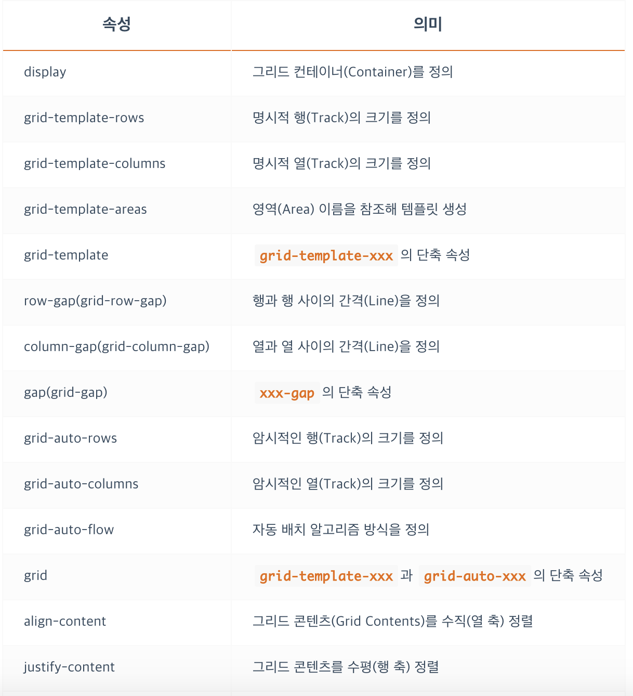
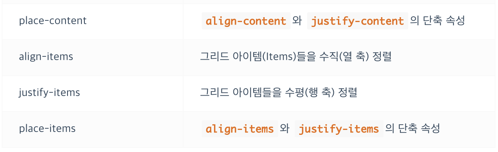

<br/>


## **grid container - `display`**
- Grid Container(컨테이너)를 정의합니다.
- 정의된 컨테이너의 자식 요소들은 자동으로 Grid Items(아이템)로 정의됩니다.
- 그리드를 사용하기 위해 컨테이너에 필수로 작성합니다!

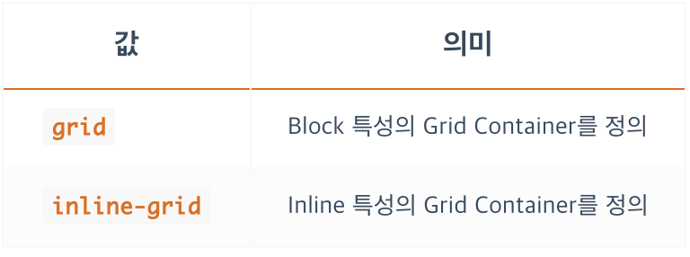

<br/>


## **grid container - `grid-template-rows`**
- 명시적 행(Track)의 크기를 정의합니다.
- 동시에 라인(Line)의 이름도 정의할 수 있습니다.
- 라인의 이름엔 `' '`, `" "` 가 들어가지 않습니다.
- 각 라인은 행(Row, Track)과 열(Column, Track)의 개수대로 숫자(양수/음수) 라인 이름이 자동으로, 지정되어 있어서, 꼭 필요한 경우가 아니면 라인 이름을 정의할 필요가 없습니다.
- `fr(fraction, 공간 비율)` 단위를 사용할 수 있습니다.
- `repeat()` 함수를 사용할 수 있습니다.
- 사용 방법은 `grid-template-columns`와 같습니다

<br/>


## **grid container - `grid-template-columns`**
- 명시적 열(Track)의 크기를 정의합니다.
- 동시에 라인(Line)의 이름도 정의할 수 있습니다.
- 라인의 이름엔 `' '`, `" "` 가 들어가지 않습니다.
- 각 라인은 행(Row, Track)과 열(Column, Track)의 개수대로 숫자(양수/음수) 라인 이름이 자동으로 지정되어 있어서, 꼭 필요한 경우가 아니면 라인 이름을 정의할 필요가 없습니다.
- `fr(fraction, 공간 비율)` 단위를 사용할 수 있습니다.
- `repeat()` 함수를 사용할 수 있습니다.

```css
.container {
  display: grid;
  grid-template-columns: 1열크기 2열크기 ...;
  grid-template-columns: [선이름] 1열크기 [선이름] 2열크기 [선이름] ...;
}

/* 각 열의 크기를 정의합니다. */
.container {
  grid-template-columns: 100px 200px;
}
/* 동시에 각 라인의 이름도 정의할 수 있습니다. */
.container {
  grid-template-columns: [first] 100px [second] 200px [third];
}
/* 라인에 중복된 이름을 지정할 수 있습니다. */
.container {
  grid-template-columns: [col1-start] 100px [col1-end col2-start] 200px [col2-end];
}
```
```css
.container {
  width: 1200px;
  grid-template-columns: 100px 100px 100px 100px 100px 100px 100px 100px 100px 100px 100px 100px;
}

/* repeat() 함수를 사용하면 위 내용을 다음과 같이 간소화할 수 있습니다. */

.container {
  width: 1200px;
  grid-template-columns: repeat(12, 100px);
}

.container {
  grid-template-columns: repeat(4, 100px 200px 50px);
  /* grid-template-columns: 100px 200px 50px 100px 200px 50px 100px 200px 50px 100px 200px 50px; */
}

.container {
  grid-template-columns: repeat(4, 1fr 2fr 3fr);
  /* grid-template-columns: 1fr 2fr 3fr 1fr 2fr 3fr 1fr 2fr 3fr 1fr 2fr 3fr; */
}
```

<br/>


## **grid container - `grid-template-areas`**
- 지정된 그리드 `영역 이름(grid-area)` 을 참조해 그리드 템플릿을 생성합니다.
- `grid-area` 는 Grid Container가 아닌 `Grid Item` 에 적용하는 속성입니다.
- `.(마침표)` 를 사용하거나 명시적으로 `none` 을 입력해 빈 영역을 정의할 수 있습니다.
```html
<div class="container">
  <div class="item">HEADER</div>
  <div class="item">MAIN</div>
  <div class="item">ASIDE</div>
  <div class="item">FOOTER</div>
</div>
```

### **`1`**
```css
.container {
  display: grid;
  grid-template-rows: repeat(3, 100px);
  grid-template-columns: repeat(3, 1fr);
  grid-template-areas:
    "header header header"
    "main main aside"
    "footer footer footer";
}
header { grid-area: header; }
main   { grid-area: main;   }
aside  { grid-area: aside;  }
footer { grid-area: footer; }
```
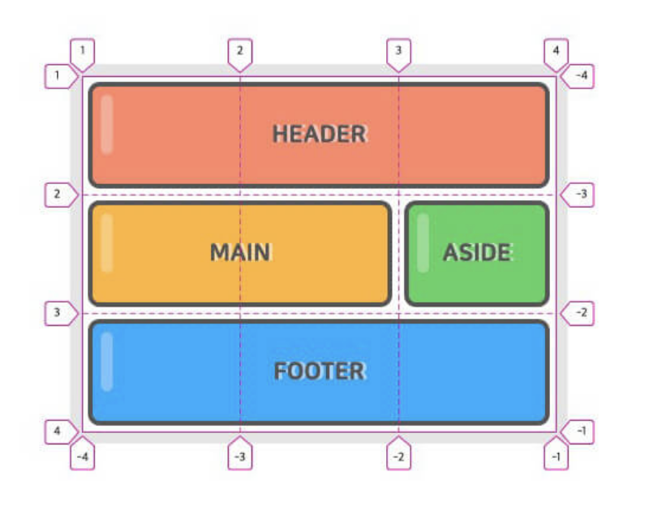

### **`2`**

```css
.container {
  display: grid;
  grid-template-rows: repeat(4, 100px);
  grid-template-columns: repeat(3, 1fr);
  grid-template-areas:
    "header header header"
    "main . ."
    "main . aside"
    "footer footer footer";
}
header { grid-area: header; }
main   { grid-area: main;   }
aside  { grid-area: aside;  }
footer { grid-area: footer; }
```
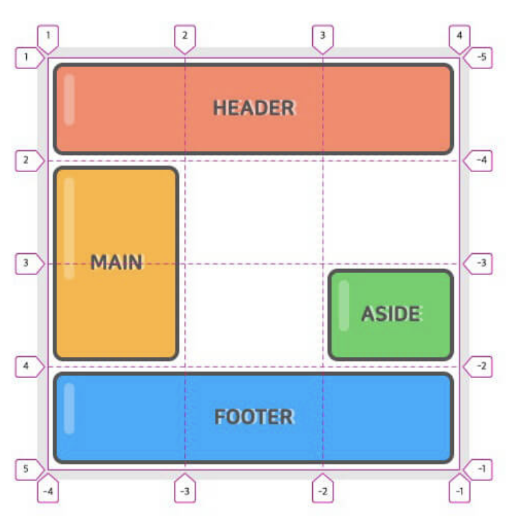

<br/>


## **grid container - `row-gap(grid-row-gap)`**
- 각 행과 행 사이의 간격(Gutter)을 지정합니다.
- 더 명확하게는 그리드 선(Grid Line)의 크기를 지정한다고 표현할 수 있습니다.

```css
.container {
  row-gap: 크기;
}
```

<br/>


## **grid container - `column-gap(grid-column-gap)`**
- 각 열과 열 사이의 간격(Gutter)을 지정합니다.

```css
.container {
  column-gap: 크기;
}
```

<br/>


## **grid container - `gap(grid-gap)`**
- 각 행과 행, 열과 열 사이의 간격(Gutter)을 지정합니다.
- `row-gap, column-gap` 을 사용하는 단축속성 입니다.

```css
.container {
  gap: <grid-row-gap> <grid-column-gap>;
}

.container {
  display: grid;
  grid-template-rows: repeat(2, 150px);
  grid-template-columns: repeat(3, 1fr);
  gap: 20px 10px;
}
/* 하나의 값으로 통일할 수 있습니다. */
.container {
  gap: 10px;  /* row-gap: 10px; + column-gap: 10px; */
}
/* 하나의 값만 적용하고자 한다면 다음과 같이 사용할 수 있습니다. */
.container {
  gap: 10px 0; /* row-gap */
  gap: 0 10px; /* column-gap */
}
```

### **`grid-gap`(`grid-row-gap, grid-column-gap`)의 접두사 `grid-`는 더 이상 사용되지 않으며, `gap(row-gap, column-gap)`로 교체되었습니다. 하지만 일부 버전의 브라우저 지원을 위해 `grid-` 접두사의 사용을 고려할 수 있습니다.**

<br/>


## **grid container - `grid-auto-rows`**
- `암시적 행(Track)` 의 크기를 정의합니다.
- 아이템(Item)이 `grid-template-rows` 로 정의한 명시적 행 외부에 배치되는 경우 암시적 행의 크기가 적용됩니다.
- 암시적 크기가 적용된 행과 열은 `양수 라인 번호` 만 사용할 수 있습니다.(음수 사용 불가)

```html
<div class="container">
  <div class="item">1</div>
  <div class="item">2</div>
  <div class="item">3</div>
</div>
```
```css
.container {
  width: 300px;
  height: 200px;
  display: grid;
  grid-template-rows: 100px 100px; /* 명시적 2개 행 정의 */
  grid-template-columns: 150px 150px; /* 명시적 2개 열 정의 */
  grid-auto-rows: 100px; /* 그 외(암시적) 행의 크기 정의 */
}
.item:nth-child(3) {
  grid-row: 3 / 4;
}
```
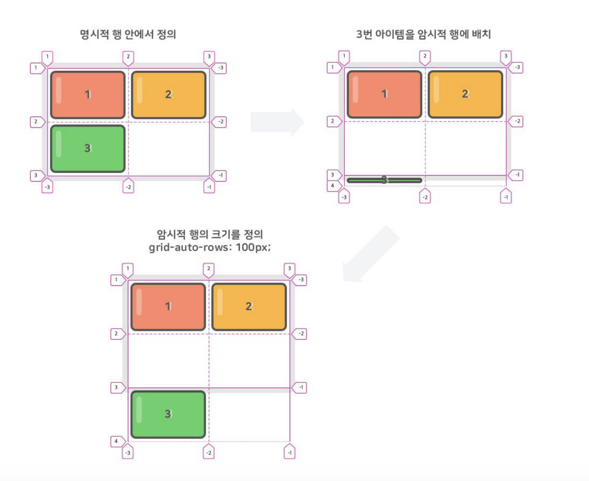

<br/>


## **grid container - `grid-auto-columns`**
- 암시적 열(Track)의 크기를 정의합니다.
- 아이템(Item)이 `grid-template-columns` 로 정의한 명시적 열 외부에 배치되는 경우 암시적 열의 크기가 적용됩니다.
- 암시적 크기가 적용된 행과 열은 `양수 라인 번호` 만 사용할 수 있습니다.(음수 사용 불가)

```css
.container {
  width: 300px;
  height: 200px;
  display: grid;
  grid-template-rows: 100px 100px;
  grid-template-columns: 150px 150px;
  grid-auto-rows: 100px;
  grid-auto-columns: 100px;
}
.item:nth-child(3) {
  grid-row: 3 / 4;
  grid-column: 3 / 4;
}
```
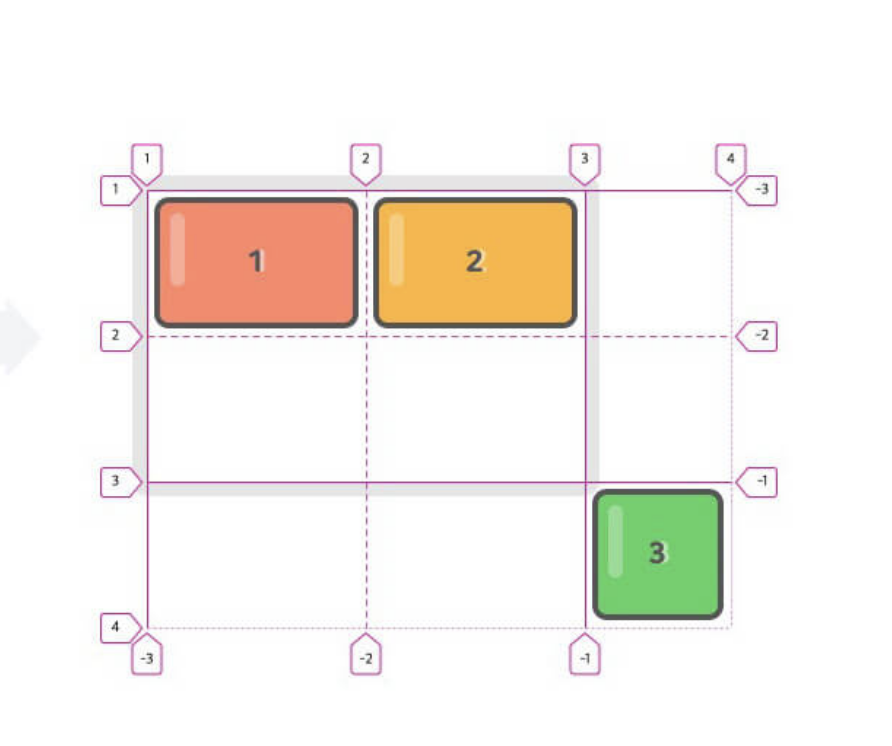

<br/>


## **grid container - `grid-auto-flow`**
- 배치하지 않은 아이템(Item)을 어떤 방식의 ‘자동 배치 알고리즘’으로 처리할지 정의합니다.
- 배치한 아이템은 `grid-area(이하 개별 속성 포함)` 를 사용한 아이템을 의미합니다.

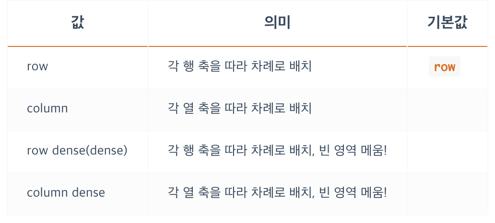

```css
/* For row & row dense */
.container {
  display: grid;
  grid-template-rows: repeat(3, 1fr);
  grid-template-columns: repeat(3, 1fr);
  grid-auto-flow: row || row dense || dense;
}
.item:nth-child(2) {
  grid-column: span 3;
}
```
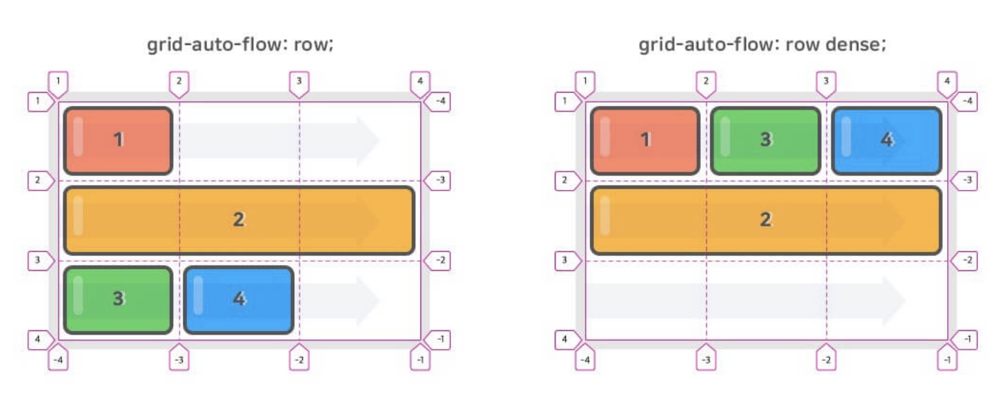

```css
/* For column & column dense */
.container {
  display: grid;
  grid-template-rows: repeat(3, 1fr);
  grid-template-columns: repeat(3, 1fr);
  grid-auto-flow: column || column dense;
}
.item:nth-child(1) {
  grid-column: 2 / span 2;
}
.item:nth-child(2) {
  grid-column: span 2;
}
```
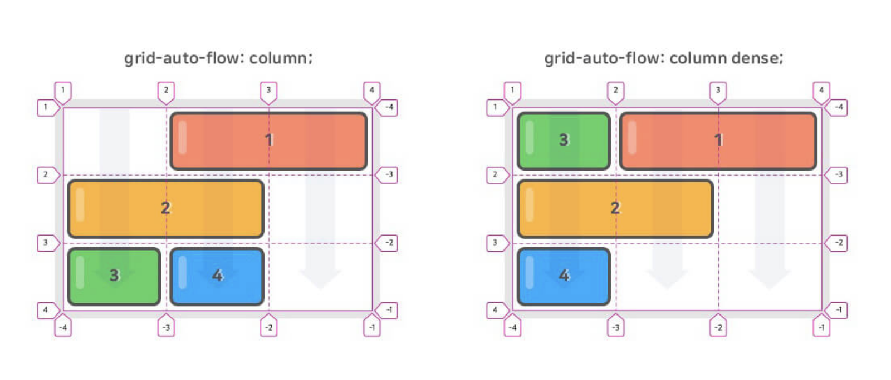

<br/>


## **grid container - `grid-template`**
- `grid-template-rows`, `grid-template-columns` 그리고 `grid-template-areas` 의 단축 속성입니다.

```css
/* 0 */
.container {
  grid-template: <grid-template-rows> / <grid-template-columns>;
  grid-template: <grid-template-areas>;
}
/* 1 */
.container {
  grid-template:
    [1행시작선이름] "AREAS" 행너비 [1행끝선이름]
    [2행시작선이름] "AREAS" 행너비 [2행끝선이름]
    / <grid-template-columns>;
}
/* 2 */
.container {
  display: grid;
  grid-template:
    "header header header" 80px
    "main main aside" 350px
    "footer footer footer" 130px
    / 2fr 100px 1fr;
}
header { grid-area: header; }
main   { grid-area: main; }
aside  { grid-area: aside; }
footer { grid-area: footer; }

/* 3 (2와 같은 결과)*/
.container {
  display: grid;
  grid-template-rows: 80px 350px 130px;
  grid-template-columns: 2fr 100px 1fr;
  grid-template-areas:
    "header header header"
    "main main aside"
    "footer footer footer";
}
```

<br/>


## **grid container - `grid`**
- `grid-template-xxx` 과 `grid-auto-xxx` 의 단축 속성입니다.

```css
/* 0 display-grid 생략!*/
.container {
  grid: <grid-template>;
  grid: <grid-template-rows> / <grid-auto-flow> <grid-auto-columns>;
  grid: <grid-auto-flow> <grid-auto-rows> / <grid-template-columns>;
}

/* 1 모두 같은 결과를 출력합니다.*/
.container {
  grid: <grid-template-rows> / <grid-template-columns>;
}
.container {
  grid: 100px 200px / 1fr 2fr;
}
.container {
  grid-template-rows: 100px 200px;
  grid-template-columns: 1fr 2fr;
}


/* 2 모두 같은 결과를 출력합니다. */
.container {
  grid: <grid-template>;
}
.container {
  grid:
    "header header header" 80px
    "main main aside" 350px
    "footer footer footer" 130px
    / 2fr 100px 1fr;
}
.container {
  grid-template:
    "header header header" 80px
    "main main aside" 350px
    "footer footer footer" 130px
    / 2fr 100px 1fr;
}


/* 3 모두 같은 결과를 출력합니다. */
.container {
  grid: <grid-template-rows> / <grid-auto-flow> <grid-auto-columns>;
}
.container {
  grid: 100px 100px / auto-flow 150px;
}
.container {
  grid-template-row: 100px 100px;
  grid-auto-flow: column;
  grid-auto-columns: 150px;
}


/* 4 모두 같은 결과를 출력합니다. */
.container {
  grid: <grid-auto-flow> <grid-auto-rows> / <grid-template-columns>;
}
.container {
  grid: auto-flow 150px / 100px 100px;
}
.container {
  grid-template-columns: 100px 100px;
  grid-auto-flow: row;
  grid-auto-rows: 150px;
}


/* 5 모두 같은 결과를 출력합니다. */
.container {
  grid: auto-flow dense 150px / 100px 100px;
}
.container {
  grid-template-columns: 100px 100px;
  grid-auto-flow: row dense;
  grid-auto-rows: 150px;
}

/* 4, 5 경우 단축속성에 포함되지 않은 grid-template-rows,columns 는 따로 설정해 주어야 합니다.  */
```

<br/>


## **grid container - `align-content`**
- 그리드 콘텐츠(Contents)를 수직(열 축) 정렬합니다.
- 그리드 콘텐츠의 세로 너비가 그리드 컨테이너(Container)보다 작아야 합니다.

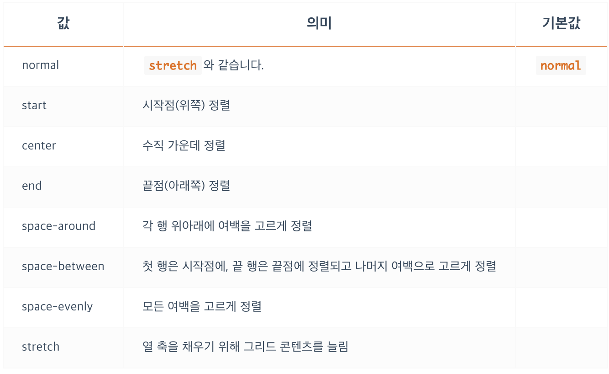

```css
.container {
  width: 450px;
  height: 450px;
  display: grid;
  grid-template-rows: repeat(3, 100px);
  grid-template-columns: repeat(3, 100px);
  align-content: <align-content>;
}
```

<br/>


## **grid container - `justify-content`**
- 그리드 콘텐츠(Contents)를 수평(행 축) 정렬합니다.
- 그리드 콘텐츠의 가로 너비가 그리드 컨테이너(Container)보다 작아야 합니다.

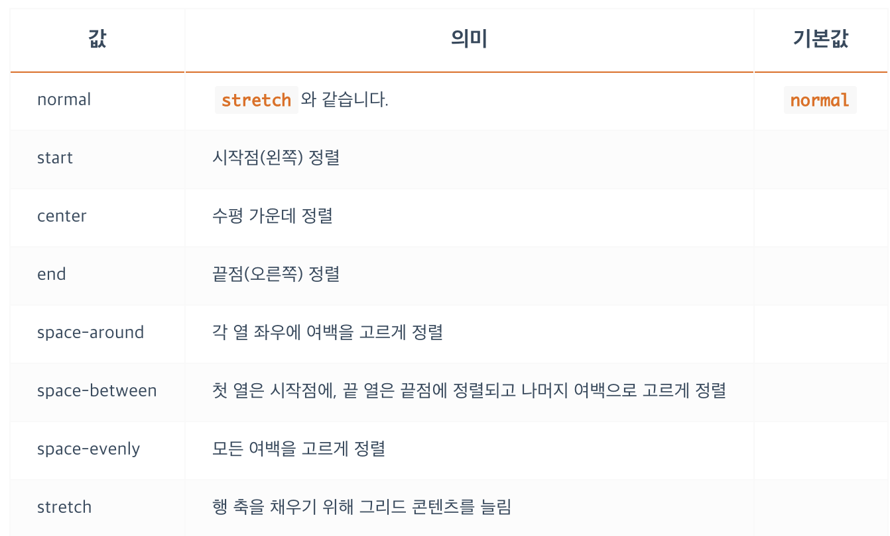
```css
.container {
  width: 450px;
  height: 450px;
  display: grid;
  grid-template-rows: repeat(3, 100px);
  grid-template-columns: repeat(3, 100px);
  justify-content: <justify-content>;
}
```

<br/>


## **grid container - `align-items`**
- 그리드 아이템(Items)들을 각각의 칸 안에서 수직(열 축) 정렬합니다.
- 그리드 아이템의 세로 너비가 자신이 속한 그리드 행(Track)의 크기보다 작아야 합니다.

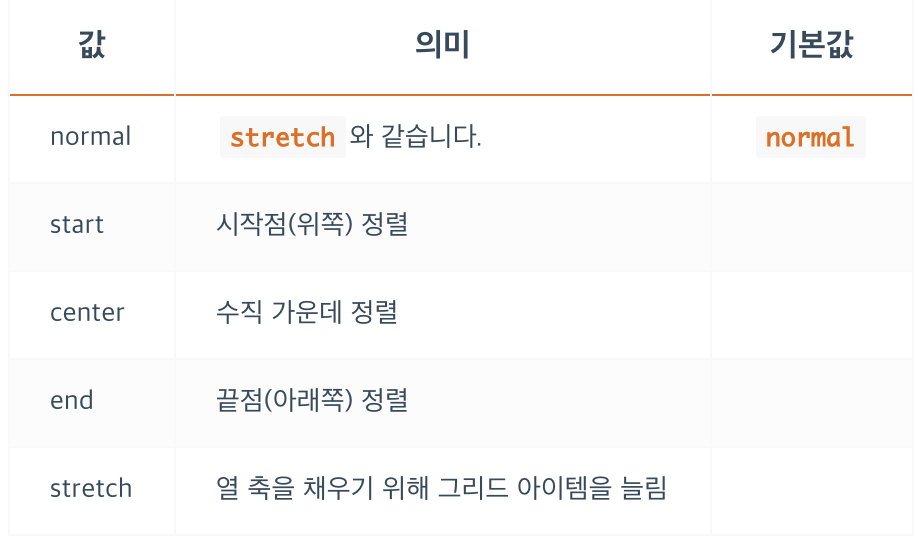
```css
.container {
  width: 450px;
  height: 450px;
  display: grid;
  grid-template-rows: repeat(3, 1fr);
  grid-template-columns: repeat(3, 1fr);
  align-items: <align-items>;
}
```

<br/>


## **grid container - `justify-items`**
- 그리드 아이템(Items)들을 각각의 칸 안에서 수평(행 축) 정렬합니다.
- 그리드 아이템의 가로 너비가 자신이 속한 그리드 열(Track)의 크기보다 작아야 합니다.

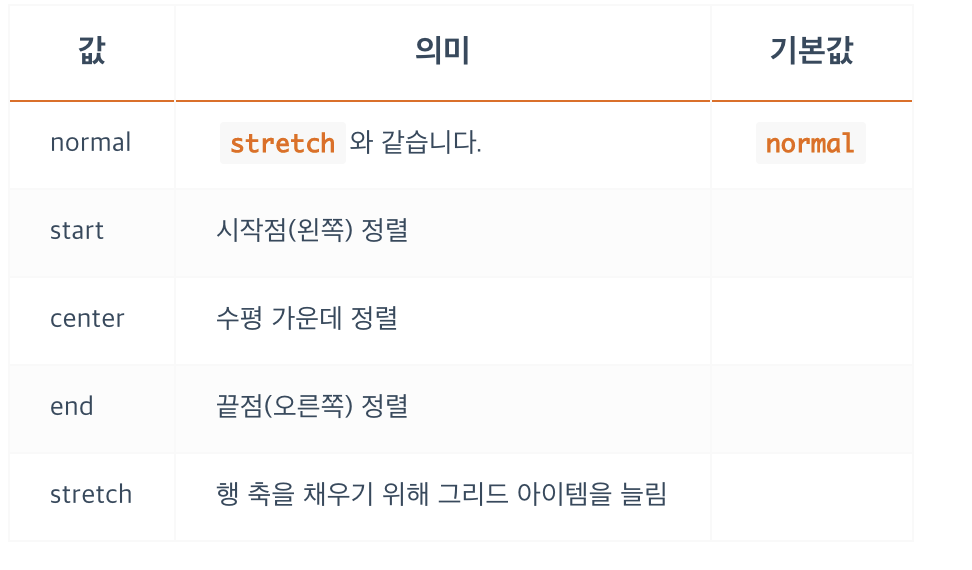

```css
.container {
  width: 450px;
  height: 450px;
  display: grid;
  grid-template-rows: repeat(3, 1fr);
  grid-template-columns: repeat(3, 1fr);
  justify-items: <justify-items>;
}
```

<br/>


## **grid item**
- Grid Item을 위한 속성들은 다음과 같습니다.

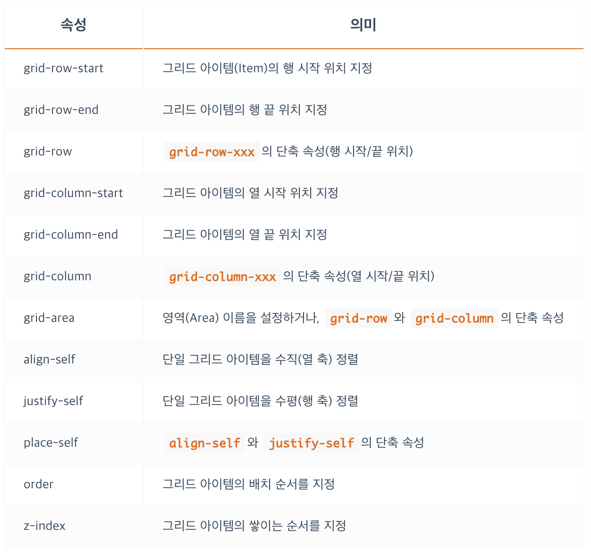

<br/>


## **grid item - `grid-row`**
- `grid-row-start` 과 `grid-row-end` 의 단축 속성입니다.
- 각 속성을 /로 구분하는 것에 주의하세요.
- 아이템의 위치를 원하는 행에 배치할 수 있습니다.
- `grid-row-end` 에 설정하는 `span x` 값은 `grid-row-start` 값으로 부터 `x` 만큼 늘린다는 의미 입니다.
- `grid-row-start` 에 설정하는 `span x` 값은 `grid-row-end` 값으로 부터 `x` 만큼 줄인다는 의미 입니다.

```css
/* 0 */
.item {
  grid-row: <grid-row-start> / <grid-row-end>;
}


/* 1 모두 같은 결과를 출력합니다. */
.item {
  grid-row-start: 1;
  grid-row-end: 2;
}
.item {
  grid-row: 1 / 2;
}


/* 2 모두 같은 결과를 출력합니다. */
.item {
  grid-row-start: 2;
  grid-row-end: span 3;
}
.item {
  grid-row: 2 / span 3;
}
.item {
  grid-row: 2 / 5;
}


/* 3 모두 같은 결과를 출력합니다. */
.item {
  grid-row-start: span 3;
  grid-row-end: 4;
}
.item {
  grid-row: span 3 / 4;
}
.item {
  grid-row: 1 / 4;
}
```

<br/>


## **grid item - `grid-column`**
- `grid-column-start` 과 `grid-column-end` 의 단축 속성입니다.
- 각 속성을 /로 구분하는 것에 주의하세요.
- 아이템의 위치를 원하는 열에 배치할 수 있습니다.
- `grid-column-end` 에 설정하는 `span x` 값은 `grid-column-start` 값으로 부터 `x` 만큼 늘린다는 의미 입니다.
- `grid-column-start` 에 설정하는 `span x` 값은 `grid-column-end` 값으로 부터 `x` 만큼 줄인다는 의미 입니다.

```css
/* 0 */
.item {
  grid-column: <grid-column-start> / <grid-column-end>;
}


/* 1 모두 같은 결과를 출력합니다. */
.item {
  grid-column-start: -1;
  grid-column-end: -3;
}
.item {
  grid-column: -1 / -3;
}
.item {
  /* Column -1번에서 -3번(-1-2=-3)까지 */
  grid-column: span 2 / -1;
}


/* 2 모두 같은 결과를 출력합니다. */
.item {
  grid-column-start: 2;
  grid-column-end: -1;
}
.item {
  /* Column 2번에서 끝(-1번)까지 */
  grid-column: 2 / -1;
}
```

<br/>


## **grid item - `grid-area`**
- `grid-row-start`, `grid-column-start`, `grid-row-end` 그리고 `grid-column-end` 의 단축 속성입니다.
- 혹은 `grid-template-areas` 가 참조할 영역(Area) 이름을 설정할 수도 있습니다.
- 영역 이름을 설정할 경우 `grid-row와 grid-column` 개념은 `무시됩니다.`
- 단축속성 사용 시 `시작 / 시작 / 끝 / 끝` 임에 주의합시다!
```css
/* 0 */
.item {
  grid-area: <grid-row-start> / <grid-column-start> / <grid-row-end> / <grid-column-end>;
  grid-area: 영역이름;
}

/* 1 모두 같은 결과를 출력합니다. */
.item {
  grid-row: 2 / 3;
  grid-column: span 2 / -1;
}
.item {
  /* '시작 / 시작 / 끝 / 끝'임에 주의합시다! */
  grid-area: 2 / span 2 / 3 / -1;
}

/* 2 다음과 같이 영역 이름을 지정해 grid-template-areas에서 참조할 수 있습니다. */
header { grid-area: header; }
main { grid-area: main;   }
aside { grid-area: aside;  }
footer { grid-area: footer; }
```

<br/>


## **grid item - `align-self`**
- 단일 그리드 아이템(Item)을 수직(열 축) 정렬합니다.
- 그리드 아이템의 세로 너비가 자신이 속한 그리드 행(Track)의 크기보다 작아야 합니다.
- `container` 의 `align-items` 와 값이 동일하며, 개별적으로 특정 아이템만 따로 정의할 때 사용합니다.

<br/>


## **grid item - `justify-self`**
-단일 그리드 아이템(Item)을 수평(행 축) 정렬합니다.
- 그리드 아이템의 가로 너비가 자신이 속한 그리드 열(Track)의 크기보다 작아야 합니다.
- `container` 의 `justify-items` 와 값이 동일하며, 개별적으로 특정 아이템만 따로 정의할 때 사용합니다.

<br/>


## **grid item - `place-self`**
- `align-self` 와 `justify-self` 의 단축 속성입니다.
하나의 값만 입력하면 두 속성에 모두 적용됩니다.
- Edge(IE) 브라우저에서 지원하지 않는 속성입니다.

```css
/* 0 */
.item {
  place-self: <align-self> <justify-self>;
}


/* 1 모두 같은 결과를 출력합니다. */
.item {
  place-self: start end;
}
.item {
  align-self: start;
  justify-self: end;
}


/* 2 모두 같은 결과를 출력합니다. */
.item {
  place-self: center;
}
.item {
  align-self: center;
  justify-self: center;
}
```

<br/>


## **grid item - `order`**
- 그리드 아이템이 자동 배치되는 순서를 변경할 수 있습니다.
- 숫자가 작을수록 앞서 배치됩니다.

```css
.container {
  display: grid;
  grid-template-rows: repeat(2, 1fr);
  grid-template-columns: repeat(3, 1fr);
}
.item:nth-child(1) { order: 1; }
.item:nth-child(3) { order: 5; }
.item:nth-child(5) { order: -1; }
```
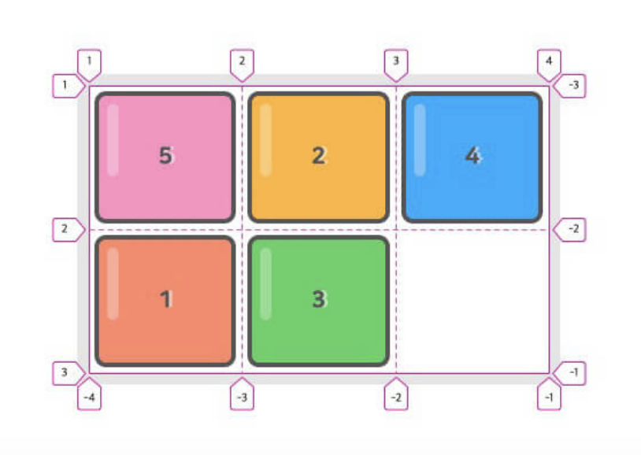

<br/>


## **grid item - `z-index`**
- `z-index` 속성을 이용해 아이템이 쌓이는 순서를 변경할 수 있습니다.

```css
.item:nth-child(1) {
  grid-area: 1 / 1 / 2 / 3;
}
.item:nth-child(2) {
  grid-area: 1 / 2 / 3 / 3;
  z-index: 1;
}
.item:nth-child(3) {
  grid-area: 2 / 2 / 3 / 4;
}
```

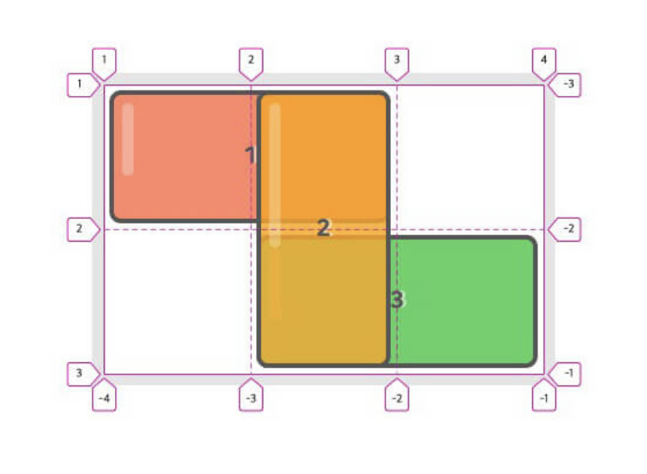

<br/>


## **grid function - `repeat`**
- `repeat()` 함수는 행/열(Track)의 크기 정의를 반복합니다.
- ‘반복되는 횟수’와 ‘행/열의 크기 정의’를 인수로 사용합니다.
- `grid-template-rows` 와 `grid-template-columns` 에서 사용합니다.

```css
/* 9컬럼 그리드 */
.container {
  grid-template-columns: 100px 100px 100px 100px 100px 100px 100px 100px 100px;
}
.container {
  grid-template-columns: repeat(9, 100px);
}


/* 12컬럼 그리드 */
.container {
  grid-template-columns: 1fr 2fr 1fr 2fr 1fr 2fr 1fr 2fr 1fr 2fr 1fr 2fr;
}
.container {
  grid-template-columns: repeat(6, 1fr 2fr);
}
```

<br/>


## **grid function - `minmax`**
- `minmax()` 함수는 행/열(Track)의 `최소/최대 크기` 를 정의합니다.
- 첫 번째 인수는 `최솟값` 이고 두 번째 인수는 `최댓값` 입니다.
- `grid-template-rows`, `grid-template-columns`, `grid-auto-rows` 그리고 `grid-auto-columns` 에서 사용합니다.
- 일반 요소에 `min-width와 max-width 속성` 을 동시 지정하는 것과 유사합니다.

```css
.container {
  grid-template-columns: minmax(100px, 1fr) minmax(200px, 1fr);
}
```

<br/>


## **grid function - `fit-content`**
- fit-content() 함수는 행/열(Track)의 크기를 그리드 아이템(Item)이 포함하는 내용(Contents) 크기에 맞춥니다.
- `내용의 최대 크기` 를 인수로 사용합니다. `minmax(auto, max-content)` 와 유사합니다.
- `내용 크기` 에 맞추지만 `fit-content()` 인수 값 보다 크다면, 인수 값의 크기에 맞춥니다.


<br/>


## **fr**
- fr(fractional unit)은 `사용 가능한 공간에 대한 비율` 을 의미합니다.

<br/>


## **min-content**
- 그리드 아이템이 포함하는 내용(Contents)의 최소 크기를 의미합니다.
- 한글을 사용하는 경우 `word-break: keep-all;` 를 설정하면 정상적으로 동작합니다.

<br/>


## **max-content**
- 그리드 아이템이 포함하는 내용(Contents)의 최대 크기를 의미합니다.

<br/>


## **auto-fill, auto-fit**
- 행/열(Track)의 개수를 그리드 컨테이너(Container) 및 행/열 크기에 맞게 `자동으로(암시적)` 조정합니다.
- `repeat()` 함수와 같이 사용하며, 행/열과 아이템(Item) 개수가 명확할 필요가 없거나 명확하지 않은 경우 유용합니다.`(반응형 그리드)`
- `auto-fill`과 `auto-fit` 은 **`간단한 차이점을 제외하면 동일하게 동작합니다.`**

<br/>


## **auto-fill, auto-fit**
- `auto-fill` 과 `auto-fit` 은 차이점은 그리드 컨테이너가 하나의 행/열(Track)에 모든 아이템을 수용하고 `남는 공간이 있을 때 발생합니다.`
- auto-fill은 남는 공간(빈 트랙)을 그대로 유지하고, auto-fit은 남는 공간을 축소합니다. (item 의 너비를 최대로 합니다.)

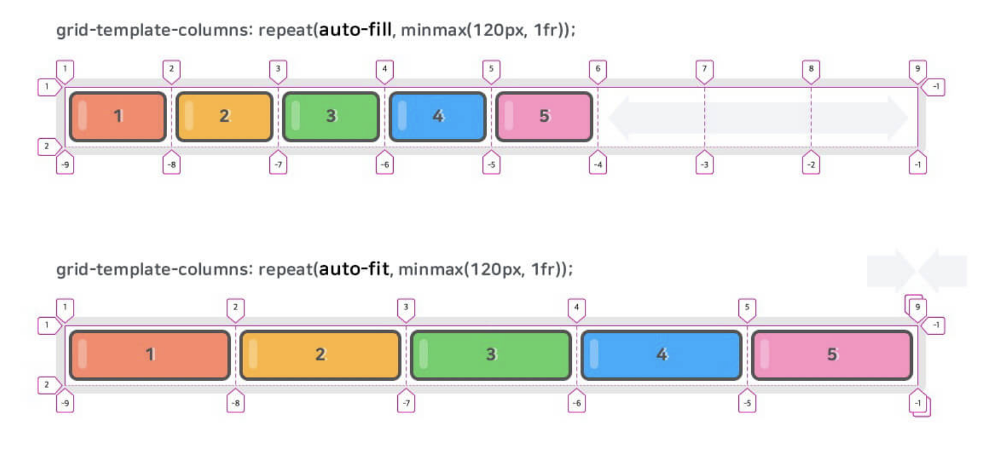