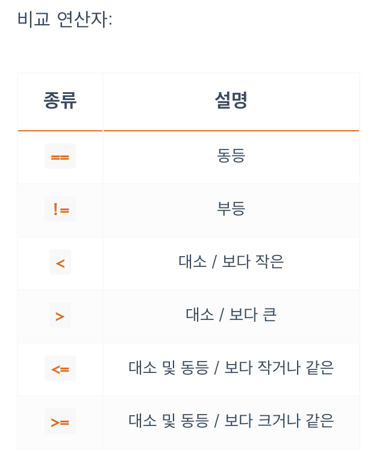

<br/>


## **SCSS 개요**
- CSS 는 쉽고 간단하지만 단점들이 존재합니다. `Sass(SCSS)` 는 이를 보완하는 개념입니다.
- 보통 CSS Preprocessor 라고 부릅니다.
- 사스는 기초 언어에 힘과 우아함을 더해주는 CSS의 확장입니다.
- 웹에서는 CSS만 동작하기 때문에 작성한 전처리기를 웹에서 동작 가능한 표준의 `CSS로 컴파일(Compile)` 하는 과정이 필요합니다.
- 전처리기에는 `Sass(SCSS)` 외에도 `Less`, `Stylus` 가 있습니다.

<br/>


## **Sass 와 SCSS 의 차이**
- Sass(Syntactically Awesome Style Sheets)의 3버전에서 새롭게 등장한 SCSS는 CSS 구문과 완전히 호환되도록 새로운 구문을 도입해 만든 Sass의 모든 기능을 지원하는 CSS의 상위집합(Superset) 입니다.
- SCSS는 CSS와 거의 같은 문법으로 Sass 기능을 지원한다는 의미입니다.
- `CSS` 를 `SCSS` 에 그대로 붙여넣으면 정상동작 하지만, `Sass` 는 동작하지 않습니다.
- 더 쉽고 간단한 차이는 `{}(중괄호`)와 `;(세미콜론)`의 유무입니다.
- `Mixins(‘믹스인’은 재사용 가능한 기능을 만드는 방식의 의미합니다)` 의 차이도 있습니다.
- `Sass` 는 `=` 와 `+` 기호로 `Mixins` 기능을 사용하고, `SCSS` 는 `@mixin` 과 `@include` 로 기능을 사용했습니다.

**`Sass`**
```scss
.list
  width: 100px
  float: left
  li
    color: red
    background: url("./image.jpg")
    &:last-child
      margin-right: -10px
```

**`SCSS`**
```scss
.list {
  width: 100px;
  float: left;
  li {
    color: red;
    background: url("./image.jpg");
    &:last-child {
      margin-right: -10px;
    }
  }
}
```

<br/>


## **컴파일**
- Sass(SCSS)는 웹에서 직접 동작할 수 없습니다.
- 어디까지나 최종에는 표준 CSS로 동작해야 하며, 우리는 전처리기로 작성 후 CSS로 컴파일해야 합니다.

### **`SassMeister`**
- 간단한 Sass 코드는 컴파일러를 설치하는게 부담될 수 있습니다. 그럴 경우 
[SassMeister](https://www.sassmeister.com/) 를 사용할 수 있습니다.
- 페이지 접속 후 바로 Sass나 SCSS 문법으로 코딩하면 CSS로 실시간 변환됩니다.

### **`Parcel`**
- 웹 애플리케이션 번들러 Parcel은 굉장히 단순하게 컴파일할 수 있습니다.

**Parcel를 전역으로 설치**
```
$ npm install -g parcel-bundler
```
**프로젝트에 Sass 컴파일러(node-sass)를 설치**
```
$ npm install --save-dev node-sass
```
**HTML에 `<link>`로 Sass 파일만 연결**
```html
<link rel="stylesheet" href="scss/main.scss">
```
**컴파일**
```
$ parcel index.html
# 혹은
$ parcel build index.html
```

<br/>


## **SCSS 문법 - `주석`**
- Sass(SCSS) 는 두가지 스타일의 주석을 사용합니다.
```scss
// 컴파일되지 않는 주석
/* 컴파일되는 주석 */
```
- Sass 의 경우 여러 줄 주석을 사용할 때 각 줄 앞에 `*` 을 붙여야 하고, `*` 의 라인을 맞춰줘야 합니다.
```scss
/* 컴파일되는
 * 여러 줄
 * 주석 */

// * 의 라인이 맞지 않아 Error
/* 컴파일되는
* 여러 줄
    * 주석 */
```
- SCSS 는 각 줄에 `*` 이 없어도 문제되지 않습니다. 따라서 기존 CSS와 호환이 쉽습니다.
```scss
/*
컴파일되는
여러 줄
주석
*/
```

<br/>


## **SCSS 문법 - `데이터 종류`**


- Numbers: 숫자에 단위가 있거나 없습니다.
- Strings: 문자에 따옴표가 있거나 없습니다.
- Nulls: 속성값으로 null이 사용되면 없는 개념이 되며 컴파일하지 않습니다.
- Lists: `()` 를 붙여도 되고 안붙여도 됩니다. 데이터 값들을 `,` 로 구분하거나 붙이지 않고 띄어 쓰기로 구분합니다.
- Maps: `()` 를 꼭 붙여야 합니다.

<br/>


## **SCSS 문법 - `중첩(Nesting)`**
- Sass는 중첩 기능을 사용할 수 있습니다.
- 상위 선택자의 반복을 피하고 좀 더 편리하게 복잡한 구조를 작성할 수 있습니다.

**`scss`**
```scss
.section {
  width: 100%;
  .list {
    padding: 20px;
    li {
      float: left;
    }
  }
}
```
**`Compiled to:`**
```scss
.section {
  width: 100%;
}
.section .list {
  padding: 20px;
}
.section .list li {
  float: left;
}
```

<br/>


## **SCSS 문법 - `중첩 - Ampersand (상위 선택자 참조)`**
- 중첩 안에서 `&` 키워드는 상위(부모) 선택자를 참조하여 치환합니다.
```scss
.btn {
  position: absolute;
  &.active {
    color: red;
  }
  .btn.active {
    color: blue;
  }
}
.list {
  li {
    &:last-child {
      margin-right: 0;
    }
  }
}
```
```scss
.btn {
  position: absolute;
}
.btn.active {
  color: red;
}

/* 상위 선택자 참조를 하지 않으면 원하는 형태로 선언하기 힘듭니다. */
.btn .btn.active {
  color: blue;
}
.list li:last-child {
  margin-right: 0;
}
```
- `&` 키워드가 참조한 상위 선택자로 치환되는 것이기 때문에 다음과 같이 응용할 수도 있습니다.
```scss
.fs {
  &-small { font-size: 12px; }
  &-medium { font-size: 14px; }
  &-large { font-size: 16px; }
}
```
```scss
.fs-small {
  font-size: 12px;
}
.fs-medium {
  font-size: 14px;
}
.fs-large {
  font-size: 16px;
}
```

<br/>


## **SCSS 문법 - `@at-root (중첩 벗어나기)`**
- 중첩에서 벗어나고 싶을 때 `@at-root` 키워드를 사용합니다.
- (필요한 데이터가 중첩 안에 있음) 중첩 안에서 생성하되 중첩 밖에서 사용해야 하는 경우에 유용합니다.

```scss
.list {
  $w: 100px;
  $h: 50px;
  li {
    width: $w;
    height: $h;
  }
  @at-root .box {
    width: $w;
    height: $h;
  }
}
```
```scss
.list li {
  width: 100px;
  height: 50px;
}
.box {
  width: 100px;
  height: 50px;
}
```
- `.list` 안에 있는 특정 변수를 범위 밖에서 사용할 수 없기 때문에, 위 예제 처럼 `@at-root` 키워드를 사용해야 합니다.
```scss
.list {
  $w: 100px;
  $h: 50px;
  li {
    width: $w;
    height: $h;
  }
}

// Error
.box {
  width: $w;
  height: $h;
}
```

<br/>


## **SCSS 문법 - `중첩된 속성 정의`**
- `font-`, `margin-` 등과 같이 동일한 네임 스페이스를 가지는 속성들을 다음과 같이 사용할 수 있습니다.

```scss
.box {
  font: {
    weight: bold;
    size: 10px;
    family: sans-serif;
  };
  margin: {
    top: 10px;
    left: 20px;
  };
  padding: {
    bottom: 40px;
    right: 30px;
  };
}
```
```scss
.box {
  font-weight: bold;
  font-size: 10px;
  font-family: sans-serif;
  margin-top: 10px;
  margin-left: 20px;
  padding-bottom: 40px;
  padding-right: 30px;
}
```

<br/>


## **SCSS 문법 - `변수`**
- 반복적으로 사용되는 값을 변수로 지정할 수 있습니다.
- 변수 이름 앞에는 항상 `$` 를 붙입니다.

```
$변수이름: 속성값;
```
```scss
$color-primary: #e96900;
$url-images: "/assets/images/";
$w: 200px;

.box {
  width: $w;
  margin-left: $w;
  background: $color-primary url($url-images + "bg.jpg");
}
```
```scss
.box {
  width: 200px;
  margin-left: 200px;
  background: #e96900 url("/assets/images/bg.jpg");
}
```

<br/>


## **SCSS 문법 - `변수 유효범위(Variable Scope)`**
- 변수는 사용 가능한 유효범위가 있습니다.
- 선언된 블록(`{}`) 내에서만 유효범위를 가집니다.

```scss
.box1 {
  $color: #111;
  background: $color;
}
// Error $color 는 .box1 내에서만 유효
.box2 {
  background: $color;
}
```

<br/>


## **SCSS 문법 - `변수 재 할당(Variable Reassignment)`**
- 다음과 같이 변수에 변수를 할당할 수 있습니다.

```scss
$red: #FF0000;
$blue: #0000FF;

$color-primary: $blue;
$color-danger: $red;

.box {
  color: $color-primary;
  background: $color-danger;
}
```
```scss
.box {
  color: #0000FF;
  background: #FF0000;
}
```

<br/>


## **SCSS 문법 - `!global (전역 설정)`**
- `!global` 플래그를 사용하면 변수의 유효범위를 전역(Global)로 설정할 수 있습니다.

```scss
.box1 {
  $color: #111 !global;
  background: $color;
}
.box2 {
  background: $color;
}
```
```scss
.box1 {
  background: #111;
}
.box2 {
  background: #111;
}
```

```scss
$color: #000;
// 전역 변수
.box1 {
  $color: #111 !global;
//전역의 $color 값을 바꿉니다.
  background: $color;
}
.box2 {
  background: $color;
}
.box3 {
  $color: #222;
// !global 없으므로 이 scope 내에서만 사용되는 $color 의미
  background: $color;
}
.box4 {
  background: $color;
}
```
```scss
.box1 {
  background: #111;
}

.box2 {
  background: #111;
}

.box3 {
  background: #222;
}

.box4 {
  background: #111;
}
```

<br/>


## **SCSS 문법 - `!default (초깃값 설정)`**
- `!default` 플래그는 할당되지 않은 변수의 초깃값을 설정합니다.
- 즉, 할당되어있는 변수가 있다면 변수가 기존 할당 값을 사용합니다.
- `변수와 값을 설정하겠지만, 혹시 기존 변수가 있을 경우는 현재 설정하는 변수의 값은 사용하지 않겠다` 는 의미로 쓸 수 있습니다.
```scss
$color-primary: red;

.box {
  $color-primary: blue !default;
  background: $color-primary;
}
```
```scss
.box {
  background: red;
}
```

- 외부 Sass(SCSS) 라이브러리를 연결했더니 변수 이름이 같아 내가 작성한 코드의 변수들이 Overwrite(덮어쓰기) 된다면 문제가 있습니다.
- 이럴 때 Sass(SCSS) 라이브러리(혹은 새롭게 만든 모듈)에서 사용하는 변수에 `!default` 플래그가 있다면 기존 코드(원본)를 Overwrite 하지 않고도 사용할 수 있습니다.

<br/>


## **SCSS 문법 - `#{} (문자 보간)`**
- `#{}` 를 이용해서 코드의 어디든지 변수 값을 넣을 수 있습니다
- Sass의 내장 함수 `unquote()` 는 문자에서 따옴표를 제거합니다.

```scss
$family: unquote("Droid+Sans");
@import url("http://fonts.googleapis.com/css?family=#{$family}");
```
```scss
@import url("http://fonts.googleapis.com/css?family=Droid+Sans");
```

<br/>


## **SCSS 문법 - `가져오기(Import)`**
- `CSS` `@import` 는 `@import url("경로")`
- `SCSS` `@import` 는 `@import "경로"` url 함수가 필요 없습니다.
- `@import` 로 외부에서 가져온 Sass 파일은 모두 단일 CSS 출력 파일로 병합됩니다.
- 또한, 가져온 파일에 정의된 모든 변수 또는 Mixins 등을 주 파일에서 사용할 수 있습니다.
- Sass `@import` 는 기본적으로 Sass 파일을 가져오는데, `CSS @import 규칙으로 컴파일되는` 몇 가지 상황이 있습니다.
    - 파일 확장자가 .css일 때
    - 파일 이름이 `http://로` 시작하는 경우
    - url()이 붙었을 경우
    - 미디어쿼리가 있는 경우
    ```scss
    @import "hello.css"; // url 은 없지만 .css 확장자 이기 때문에 
    @import "http://hello.com/hello"; // http://로 시작하는 경우
    @import url(hello); // url()이 붙었을 경우
    @import "hello" screen;// 미디어쿼리가 있는 경우
    ```

### **여러 파일 가져오기**
- 하나의 `@import` 로 여러 파일을 가져올 수도 있습니다.
파일 이름은 `,` 로 구분합니다.

```scss
@import "header", "footer"; // header.scss, footer.scss
```

<br/>


## **SCSS 문법 - `파일 분할(Partials)`**
- 프로젝트 규모가 커지면 파일들을 `header.scss`나 `side-menu.scss` 같이 각 기능과 부분으로 나눠 유지보수가 쉽도록 관리하게 됩니다.
- 이 경우 파일이 점점 많아지는데, 모든 파일이 컴파일 시 각각의 ~.css 파일로 나눠서 저장된다면 관리나 성능 차원에서 문제가 될 수 있습니다.
- 파일 이름 앞에 `_` 를 붙여(`_header.scss와 같이`) `@import` 로 가져오면 컴파일 시 `~.css` 파일로 컴파일하지 않습니다.

### **파일 이름이 `header.scss`, `side-menu.scss` 인 경우**
```scss
// main.scss
@import "header", "side-menu";
```
**`scss`디렉토리에 있는 파일들을 `css`디렉토리로 컴파일**
```
$ node-sass scss --output css
```
**`scss/` 에 있던 각각의 `.scss` 파일들이 `css/` 안에 각 하나씩의 `.css` 파일로 컴파일됩니다.**
```
Sass-App
  # ...
  ├─css
  │  ├─header.css
  │  ├─side-menu.css
  │  └─main.css
  ├─scss
  │  ├─header.scss
  │  ├─side-menu.scss
  │  └─main.scss
  # ...
```
### **파일 이름이 `_header.scss`, `_side-menu.scss` 인 경우**
```scss
// main.scss
@import "header", "side-menu";
```
**`scss`디렉토리에 있는 파일들을 `css`디렉토리로 컴파일**
```
$ node-sass scss --output css
```
**`scss/` 에 있던 각각의 `.scss` 파일들이 `css/` 안에 별도의 `.css` 파일로 컴파일되지 않고 사용됩니다.**
```
Sass-App
  # ...
  ├─css
  │  └─main.css  (main + header + side-menu)
  ├─scss
  │  ├─header.scss
  │  ├─side-menu.scss
  │  └─main.scss
  # ...
```

- `Webpack` 이나 `Parcel`, `Gulp` 같은 일반적인 빌드툴에서는 `Partials 기능을 사용할 필요 없이`, 설정된 값에 따라 빌드됩니다. 하지만 **되도록 `_` 를 사용할 것을 권장합니다.**

<br/>


## **SCSS 문법 - `연산(Operations)`**
- Sass는 기본적인 연산 기능을 지원합니다.


- `*` 곱하기의 경우 하나 이상의 값이 반드시 **단위 없는** 숫자 여야 합니다.
```scss
// Error
$w : 10px * 10px;

// $w : 100px;
$w : 10px * 10;
```
- `/` 나누기의 경우 오른쪽 값이 반드시 **단위 없는** 숫자 여야 합니다.
```scss
// Error
$h : 10px / 2px;

// $h : 5px;
$h : 10px / 2;
```
<br/><br/>

<br/><br/>


<br/>


## **SCSS 문법 - `연산 - 숫자`**
- 상대적 단위 연산
    - 일반적으론 절댓값을 나타내는 px 단위로 연산을 합니다. 상대적 단위(`%, em, vw 등`)의 연산의 경우 `CSS calc()` 로 연산해야 합니다.
    ```scss
    width: 50% - 20px;  // 단위 모순 에러(Incompatible units error)
    width: calc(50% - 20px);  // 연산 가능
    ```
    - calc 는 css 함수 입니다.

- 나누기 연산의 주의사항
    - CSS는 속성 값의 숫자를 분리하는 방법으로 `/` 를 허용하기 때문에 `/` 가 나누기 연산으로 사용되지 않을 수 있습니다.
    예를 들어, `font: 16px / 22px serif;` 같은 경우 `font-size: 16px` 와 `line-height: 22px` 의 속성값 분리를 위해서 `/` 를 사용합니다.
    - 위와 같은 이유로 `/` 가 나누기 연산으로 사용되지 않는 경우가 있습니다. 
    ```scss
    div {
    width: 20px + 20px;  // 더하기
    height: 40px - 10px;  // 빼기
    font-size: 10px * 2;  // 곱하기
    margin: 30px / 2;  // 나누기
    }   
    ```
    ```scss
    div {
     width: 40px;  /* OK */
    height: 30px;  /* OK */
    font-size: 20px;  /* OK */
    margin: 30px / 2;  /* ?? */
    }
    ```
- `/` 를 나누기 연산 기능으로 사용하려면 다음과 같은 조건을 충족해야 합니다.
    - 값 또는 그 일부가 변수에 저장되거나 함수에 의해 반환되는 경우
    - 값이 `()` 로 묶여있는 경우
    - 값이 다른 산술 표현식의 일부로 사용되는 경우
```scss
div {
  $x: 100px;
  width: $x / 2;  // 변수에 저장된 값을 나누기
  height: (100px / 2);  // 괄호로 묶어서 나누기
  font-size: 10px + 12px / 3;  // 더하기 연산과 같이 사용 (다른 산술 표현식의 일부로 사용)
}
```
```scss
div {
  width: 50px;
  height: 50px;
  font-size: 14px;
}
```

<br/>


## **SCSS 문법 - `연산 - 문자`**
- 문자 연산에는 `+` 만 사용됩니다.
문자 연산의 결과는 `첫 번째 피연산자` 를 기준으로 합니다.
첫 번째 피연산자에 따옴표가 붙어있다면 연산 결과를 따옴표로 묶습니다.
반대로 첫 번째 피연산자에 따옴표가 붙어있지 않다면 연산 결과도 따옴표를 처리하지 않습니다.

```scss
div::after {
  content: "Hello " + World;
  flex-flow: row + "-reverse" + " " + wrap
}
```
```scss
div::after {
/* 첫 번째 피연산자에 따옴표가 있는 연산 결과 */
  content: "Hello World";

/* 첫 번째 피연산자에 따옴표가 없는 연산 결과 */
  flex-flow: row-reverse wrap;
}
```

<br/>


## **SCSS 문법 - `연산 - 색상`**
- 색상도 연산할 수 있습니다.

```scss
div {
  color: #123456 + #345678;
  color: #111111 *2;
  // R: 12 + 34 = 46
  // G: 34 + 56 = 8a
  // B: 56 + 78 = ce
  background: rgba(50, 100, 150, .5) + rgba(10, 20, 30, .5);
  // R: 50 + 10 = 60
  // G: 100 + 20 = 120
  // B: 150 + 30 = 180
  // A: Alpha channels must be equal
}
```
```scss
div {
  color: #468ace;
  color: #222222;
  background: rgba(60, 120, 180, 0.5);
}
```

- `rgba()` 에서 마지막 요소인 `Alpha(투명도)` 값이 같아야 연산이 가능합니다.
- `Alpha(투명도)` 는 연산되지 않습니다.
- Alpha 값을 연산하기 위해 `opacify()`, `transparentize()` 색상 함수들을 사용할 수 있습니다.
- `opacify()` 는 투명도를 더 불투명하게 만들어주는 함수
- `transparentize()` 는 투명도를 더 투명하게 만들어주는 함수

```scss
$color: rgba(10, 20, 30, .5);
div {
  color: opacify($color, .3);  // 30% 더 불투명하게 / 0.5 + 0.3
  background-color: transparentize($color, .2);  // 20% 더 투명하게 / 0.5 - 0.2
}
```
```scss
div {
  color: rgba(10, 20, 30, 0.8);
  background-color: rgba(10, 20, 30, 0.3);
}
```

<br/>


## **SCSS 문법 - `연산 - 논리`**
- Sass의 `@if` 조건문에서 사용되는 `논리(Boolean)` 연산에는 `and’,’ or’, ‘not’` 이 있습니다.
- 자바스크립트 문법에 익숙하다면 `&&, ||, !` 와 같은 기능으로 생각하면 됩니다.

```scss
$width: 90px;
div {
  @if not ($width > 100px) {
    height: 300px;
  }
}
```
```scss
div {
  height: 300px;
}
```

<br/>


## **SCSS 문법 - `재활용 - mixins, include`**
- Sass `Mixins` 는 스타일 시트 전체에서 **재사용 할 CSS 선언 그룹** 을 정의하는 아주 훌륭한 기능입니다.
- 선언하기(`@mixin`)와 포함하기(`@include`) 두 가지만 기억하면 됩니다.

```scss
@mixin size ($w : 100px, $h : 100px){
    width : $w;
    height : $h;
}

.box1 {
    @include size;
}
.box2 {
    @include size($h:300px);
}
.box3 {
    @include size(200px,300px);
}
```
```scss
.box1 {
  width: 100px;
  height: 100px;
}

.box2 {
  width: 100px;
  height: 300px;
}

.box3 {
  width: 200px;
  height: 300px;
}
```
### **@mixin**
```scss
// SCSS
@mixin 믹스인이름 {
  스타일;
}

// Sass
=믹스인이름
  스타일
```
```scss
// SCSS
@mixin large-text {
  font-size: 22px;
  font-weight: bold;
  font-family: sans-serif;
  color: orange;
}

// Sass
=large-text
  font-size: 22px
  font-weight: bold
  font-family: sans-serif
  color: orange
```
- Mixin은 선택자를 포함 가능하고 상위(부모) 요소 참조(`&` 같은)도 할 수 있습니다.
```scss
@mixin large-text {
  font: {
    size: 22px;
    weight: bold;
    family: sans-serif;
  }
  color: orange;

  &::after {
    content: "!!";
  }

  span.icon {
    background: url("/images/icon.png");
  }
}
```

### **@include**
```scss
// SCSS
@include 믹스인이름;

// Sass
+믹스인이름
```
```scss
// SCSS
h1 {
  @include large-text;
}
div {
  @include large-text;
}

// Sass
h1
  +large-text
div
  +large-text
```
```scss
h1 {
  font-size: 22px;
  font-weight: bold;
  font-family: sans-serif;
  color: orange;
}
h1::after {
  content: "!!";
}
h1 span.icon {
  background: url("/images/icon.png");
}

div {
  font-size: 22px;
  font-weight: bold;
  font-family: sans-serif;
  color: orange;
}
div::after {
  content: "!!";
}
div span.icon {
  background: url("/images/icon.png");
}
```

<br/>


## **SCSS 문법 - `재활용 - 인수(Arguments)`**
- Mixin은 함수(Functions)처럼 인수(Arguments)를 가질 수 있습니다.

```scss
// SCSS
@mixin 믹스인이름($매개변수) {
  스타일;
}
@include 믹스인이름(인수);

// Sass
=믹스인이름($매개변수)
  스타일

+믹스인이름(인수)
```


```scss
@mixin dash-line($width, $color) {
  border: $width dashed $color;
}

.box1 { @include dash-line(1px, red); }
.box2 { @include dash-line(4px, blue); }
```
```scss
.box1 {
  border: 1px dashed red;
}
.box2 {
  border: 4px dashed blue;
}
```
### **인수의 기본값 설정**
- 인수(argument)는 기본값(default value)을 가질 수 있습니다.
- `@include` 포함 단계에서 별도의 인수가 전달되지 않으면 기본값이 사용됩니다.

```scss
@mixin 믹스인이름($매개변수: 기본값) {
  스타일;
}
```
```scss
@mixin dash-line($width: 1px, $color: black) {
  border: $width dashed $color;
}

.box1 { @include dash-line; }
.box2 { @include dash-line(4px); }
```
```scss
.box1 {
  border: 1px dashed black;
}
.box2 {
  border: 4px dashed black;
}
```

### **키워드 인수(Keyword Arguments)**
- Mixin에 전달할 인수를 입력할 때 명시적으로 키워드(변수)를 입력하여 작성할 수 있습니다.
- 별도의 인수 입력 순서를 필요로 하지 않아 편리하게 작성할 수 있습니다.
- 작성하지 않은 인수가 적용될 수 있도록 기본값을 설정해 주는 것이 좋습니다.

```scss
@mixin 믹스인이름($매개변수A: 기본값, $매개변수B: 기본값) {
  스타일;
}

@include 믹스인이름($매개변수B: 인수);
```
```scss
@mixin position(
  $p: absolute,
  $t: null,
  $b: null,
  $l: null,
  $r: null
) {
  position: $p;
  top: $t;
  bottom: $b;
  left: $l;
  right: $r;
}

.absolute {
  // 키워드 인수로 설정할 값만 전달
  @include position($b: 10px, $r: 20px);
}
.fixed {
  // 인수가 많아짐에 따라 가독성을 확보하기 위해 줄바꿈
  @include position(
    fixed,
    $t: 30px,
    $r: 40px
  );
}
```
```scss
.absolute {
  position: absolute;
  bottom: 10px;
  right: 20px;
}
.fixed {
  position: fixed;
  top: 30px;
  right: 40px;
}
```

### **가변 인수(Variable Arguments)**
- 입력할 인수의 개수가 불확실한 경우가 있습니다. 그럴 경우 가변 인수를 사용할 수 있습니다.
- 가변 인수는 매개변수 뒤에 ...을 붙여줍니다.

**매개변수에 `...` 을 사용**
```scss
@mixin 믹스인이름($매개변수...) {
  스타일;
}

@include 믹스인이름(인수A, 인수B, 인수C);
```
```scss
// 인수를 순서대로 하나씩 전달 받다가, 3번째 매개변수($bg-values)는 인수의 개수에 상관없이 받음
@mixin bg($width, $height, $bg-values...) {
  width: $width;
  height: $height;
  background: $bg-values;
}

div {
  // 위의 Mixin(bg) 설정에 맞게 인수를 순서대로 전달하다가 3번째 이후부터는 개수에 상관없이 전달
  @include bg(
    100px,
    200px,
    url("/images/a.png") no-repeat 10px 20px,
    url("/images/b.png") no-repeat,
    url("/images/c.png")
  );
}
```
```scss
div {
  width: 100px;
  height: 200px;
  background: url("/images/a.png") no-repeat 10px 20px,
              url("/images/b.png") no-repeat,
              url("/images/c.png");
}

```

**전달할 인수에 `...` 사용**
```scss
@mixin font(
  $style: normal,
  $weight: normal,
  $size: 16px,
  $family: sans-serif
) {
  font: {
    style: $style;
    weight: $weight;
    size: $size;
    family: $family;
  }
}
div {
  // 매개변수 순서와 개수에 맞게 전달 (list)
  $font-values: italic, bold, 16px, sans-serif;
  @include font($font-values...);
}
span {
  // 필요한 값만 키워드 인수로 변수에 담아 전달 (map)
  $font-values: ($style: italic, $size: 22px);
  @include font($font-values...);
}
a {
  // 필요한 값만 키워드 인수로 전달 (map)
  @include font(($weight: 900, $family: monospace)...);
}
```
```scss
div {
  font-style: italic;
  font-weight: bold;
  font-size: 16px;
  font-family: sans-serif;
}
span {
  font-style: italic;
  font-weight: normal;
  font-size: 22px;
  font-family: sans-serif;
}
a {
  font-style: normal;
  font-weight: 900;
  font-size: 16px;
  font-family: monospace;
}
```


<br/>


## **SCSS 문법 - `재활용 - @content`**
- 선언된 Mixin에 `@content이` 포함되어 있다면 해당 부분에 원하는 **스타일 블록** 을 전달할 수 있습니다.
- 이 방식을 사용하여 기존 Mixin이 가지고 있는 기능에 선택자나 속성 등을 추가할 수 있습니다.

```scss
@mixin 믹스인이름() {
  스타일;
  @content;
}

@include 믹스인이름() {
  // 스타일 블록
  스타일;
}
```
```scss
@mixin icon($url) {
  &::after {
    content: $url;
    @content;
  }
}
.icon1 {
  // icon Mixin의 기존 기능만 사용
  @include icon("/images/icon.png");
}
.icon2 {
  // icon Mixin에 스타일 블록을 추가하여 사용
  @include icon("/images/icon.png") {
    position: absolute;
  };
}
```
```scss
.icon1::after {
  content: "/images/icon.png";
}
.icon2::after {
  content: "/images/icon.png";
  position: absolute;
}
```
- Mixin에게 전달된 스타일 블록은 Mixin의 범위가 아니라 스타일 블록이 정의된 범위에서 평가됩니다.

```scss
$color: red;

@mixin colors($color: blue) {
  // Mixin의 범위
  @content;
  background-color: $color;
  border-color: $color;
}

div {
  @include colors() {
    // 스타일 블록이 정의된 범위
    // 이 범위에서의 $color 값은 전역 변수의 값인 red 입니다.
    color: $color;
  }
}
```
```scss
div {
  color: red;
  background-color: blue;
  border-color: blue;
}
```

<br/>


## **SCSS 문법 - `확장(Extend)`**
- 특정 선택자가 다른 선택자의 모든 스타일을 가져야하는 경우가 종종 있습니다.
- 이럴 경우 선택자의 확장 기능을 사용할 수 있습니다.

```scss
@extend 선택자;
```
```scss
.btn {
  padding: 10px;
  margin: 10px;
  background: blue;
}
.btn-danger {
  @extend .btn;
  background: red;
}
```
```css
.btn, .btn-danger {
  padding: 10px;
  margin: 10px;
  background: blue;
}
.btn-danger {
  background: red;
}
```

- 결과를 보면 `,` 로 구분하는 `다중 선택자(Multiple Selector)` 가 만들어졌습니다.
- 결과적으로 `확장(Extend)` 기능은 무해하거나 혹은 유익할 수도 있지만 그만큼 **부작용을 가지고 있을 수 있습니다.**
따라서 **확장은 사용을 권장하지 않으며**, 위에서 살펴본 **Mixin을 대체 기능**으로 사용하세요.

<br/>


## **SCSS 문법 - `함수(Functions)`**
- 자신의 함수를 정의하여 사용할 수 있습니다.
- 함수와 Mixins은 거의 유사하지만 반환되는 내용이 다릅니다.
- Mixin은 위에서 살펴본 대로 지정한 스타일(Style)을 반환합니다.
- 함수는 보통 `연산된(Computed) 특정 값`을 `@return` 지시어를 통해 반환합니다.
- 함수는 `@include` 같은 별도의 지시어 없이 사용하기 때문에 내가 `지정한 함수` 와 `내장 함수(Built-in Functions)` 의 이름이 충돌할 수 있습니다. 따라서 내가 지정한 함수에는 별도의 접두어를 붙여주는 것이 좋습니다.


```scss
// Mixins
@mixin 믹스인이름($매개변수) {
  스타일;
}

// Functions
@function 함수이름($매개변수) {
  @return 값
}
```
- Mixin은 사용 시 `@include` 지시어를 사용합니다.
- 함수는 사용 시 함수이름으로 바로 사용합니다.
```scss
// Mixin
@include 믹스인이름(인수);

// Functions
함수이름(인수)
```

```scss
$max-width: 980px;

@function columns($number: 1, $columns: 12) {
  @return $max-width * ($number / $columns)
}

.box_group {
  width: $max-width;

  .box1 {
    width: columns();  // 1
  }
  .box2 {
    width: columns(8);
  }
  .box3 {
    width: columns(3);
  }
}
```
```css
.box_group {
  /* 총 너비 */
  width: 980px;
}
.box_group .box1 {
  /* 총 너비의 약 8.3% */
  width: 81.66667px;
}
.box_group .box2 {
  /* 총 너비의 약 66.7% */
  width: 653.33333px;
}
.box_group .box3 {
  /* 총 너비의 25% */
  width: 245px;
}
```

<br/>


## **SCSS 문법 - `if (함수)`**
- 조건의 값(`true, false`)에 따라 두 개의 표현식 중 하나만 반환합니다.
- **조건부 삼항 연산자(conditional ternary operator)** 와 비슷합니다.
- 조건의 값이 `true` 이면 표현식1을 반환합니다.
- 조건의 값이 `false` 이면 표현식2를 반환합니다.

```
if(조건, 표현식1, 표현식2)
```
```scss
$width: 555px;
div {
  width: if($width > 300px, $width, null);
}
```
```scss
div {
  width: 555px;
}
```

<br/>


## **SCSS 문법 - `@if (지시어)`**
- `@if` 지시어는 조건에 따른 분기 처리가 가능하며, `if 문(if statements)` 과 유사합니다.

```scss
// @if
@if (조건) {
  /* 조건이 참일 때 구문 */
}

// @if @else
@if (조건) {
  /* 조건이 참일 때 구문 */
} @else {
  /* 조건이 거짓일 때 구문 */
}

// @if @else if
@if (조건1) {
  /* 조건1이 참일 때 구문 */
} @else if (조건2) {
  /* 조건2가 참일 때 구문 */
} @else {
  /* 모두 거짓일 때 구문 */
}
```
- Sass의 내장 함수 **`unitless()`** 는 숫자에 단위가 있는지 여부를 반환합니다.

```scss
//if 예제

@mixin pCenter($w, $h, $p: absolute) {

  @if(
    $p == absolute
    or $p == fixed
    or not $p == relative
    or not $p == static
  )
  {
    width: if(unitless($w), #{$w}px, $w);
    height: if(unitless($h), #{$h}px, $h);
    position: $p;
    top: 0;
    bottom: 0;
    left: 0;
    right: 0;
    margin: auto;
  }
}

.box1 {
  @include pCenter(10px, 20px);
}
.box2 {
  @include pCenter(50, 50, fixed);
}
.box3 {
  @include pCenter(100, 200, relative);
}
```
```css
.box1 {
  width: 10px;
  height: 20px;
  position: absolute;
  top: 0;
  bottom: 0;
  left: 0;
  right: 0;
  margin: auto;
}

.box2 {
  width: 50px;
  height: 50px;
  position: fixed;
  top: 0;
  bottom: 0;
  left: 0;
  right: 0;
  margin: auto;
}
```

<br/>


## **SCSS 문법 - `@for`**
- `@for` 는 스타일을 반복적으로 출력합니다.
- for 문과 유사합니다.
- `@for` 는 `through` 를 사용하는 형식과 `to` 를 사용하는 형식으로 나뉩니다.

```scss
// through
// 종료 만큼 반복
@for $변수 from 시작 through 종료 {
  // 반복 내용
}

// to
// 종료 직전까지 반복
@for $변수 from 시작 to 종료 {
  // 반복 내용
}
```
```scss
// 1부터 3번 반복
@for $i from 1 through 3 {
  .through:nth-child(#{$i}) {
    width : 20px * $i
  }
}

// 1부터 3 직전까지만 반복(2번 반복)
@for $i from 1 to 3 {
  .to:nth-child(#{$i}) {
    width : 20px * $i
  }
}
```
```css
.through:nth-child(1) { width: 20px; }
.through:nth-child(2) { width: 40px; }
.through:nth-child(3) { width: 60px; }

.to:nth-child(1) { width: 20px; }
.to:nth-child(2) { width: 40px; }
```

<br/>


## **SCSS 문법 - `@each`**
- `@each` 는 `List` 와 `Map` 데이터를 순회 할 때 사용합니다.
- for in 문과 유사합니다.

```scss
@each $변수 in 데이터 {
  // 반복 내용
}
```
```scss
// List Data
$fruits: (apple, orange, banana, mango);

.fruits {
  @each $fruit in $fruits {
    li.#{$fruit} {
      background: url("/images/#{$fruit}.png");
    }
  }
}
```
```css
.fruits li.apple {
  background: url("/images/apple.png");
}
.fruits li.orange {
  background: url("/images/orange.png");
}
.fruits li.banana {
  background: url("/images/banana.png");
}
.fruits li.mango {
  background: url("/images/mango.png");
}
```

- 반복마다 Index 값이 필요하다면 다음과 같이 index() 내장 함수를 사용할 수 있습니다.

```scss
$fruits: (apple, orange, banana, mango);
// index(list , data);
.fruits {
  @each $fruit in $fruits {
    $i: index($fruits, $fruit);
    li:nth-child(#{$i}) {
      left: 50px * $i;
    }
  }
}
```
```css
.fruits li:nth-child(1) {
  left: 50px;
}
.fruits li:nth-child(2) {
  left: 100px;
}
.fruits li:nth-child(3) {
  left: 150px;
}
.fruits li:nth-child(4) {
  left: 200px;
}
```
- 동시에 여러 개의 List 데이터를 반복 처리할 수도 있습니다.
단, 각 데이터의 Length가 같아야 합니다.

```scss
$apple: (apple, korea);
$orange: (orange, china);
$banana: (banana, japan);

@each $fruit, $country in $apple, $orange, $banana {
  .box-#{$fruit} {
    background: url("/images/#{$country}.png");
  }
}
```
```css
.box-apple {
  background: url("/images/korea.png");
}
.box-orange {
  background: url("/images/china.png");
}
.box-banana {
  background: url("/images/japan.png");
}
```

- Map 데이터를 반복할 경우 하나의 데이터에 두 개의 변수가 필요합니다.

```scss
@each $key변수, $value변수 in 데이터 {
  // 반복 내용
}
```
```scss
$fruits-data: (
  apple: korea,
  orange: china,
  banana: japan
);

@each $fruit, $country in $fruits-data {
  .box-#{$fruit} {
    background: url("/images/#{$country}.png");
  }
}
```
```css
.box-apple {
  background: url("/images/korea.png");
}
.box-orange {
  background: url("/images/china.png");
}
.box-banana {
  background: url("/images/japan.png");
}
```

- `@each` 를 통하여 `map` 을 순회할 때 `index` 가 필요한 경우엔 `map` 의 `key, value` 중 하나를 `list` 로 바꾸어 주는 내장함수를 통하여 추출할 수 있습니다.
- `map-keys()` 는 `map` 에서 `key` 들 만을 뽑아 `list` 형태로 반환 합니다.
- `map-values()` `map` 에서 `value` 들 만을 뽑아 `list` 형태로 반환 합니다.

```scss
$fruits-data : {
    apple : korea,
    orange : china,
    banana : japan
}

$key-list : map-keys($fruits-data);
// (apple, orange, banana)
$value-list : map-values($fruits-data);
// (korea, china, japan)

@each $fruit, $country in $fruits-data {
   $key-index : index($key-list, fruit);
   $value-index : index($value-list, country);
  .box-#{$fruit} {
    background: url("/images/#{$country}.png");
  }
}
```

<br/>


## **SCSS 문법 - `@while`**
- @while은 조건이 false로 평가될 때까지 내용을 반복합니다.
- while 문과 유사하고 잘못된 조건으로 인해 컴파일 중 무한 루프에 빠질 수 있습니다.
- 사용을 권장하지 않습니다.

```scss
@while 조건 {
  // 반복 내용
}
```
```scss
$i: 6;

@while $i > 0 {
  .item-#{$i} {
    width: 2px * $i;
  }
  $i: $i - 2;
}
```
```css
.item-6 { width: 12px; }
.item-4 { width: 8px; }
.item-2 { width: 4px; }
```

<br/>


## **SCSS 문법 - `내장 함수(Built-in Functions)`**
- Sass에서 기본적으로 제공하는 내장 함수에는 많은 종류가 있습니다.
- [Sass Built-in Functions](https://sass-lang.com/documentation/modules) 에서 모든 내장 함수를 확인할 수 있습니다.
- `[]` 는 선택 가능한 인수(argument)입니다. `[]` 가 없는 인수는 필수적으로 입력 하여야 합니다.
- `Zero-based numbering` 을 사용하지 않습니다.

### **색상(RGB / HSL / Opacity) 함수**
- **mix($color1, $color2)** : 두 개의 색을 섞습니다.

- **lighten($color, $amount)** : 더 밝은색을 만듭니다.

- **darken($color, $amount)** : 더 어두운색을 만듭니다.

- **saturate($color, $amount)** : 색상의 채도를 올립니다.

- **desaturate($color, $amount)** : 색상의 채도를 낮춥니다.

- **grayscale($color)** : 색상을 회색으로 변환합니다.

- **invert($color)** : 색상을 반전시킵니다.

- **rgba($color, $alpha)** : 색상의 투명도를 변경합니다.

- **opacify($color, $amount) / fade-in($color, $amount)** : 색상을 더 불투명하게 만듭니다.

- **transparentize($color, $amount) / fade-out($color, $amount)** : 색상을 더 투명하게 만듭니다.

### **문자(String) 함수**
- **unquote($string)** : 문자에서 따옴표를 제거합니다.

- **quote($string)** : 문자에 따옴표를 추가합니다.

- **str-insert($string, $insert, $index)** : 문자의 index번째에 특정 문자를 삽입합니다.

- **str-index($string, $substring)** : 문자에서 특정 문자의 첫 index를 반환합니다.

- **str-slice($string, $start-at, [$end-at])** : 문자에서 특정 문자(몇 번째 글자부터 몇 번째 글자까지)를 추출합니다.

- **to-upper-case($string)** : 문자를 대문자를 변환합니다.

- **to-lower-case($string)** : 문자를 소문자로 변환합니다.


### **숫자(Number) 함수**
- **percentage($number)** : 숫자(단위 무시)를 백분율로 변환합니다.

- **round($number)** : 정수로 반올림합니다.

- **ceil($number)** : 정수로 올림합니다.

- **floor($number)** : 정수로 내림(버림)합니다.

- **abs($number)** : 숫자의 절대 값을 반환합니다.

- **min($numbers…)** : 숫자 중 최소 값을 찾습니다.

- **max($numbers…)** : 숫자 중 최대 값을 찾습니다.

- **random()** : 0 부터 1 사이의 난수를 반환합니다.