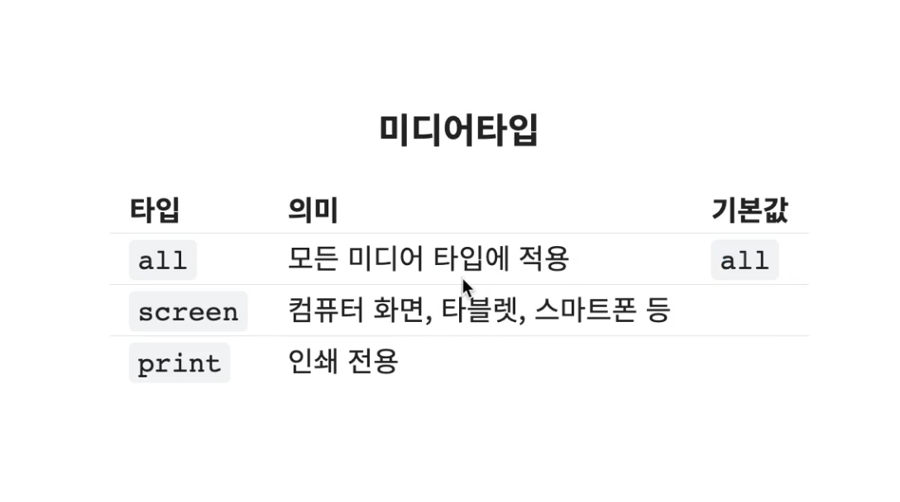
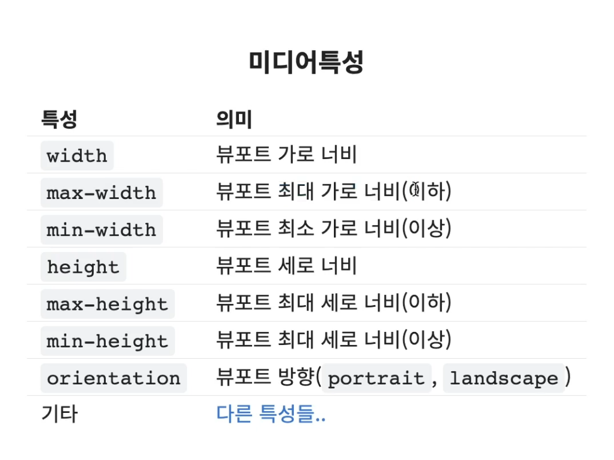
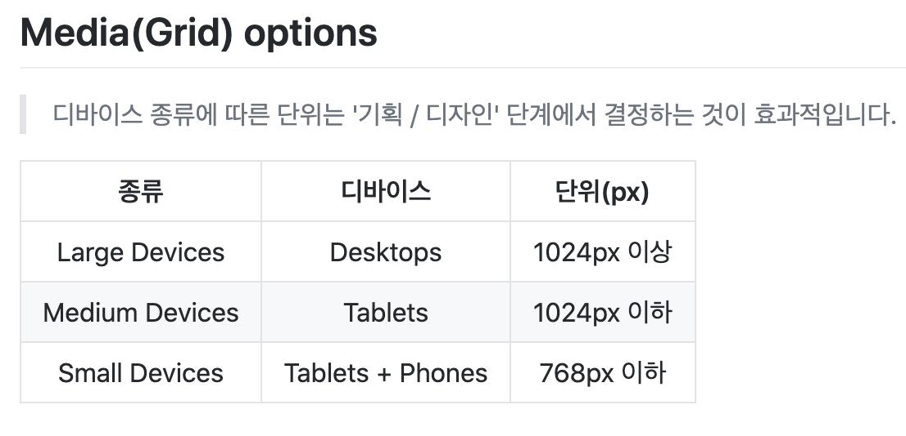

<br/>


## **미디어 쿼리 - @media**
- 다양한 미디어 유형이나 장치에 따라, 서로 다른 스타일 규칙을 적용

```css
@media 미디어타입 and (미디어특성) {
    css 코드
}

/* Viewport의 최대 너비가 1200px 일때 까지 body 태그의 글자 색상을 red 로 하겠다는 의미. 미디어 특성에 있는 내용이 조건문과 비슷*/
@media screen and (max-width: 1200px) {
    body {
        color: red;
    }
}
```



- 미디어 타입은 생략이 가능합니다. 생략하면 기본값인 `all`이 적용됩니다.



- `width : x, height: x` 는 정확이 `x` 값과 일치할 때 조건을 의미합니다.
- `max-width: x, max-height: x` 는 `x` 값 이하일 때 조건을 의미합니다.
- `min-width: x, min-height: x` 는 `x` 값 이상일 때 조건을 의미합니다.
- `orientation: portrait` 은 뷰포트의 세로가 가로보다 더 긴 상태를 의미합니다. (세로가 가로보다 더 긴 경우에 특정 css 적용)
- `orientation: landscape` 은 뷰포트의 가로가 세로보다 더 긴 상태를 의미합니다. (가로가 세로보다 더 긴 경우에 특정 css 적용)


<br/>


## **미디어 옵션**


- 그림처럼 디바이스 종류에 따른 단위를 정의 하여야합니다.
- 정해져있는 내용은 아닙니다 유동적으로 최적화된 값을 정의하면 됩니다.


