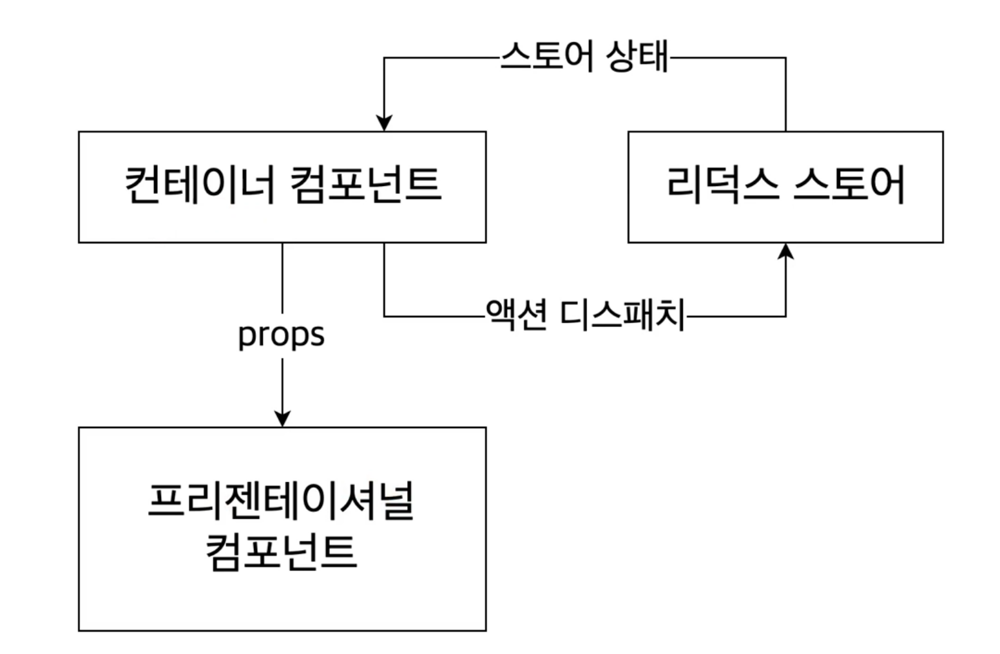

 

## **Presentational 컴포넌트와 Container 컴포넌트**

- 두 컴포넌트는 명확하게 역활이 분담되어 있고, 이렇게 분리된 프레젠테이셔널 컴포넌트와 컨테이너 컴포넌트는 따로 여러가지 곳에서 재사용이 용이하게 됩니다.

 

- ### **Presectational Component**

  - 직접적으로 보여지는 부분에 대해 담당한다.
  - Store에 의존적이지 않다.
  - props를 통해 데이터와 callback을 전달 받는다.
  - 마크업과 스타일을 가진다.
  - 데이터를 직접적으로 변경하지 않는다.
  - UI 상태값 이외에 대체로 다른 상태값을 가지고 있지 않는다.

- ### **Container Component**
  - 데이터 핸들링에 대한 위주로 개발한다.
  - 마크업이나 스타일을 가지지 않는다.
  - 리덕스의 액션이나 상태 변경에 대한 로직을 담고 있고, 프레젠테이셔널 컴포넌트에 해당 상태를 전달하거나 함수를 제공한다. -다른 프레젠테이셔널 컴포넌트나 컨테이너 컴포넌트를 관리한다.
