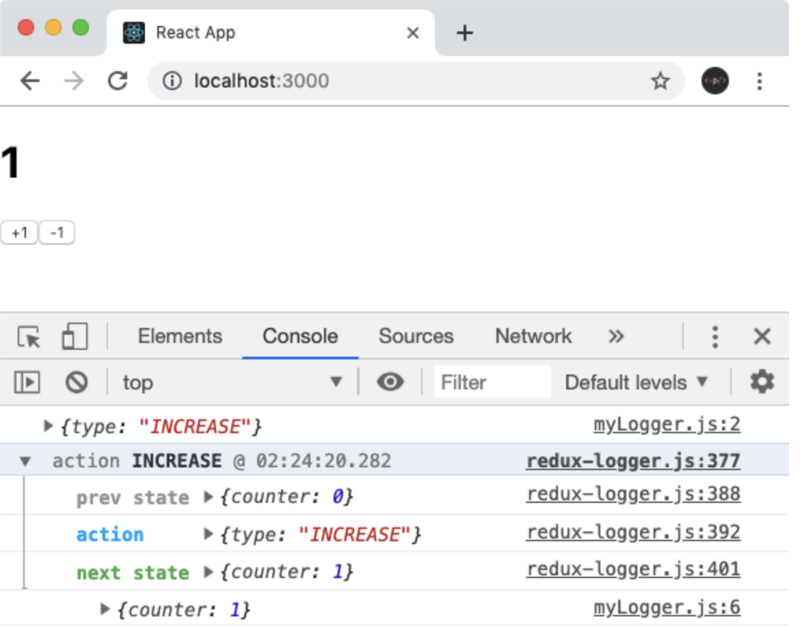

```javascript
import { createStore, applyMiddleware } from 'redux'
import logger from 'redux-logger'

const store = createStore(rootReducer, applyMiddleware(logger))

//applyMiddleware(myLogger, logger)) 여러개의 미들웨어를 적용 할 수 있습니다.
```

<br/>



- 리덕스 관련 정보들이(`action, prev state, next state`) 콘솔에 출력됩니다.

## **Redux DevTools 미들웨어 같이 사용하기**

<br/>

```javascript
import { createStore, applyMiddleware } from 'redux'
import logger from 'redux-logger'
import { composeWithDevTools } from 'redux-devtools-extension'

const store = createStore(
  rootReducer,
  composeWithDevTools(applyMiddleware(logger))
) // 여러개의 미들웨어를 적용 할 수 있습니다.
```
