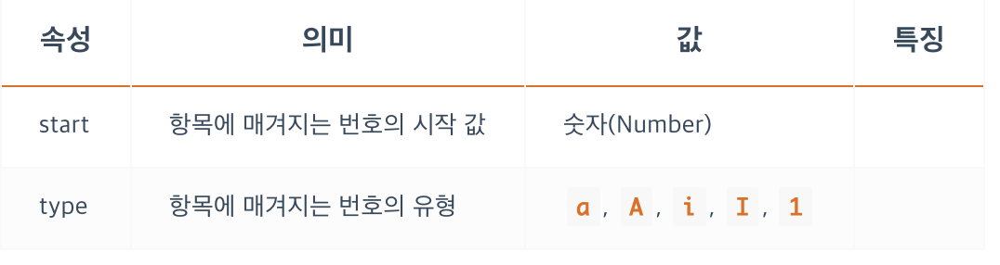
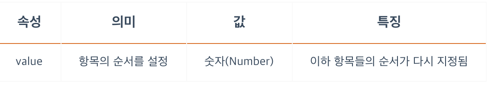
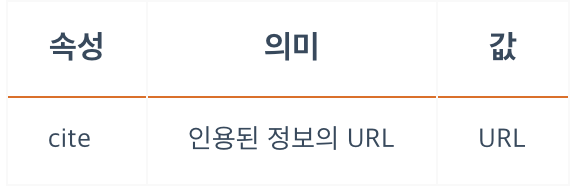

## **Body 태그에 들어가는 다양한 요소들**
---
Body 태그 - HTML문서의 정보의 구조를 나타내는 태그
<br/>

### **콘텐츠 구분 - HEADER**
- `<header>` 요소는 소개 및 탐색에 도움을 주는 콘텐츠를 나타냅니다. 제목, 로고, 검색 폼, 작성자 이름 등의 요소도 포함할 수 있습니다.
- 일반적으로 사이트의 가장 상단에 위치하는 바 입니다.
- 로고, 메뉴, 검색 바, 로그인 로그아웃 버튼, 회원가입 버튼... 등의 콘텐트 들이 들어가있습니다.
- `<header>` 안에 다른 `<header>` 또는 `<footer>`가 후손으로 올 수 없습니다.
- `<address>`, `<footer>`, 또는 다른 `<header>`의 후손으로 사용할 수 없습니다
- 이 요소는 **전역 특성**만 포함합니다.
```css
header { display: block; }
```

<br/>

### **콘텐츠 구분 - FOOTER**
- 푸터는 일반적으로 구획의 작성자, 저작권 정보, 관련 문서 등의 내용을 담습니다.
- 일반적으로 사이트의 가장 하단에 위치하는 바 입니다.
- 단, `<header>`와 다른 `<footer>`는 자손이 될 수 없습니다.
- `<address>`, `<header>`, 혹은 다른 `<footer>`의 자손일 수 없습니다.
- 이 요소는 전역 특성만 포함합니다.
```css
footer { display: block; }
```

<br/>

### **콘텐츠 구분 - H1~H6**
- 주제를 구분할때 사용되는 태그 입니다.
- 문서의 정보 계층을 구조화.
(Heading, 문서나 구분된 영역의 제목을 설정, 문서의 목차)
- `<h1>–<h6>` 요소는 6단계의 구획 제목을 나타냅니다. 구획 단계는 `<h1>`이 가장 높고 `<h6>`은 가장 낮습니다.
- 이 요소는 전역 특성만 포함합니다.
- 글씨 크기를 위해 제목 태그를 사용하지 마세요. 대신 `CSS의 font-size` 속성을 사용하세요.
- 브라우저 마다 `<h1>–<h6>` 요소 크기가 다를 수 있고, 크기를 조절해야 하는 경우가 있을 수 있습니다. 이때 크기를 바꾸고자 단계를 바꾸지 말고 `CSS의 font-size` 속성을 사용하세요.
- 제목 단계를 건너뛰는 것을 피하세요. 언제나 `<h1>`로 시작해서, `<h2>`, `<h3>` ... 순차적으로 기입하세요.
- 페이지 당 하나의 `<h1>`만 사용하세요. 여러 개를 써도 오류는 나지 않겠지만, 단일 `<h1>`이 모범 사례로 꼽힙니다. 논리적으로 생각했을 때도, `<h1>`은 가장 중요한 제목이므로 전체 페이지의 목적을 설명해야 할 것입니다. 두 개의 제목을 가진 책이나, 여러 개의 이름을 가진 영화는 볼 수 없습니다!
```css
h1, h2, h3, h4, h5, h6 { display: block; }
```

<br/>

### **콘텐츠 구분 - MAIN**
- 문서 `<body>`의 주요 콘텐츠를 나타냅니다. 주요 콘텐츠 영역은 문서의 핵심 주제나 앱의 핵심 기능에 직접적으로 연결됐거나 확장하는 콘텐츠로 이루어집니다.
- 페이지에 대한 핵짐적인 콘텐츠
- `hidden` 속성 없이는 문서에 하나보다 많은 `<main>` 요소가 존재해선 안됩니다.
- 한 문서에 하나의 `<main>` 요소만 포함 가능.
- IE(인터넷 익스플로러) 에서 지원하지 않습니다.
```css
main { display: block; }
```

<br/>

### **콘텐츠 구분 - ARTICLE**
- 독립적으로 구분되거나 재사용 가능한 영역을 설정합니다.
(매거진/신문 기사, 블로그 등)
- 일반적으로 `<h1>~<h6>`를 포함하여 식별합니다.
- 작성일자와 시간을 `<time>`의 `datetime` 속성으로 작성합니다.
- `<section>` 태그를 포함할 수 있습니다.
```css
article { display: block; }
```

<br/>

### **콘텐츠 구분 - SECTION**
- 문서의 일반적인 영역을 설정.
- 일반적으로 `<h1>~<h6>`를 포함하여 식별합니다.
- `<article>`태그를 포함할 수 있습니다.
```css
section { display: block; }
```
<br/>

### **콘텐츠 구분 - ASIDE**
- 문서의 별도 콘텐츠를 설정.
(보통 광고나 기타 링크 등의 사이드바(Side bar)를 설정)
- 핵심 콘텐츠와는 조금 관련없는 내용들이 들어가게 됩니다.
```css
aside { display: block; }
```

<br/>

### **콘텐츠 구분 - NAV**
- 다른 페이지 링크를 제공하는 영역을 설정.
(Navigation, 보통 메뉴(Home, About, Contact), 목차, 색인 등을 설정)
```css
nav { display: block; }
```

<br/>

### **콘텐츠 구분 - ADDRESS**
- `<body>, <article>, <footer>` 등에서 연락처 정보를 제공하기 위해 포함하여 사용.
```css
address { display: block; }
```

<br/>

### **콘텐츠 구분 - DIV**
- 본질적으로 아무것도 나타내지 않는 콘텐츠 영역을 설정.
(Division, 꾸미는 목적으로 사용)
```css
div { display: block; }
```


<br/>

### **문자 콘텐츠 - OL, UL, LI**
- 각 항목(`<li>`)의 정렬된 목록(`<ol>`)이나 정렬되지 않은 목록(`<ul>`)을 설정합니다. (Ordered List, Unordered List, List Item, 순서가 필요하거나(`<ol>`) 순서가 필요하지 않은(`<ul>`) 목록을 정의합니다.)
- `<ol>`과 `<ul>`은 자식으로 `<li>`만 포함 가능 합니다.
- `<li>`는 단독으로 사용할 수 없으며, `<ol>`이나 `<ul>`에 자식으로 포함되어야 합니다.
- 정렬된 목록(`<ol>`)의 항목 순서는 중요도를 의미할 수 있습니다.
```css
ol, ul { display: block; }
li { display: list-item; } /*크게 보면 블록 요소이다.*/
```

<br/>

### **문자 콘텐츠 - OL**
- 정렬된 목록을 설정.



<br/>

### **문자 콘텐츠 - LI**
- 항목을 설정.




<br/>

### **문자 콘텐츠 - DL, DT, DD**
- 용어(`<dt>`)와 정의(`<dd>`) 쌍들의 영역(`<dl>`)을 설정합니다.
(Description List, Definition Details, Definition Term)
- `<dl>`은 `<dd>`, `<dt>`만을 포함해야 합니다.
- `키(key)/값(value)` 형태를 표시할 때 유용합니다.
- 안에 `<div>`  태그 등으로 감싸는 것이 불가능 하여, 스타일링 하기가 어렵습니다. 그래서 스타일링이 필요한 경우 `<ul>(<ol>) + <li> + <dfn> + <p>` 으로 대체하여 사용하기도 합니다.
```html
<dl>
  <dt>Coffee</dt>
  <dd>Coffee is a brewed drink prepared from roasted coffee beans, the seeds of berries from certain Coffea species.</dd>
  <dt>Milk</dt>
  <dd>Milk is a nutrient-rich, white liquid food produced by the mammary glands of mammals.</dd>
</dl>
```
```css
dl, dt, dd { display: block; }
```

<br/>

### **문자 콘텐츠 - P**
- 하나의 문단, 단락을 설정합니다. (Paragraph)
- 일반적으로 정보통신보조기기 등은 다음 문단(`<p>`)으로 넘어갈 수 있는 단축키를 제공합니다.
```css
p { display: block; }
```

<br/>

### **문자 콘텐츠 - HR**
- 문단의 분리(주제에 의한)를 위해 설정합니다. (Horizontal Rule)
- 빈태그 입니다.
- 대부분의 경우 수평선(border)으로 표시(표현적 관점)되나 의미적 관점으로만 사용해야 합니다.
- 단순히 시각적요소, 수평선을 넣기 위하여 사용하는 것이 아닌 문단의 분리 목적으로 사용해야 합니다.
```css
hr { display: block; }
```

<br/>

### **선을 만들때 - `<div>`, `<hr/>` ...**
- 기본적으로 사각형 구조라, <br/>`border : 2px solid red` 같은 형식으로 넣게되면, 위 2px 아래 2px 가 생기고 시각적으로 4px의 선이 보이게 됩니다.
<br/>따라서 `border:none` 으로 제거한 후, `border-top` `border-bottom` 등으로 설정 합시다

<br/>

### **문자 콘텐츠 - PRE**
- 서식이 미리 지정된 텍스트를 설정.
(Preformatted Text)
- 원래 HTML에선 여러번의 띄어쓰기, 줄바꿈 모두 띄어쓰기 1번으로 적용 됩니다.
- `<pre>` 에선 텍스트의 공백과 줄바꿈을 유지하여 표시할 수 있음.
- 기본적으로 Monospace 글꼴 계열로 표시됨.
- Monospace - 글자 한글자 한글자의 너비가 모두 동일한 개념의 글꼴 형태 입니다.
- 작성한 텍스트 모습 그대로 화면에 출력되길 원할 때 사용하면 좋습니다.
```css
pre { display: block; }
```

<br/>

### **문자 콘텐츠 - BLOCKQUOTE**
- 일반적인 인용문을 설정. (Block Quotation)
```css
blockquote { display: block; }
```
