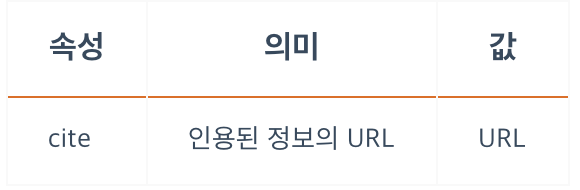

<br/>

### **인라인 텍스트 - A**
- 다른 페이지, 같은 페이지 위치(#, 해시 태그), 파일, 이메일 주소, 전화번호 등 다른 URL로 연결할 수 있는 하이퍼링크를 설정. (Anchor, 외부로 내보내기)
- `#`은 해시를 의미하고, HTML에서 id의 선택자가 됩니다. HTML에서 id는 class와는 달리 그 값이 고유해야 합니다. `<a>` 태그의 `href` 값으로 같은 페이지 요소의 `#id값` 을 넣어주게 되면 클릭 시 같은 페이지의 해당 id값을 가진 요소로 건너 뜁니다.
- `targer:_self` -> 현재 창에서 해당 url로 이동합니다.
- `targer:_blank` -> 새로운 탭을 띄어서 해당 url을 띄워줍니다.
- `download`는 실제로 다운로드 하는 동작을 하는 것이 아니라 다운로드가 되는 용도의 링크다 라는 것을 명시해주는 역할
- `inline`이지만, 보통 버튼으로 사용하는 경우가 많기 때문에 모양을 가져야 해서 `block`으로 변경해서 사용하는 경우가 많습니다.
- HTML 5 버전부터 `href`가 생략이 가능해졌습니다. 하지만 `href`를 생략하게 되면 link로써의 기능은 상실하게 됩니다.

```css
a { display: inline; }
```


<br/>

### **인라인 텍스트 - ABBR**
- 약어를 지정. (Abbreviation, 보통 `title` 속성을 사용하여 전체 글자나 설명을 제공)
- `title` 속성은 전역 속성 입니다.
```html
Using <abbr title="HyperText Markup Language">HTML</abbr> is fun and easy!
```
```css
abbr { display: inline; }
```

<br/>

### **인라인 텍스트 - B**
- 문체가 다른 글자의 범위를 설정합니다. (Bring Attention)
- 특별한 의미를 가지지 않습니다.
- 읽기 흐름에 도움을 주는 용도로 사용합니다.
- 다른 태그가 적합하지 않은 경우 **마지막 수단**으로 사용.
- 기본적으로 글자가 두껍게(Bold) 표시됩니다.
```css
b { display: inline; }
```

<br/>

### **인라인 텍스트 - MARK**
- 사용자의 관심을 끌기 위해 하이라이팅할 때 사용합니다. (Mark Text, 형광펜을 사용하여 관심있는 부분을 표시하는 것과 같은 의미)
- 기본적으로 형광펜을 사용한 것처럼 글자 배경이 노란색(Yellow)으로 표시됩니다.
```css
mark { display: inline; }
```

<br/>

### **인라인 텍스트 - EM**
- 단순한 의미 강조를 표시합니다.
(Emphasis)
- 중첩이 가능합니다.
- 중첩될수록 강조 의미가 강해집니다.
- 중첩되어도 시각적으로 달라지진 않습니다. 단지 강조됨을 명시해주는 부분입니다.
- 정보통신보조기기 등에서 구두 강조로 발음됩니다.
- 기본적으로 이탤릭체(Italic type)로 표시됩니다.
```css
em { display: inline; }
```

<br/>

### **인라인 텍스트 - STRONG**
- 의미의 중요성을 나타내기 위해 사용합니다.
(Strong Importance)
- 기본적으로 글자가 두껍게(Bold) 표시됩니다.
- 앞서 살펴본 `<em>`의 강조와 중요성은 다릅니다.
```css
strong { display: inline; }
```

<br/>

### **인라인 텍스트 - I**
- `<em>, <strong> <mark> <cite> <dfn>` 등에서 표현할 수 있는 적합한 의미가 아닌 경우 사용합니다.<br/>
(평범한 글자와 구분(아이콘이나 특수기호 같은)하기 위해 사용)
- `<b>` 태그는 일반적인 텍스트를 다룰때, `<i>`는 아이콘, 이미지, 특수기호에 활용합니다.
- 기본적으로 이탤릭체(Italic type)로 표시됩니다.
```css
i { display: inline; }
```
<br/><br/>

## **link 태그 사용 시 외부에서 가지고 오는, 내가 작성하지 않은 것(라이브러리)은 내가 작성한 것(라이브러리)의 위에 미리 불러오는 것이 좋습니다.**

<br/>

### **인라인 텍스트 - DFN**
- 용어를 정의할 때 사용합니다. (Definition)
-`<dl>, <dt>, <dd>` 는 용어와 설명을 나열하는 개념으로서 용어가 좀 많을 때 사용합니다.
```css
dfn { display: inline; }
```


<br/>

### **인라인 텍스트 - CITE**
- 창작물에 대한 참조를 설정합니다. (책, 논문, 영화, TV 프로그램, 노래, 게임 등의 제목)
- 기본적으로 이탤릭체(Italic type)로 표시됩니다.
```html
<cite>The Scream</cite> by Edward Munch. Painted in 1893.
```
```css
cite { display: inline; }
```

<br/>

### **인라인 텍스트 - Q**
-  짦은 인용문을 설정합니다. (Inline Quotation)
- 긴 인용문을 설정할 경우 `<blockquote>`를 사용합니다.
```css
q { display: inline; }
```


<br/>

### **인라인 텍스트 - U**
- 밑줄이 있는 글자를 설정합니다. (Underline)
- 순수하게 꾸미는 용도의 요소로 사용합니다.
- `<a>`와 헷갈릴 수 있는 위치에서 사용하지 않도록 주의해야 합니다.
- `<span style="text-decoration: underline;">`을 활용할 수 있을 경우에는 사용을 권장하지 않습니다.
- css를 활용할 수 있는 경우엔 사용을 권장하지 않습니다.
```css
u { display: inline; }
```

<br/>

### **인라인 텍스트 - CODE**
- 컴퓨터 코드 범위를 설정합니다. (Inline Code)
- `<code>document.getElementById('id-value')</code>` is a piece of computer code.
- 기본적으로 고정폭(Monospace) 글꼴 계열로 표시됩니다.
- 특정 부분이 코드 라는 것을 정확하게 인지시켜 주기 위하여 사용한다고 볼 수 있습니다.
```css
code { display: inline; }
```

<br/>

### **인라인 텍스트 - KBD**
- 텍스트 입력 장치(키보드)에서 사용자 입력을 나타내는 텍스트 범위를 설정합니다. (Keyboard Input) 
- 키보드 키를 사용자에게 명시 해줄 수 있습니다.
```html
<p><kbd>Ctrl</kbd> + <kbd>Alt</kbd> + <kbd>K</kbd></p>, <kbd>ESC</kbd>
```
```css
kbd { display: inline; }
```

<br/>

### **인라인 텍스트 - SUP, SUB**
- 위 첨자`(<sup>)`와 아래 첨자`(<sub>)`를 설정합니다.
(Superscripted text, Subscript text)

```html
X<sup>4</sup> + Y<sup>2</sup>, H<sub>2</sub>O
```
```css
sup, sub { display: inline; }
```

<br/>

### **인라인 텍스트 - TIME**
- 날짜나 시간을 나타내기 위한 목적으로 사용합니다.
- IE 지원 불가합니다.

```html
<p>The Cure will be celebrating their 40th anniversary on <time datetime="2018-07-07">July 7</time> in London's Hyde Park.</p>
```
```css
time { display: inline; }
```


<br/>

### **인라인 텍스트 - SPAN**
- 본질적으로 아무것도 나타내지 않는 콘텐츠 영역을 설정합니다.
- 블록 속성의 `<div>` 와 유사합니다. 막 사용될 수 있습니다. (좋은의미)
- 꾸미는 목적으로 자주 사용합니다.

```css
span { display: inline; }
```

<br/>

### **인라인 텍스트 - BR**
- 줄바꿈을 설정합니다.
- 빈태그 입니다.
- `<br/>` 태그를 여러번 사용하여 간격을 벌리는 행위는 절대 하시면 안됩니다.
- HTML은 구조적인 부분이고, 화면에 표시되는 부분은 css로 작업하여야 합니다.
- `line-height (한 줄의 높이)` 등의 css 속성으로 줄 간격을 벌릴 수 있습니다.
```css
br { display: inline; }
```

<br/>

### **수정 - DEL**
- 삭제된(변경된) 텍스트의 범위를 지정합니다.
```css
del { display: inline; }
```


<br/>

### **수정 - INS**
- 새로 추가된(변경된) 텍스트의 범위를 지정합니다.
```css
ins { display: inline; }
```
