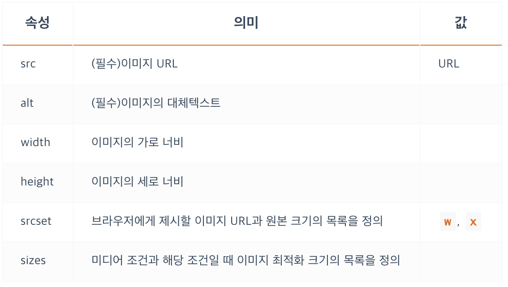
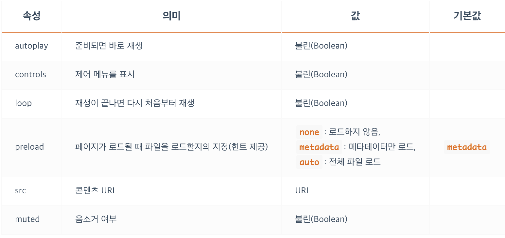
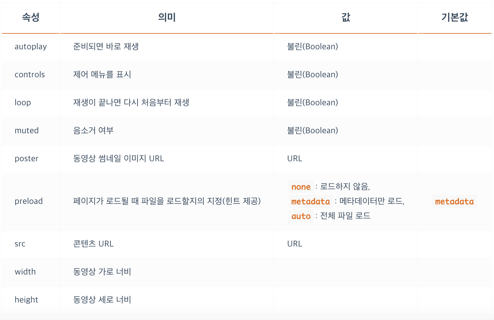
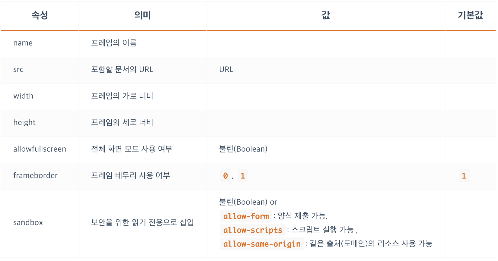
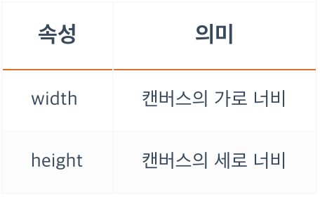
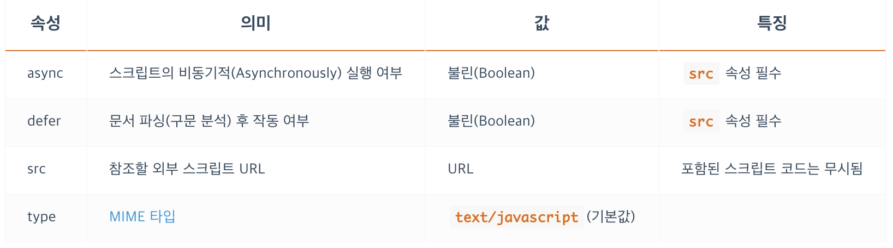

<br/>

### **멀티미디어 - IMG**
- 이미지를 삽입합니다.
- 빈태그 입니다.
- `width, height` 중 한가지 속성으로 크기를 지정하면 이미지가 가지고 있는 비율을 그대로 유지한 채 사이즈를 줄일 수 있습니다. 
- 비율을 유지한 상태로 크기를 조절하는 용도에는 가로, 세로 중 한쪽 방향의 사이즈만 입력하는것이 좋습니다.
- 물론 css를 통해서도 사이즈를 조절할 수 있습니다.


```css
img { display: inline; }
```
<br/>

### **멀티미디어 - IMG - srcset, sizes 속성**
- IE를 지원하지 않습니다.
- `src` 속성은 `srcset`을 사용할 수 없는 환경에서 동작합니다!
- `srcset, sizes` 속성은 반응형 웹사이트를 제작할 때 해당하는 반응형 구조에 따라서 이미지가 어떤 종류가 나올 것인지 설정할 때 활용합니다. 
- `srcset` 속성은 쉼표(,)로 구분된 사용할 이미지들의 경로와 해당 이미지의 원본 크기를 지정하고,<br/>
`sizes` 속성은 쉼표(,)로 구분된 미디어조건(선택적)과 그에 따라 최적화되어 출력될 이미지 크기를 지정합니다.
- `srcset` 속성은 ‘이미지 소스의 세트’라는 의미입니다.
같은 비율의 다양한 크기를 가지는 동일 이미지들을 최소 2개 이상 명시하는 속성이죠.
- `sizes` 는 최적화된 조건을 명시하는 영역 `srcset` 은 조건을 따져서 출력될 이미지들(후보들) 의 목록입니다. 아래 예시에선 `(max-width: 480px)` 인 미디어 조건일 때 최적화된 사이즈 `300px` 이라는 의미 입니다.
```html
<!-- srcset, sizes -->
<!-- 다양한 디스플레이 해상도에 맞는 최적의 이미지를 브라우저가 선택해서 사용 -->

<!-- src 속성은 srcset을 활용할 수 있는 환경이면 무시됩니다. srcset을 활용할 수 없는 경우 사용하기 위해 작성해 줍니다.-->

```
```html

```


<br/>

### **멀티미디어 - IMG - srcset속성**
- `srcset`은 브라우저에 제시할(사용할) 이미지들과 그 이미지들의 원본 크기를 지정합니다.
- 사용할 이미지를 사이즈별로 2장 이상 준비하여 srcset 속성에 작성합니다.
단, 주의사항은 이미지의 크기로 `px`단위가 아닌 `w` 디스크립터 혹은 `x` 디스크립터를 입력해야 하며, <strong>작은 크기 이미지부터 순서대로 입력</strong>합니다.

<br/>

### **멀티미디어 - IMG - W descriptor**
- `w 디스크립터(Width descriptor)`는 이미지의 `원본 크기(가로 너비)`를 의미합니다. 예를 들어 400x300(px) 크기 이미지의 w 값은 400w입니다.
- `브라우저(User agent)`는 지정된 `w 디스크립터`를 통해 각 이미지의 최적화된 픽셀 밀도를 계산합니다.

```html

```
- 위 예제의 결과로,
- 뷰포트 너비가 400px 이하일 때 heropy_small.png(400px)가 사용됩니다.
- 뷰포트 너비가 401~700px 일 때 heropy_medium.png(700px)가 사용됩니다.
- 뷰포트 너비가 701px 이상일 때 heropy_large.png(1000px)가 사용됩니다.
- 이미지를 뷰포트에 맞춰 늘리게 되면 이미지 픽셀 단위가 뭉개지기 시작합니다. 
- 그래서 이미지를 늘리는 것 보다는 줄이는 것이 이미지가 깨지지, 뭉개지지 않는 방법이라고 브라우저는 판단을 합니다.
- 브라우저는 현재 뷰포트에 최적화된 이미지로 줄여서 사용할 수 있는 가장 가까운 이미지 크기를 찾습니다.
- 고정된 이미지 크기를 유지하려면 `width` 속성을 추가할 수 있습니다.
(`sizes` 속성과는 다른 개념입니다!)
```html

```
- 뷰포트 크기에 맞게 최적화된 이미지(small, medium, larger)가 400px로 출력됩니다.

<br/>

### **멀티미디어 - IMG - X descriptor**
- `x 디스크립터(Device pixel ratio descriptor)`는 이미지의 비율 의도를 의미합니다.
- 위 w 디스크립터에서 사용했던 예제를 다음과 같이 수정할 수 있습니다.
```html

```
- 위 예제에서 기준은 맨위에 있는 `1x (400w)`가 되고 아래 것들은 각각 `1.75x (700w)`, `2.5 (1000w)`를 나타내게 됩니다.
- `x 디스크립터` 경우는 배수로 작성하기 때문에 정확한 크기를 가늠하기 어려울 수 있습니다.
- 많은 경우 `w 디스크립터`의 사용을 추천합니다.
- `w 디스크립터`는 `x 디스크립터`의 상위호환 입니다.

<br/>

### **멀티미디어 - IMG - sizes속성**
- `sizes`는 미디어조건과 그 조건에 해당하는 이미지의 ‘최적화 출력 크기’를 지정합니다.
```html

```
- 위 예제의 결과로,
- 뷰포트 너비가 400px 이하일 때 heropy_small.png(400px)가 사용됩니다.
- 뷰포트 너비가 401~700px 일 때 heropy_medium.png(700px)가 사용됩니다.
- 뷰포트 너비가 701~999px 일 때 heropy_large.png(1000px)가 사용됩니다.
- 뷰포트 너비가 1000px 이상일 때 heropy_medium.png(700px)가 사용됩니다.
- `sizes="(min-width: 1000px) 700px"`에서 `(min-width: 1000px)`은 ‘뷰포트 너비(가로)가 1000px 이상일 때’를 의미하며, 이어나오는 700px은 그 조건일 때 이미지를 ‘700px로 최적화 출력하겠다’를 의미합니다.
<br/>

### **멀티미디어 - IMG - sizes, width 차이**
**`미디어 조건이 생략된 sizes를 사용한 경우`**
```html


```
- 위 예제의 결과로,
- 뷰포트 너비와 상관없이 heropy_medium.png만 사용됩니다.
또한 heropy_medium.png는 500px의 크기를 가집니다.(원래는 700px 크기의 이미지입니다)

**`width를 사용한 경우`**
```html

```
- 위 예제의 결과로,
- 뷰포트 너비가 400px 이하일 때 heropy_small.png가 사용됩니다.
- 뷰포트 너비가 401~700px 일 때 heropy_medium.png가 사용됩니다.
- 뷰포트 너비가 701px 이상일 때 heropy_large.png가 사용됩니다.
- 뷰포트 너비에 따라 사용되는 이미지가 달라지지만 크기는 500px로 고정되었습니다.

**`width`는 이미지의 (*출력 크기*) 만 지정하는 데 반해, `sizes`는 이미지의 (*출력 크기*, *최적 크기*) 도 함께 지정하는 개념입니다.<br/>
따라서 `sizes="500px"`이 지정된 첫 번째 예제는 500px에 최적화된 이미지로 heropy_medium.png를 사용하고 이미지 크기를 500px로 설정한 것이고. `width="500px"`이 지정된 두 번째 예제는 500px에 최적화를 고려하지 않고 뷰포트 크기에 따라 경로가 다른 이미지들을 가져와 500px에 맞춰 사이즈를 조정 하고 있습니다.**


<br/>

### **멀티미디어 - AUDIO**
- 소리 콘텐츠(MP3)를 삽입합니다.
- `autoplay`가 지정된 경우, `preload`는 무시됩니다.

```css
audio { display: inline; }
```


<br/>

### **멀티미디어 - VIDEO**
- 동영상 콘텐츠(MP4)를 삽입합니다.
- `autoplay`가 지정된 경우, `preload`는 무시됩니다.
```css
video { display: inline; }
```


<br/>

### **멀티미디어 - FIGURE, FIGCAPTION**
- `<figure>`는 이미지나 삽화, 도표 등의 영역을 설정합니다.
- `<figcaption>`는 `<figure>`에 포함되어 이미지나 삽화 등의 설명을 표시합니다.(Figure Caption)
```html
<figure>
  
  <figcaption>Milk is a nutrient-rich, white liquid food produced by the mammary glands of mammals.</figcaption>
</figure>
```
```css
figure { display: block; }
figcation { display: inline; }
```

<br/>

### **내장 콘텐츠 - IFRAME**
- 다른 HTML 페이지를 현재 페이지에 삽입합니다. (중첩된 브라우저 컨텍스트(프레임)를 표시)
- `sandbox` 는 보안을 위해 읽기 전용으로 삽입한다는 속성 입니다.
보안상 일부분을 막다 보니, 온전하게 페이지가 표지되지 않는 경우도 있을 수 있습니다. 다 막기는 하되, 일부 부분들을 속성 값으로 허용할 수 있습니다.
- 보안적인 이슈가 있기  때문에 신중하게 사용해야 합니다.
```html
<iframe width="1280" height="720" src="https://www.youtube.com/embed/Q9yn1DpZkHQ" frameborder="0" allowfullscreen></iframe>
```
```css
iframe { display: inline; }
```


<br/>

### **내장 콘텐츠 - CANVAS**
- `Canvas API`이나 `WebGL API`를 사용하여 그래픽이나 애니메이션을 랜더링 하는 범위를 지정하는 용도로 사용 합니다.
- 그림을 그리는 것은 자바스크립트로 그려야 합니다. html 과 css로는 `<canvas>` 안에 그림을 그리는 것이 아닙니다.
```html
<!DOCTYPE html>
<html>
 <head>
  <meta charset="utf-8"/>
  <script type="application/javascript">
    function draw() {
      var canvas = document.getElementById("canvas");
      if (canvas.getContext) {
        var ctx = canvas.getContext("2d");

        ctx.fillStyle = "rgb(200,0,0)";
        ctx.fillRect (10, 10, 50, 50);

        ctx.fillStyle = "rgba(0, 0, 200, 0.5)";
        ctx.fillRect (30, 30, 50, 50);
      }
    }
  </script>
 </head>
 <body>
   <canvas id="canvas" width="150" height="150"></canvas>
 </body>
</html>
```
```css
canvas { display: inline; }
```


<br/>

### **스크립트 - SCRIPT**
- 스크립트 코드를 문서에 포함하거나 참조(외부 스크립트) 할때 사용합니다.
- `src` 속성을 사용하면, 내부에 작성된 자바스크립트 코드는 무시 됩니다.
- `defer` 속성을 사용하면, html 파싱이 모두 끝난 후 js를 실행합니다. html 문서 파싱이 끝난 후 실행되어야 정상적으로 작동하는 코드라면 `<head>` 안에 `<script>` 태그가 위치한 경우엔 `defer` 속성을 사용하고, `defer` 속성 없이 `<body>`태그 제일 하단에 `<script>` 태그를 위치하면 정상 동작하는 것을 확인할 수 있습니다. 
- `MIME 타입` 의 경우 기본값이 `text/javascript` 라 자바스크립트 사용시 생략이 가능하지만, 다른 script 경우는 명시해 주어야 합니다.
```css
script { display: none; }
```


<br/>

### **스크립트 - NOSCRIPT**
- 스크립트를 지원하지 않는 경우에 삽입할 HTML을 정의합니다.
- 예전엔 자바스크립트가 동작하지 않는 브라우저들도 있었습니다. 이런 경우엔 특정 내용을 실행해 달라고 정의할 때 그 내용을 `<noscript>` 태그안에 작성합니다.
- 혹은, 이전에 배운 `<iframe>` 중첩 브라우저 컨텍스트를 이용할 때 `sandbox` 속성 때문에 스크립트 코드가 실행되지 못하게 막을 수 있었습니다. 이런 경우에도 사용됩니다.
```html
<noscript>
  <p>Your browser does not support JavaScript!</p>
</noscript>
```
```css
noscript { display: inline; }
```
