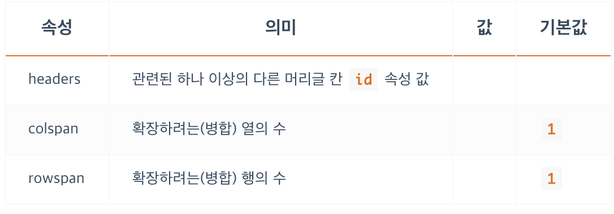
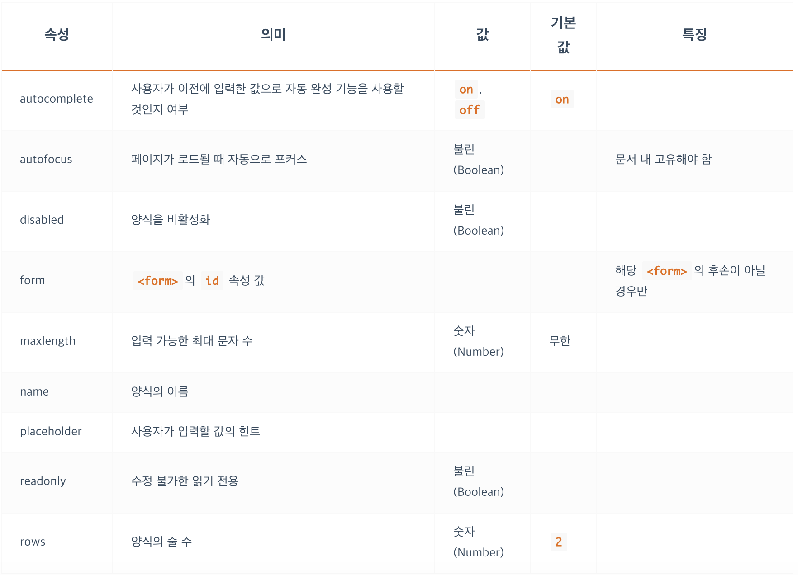

<br/>

### **표 콘텐츠 - TABLE**
- Table을 만들기 위한 기본 틀 `<table>, <tr>, <th>, <td>`
- (Table Row, Table Header, Table Data)
- 데이터 표를 만드는 `<table>`
- 행(줄) 만드는 `<tr>`
- 열(칸, 셀(Cell)) 만드는 `(<th>`, `<td>)` 일반적으로는 `<td>`를 사용하고 그 중 제목의 역할을 하는 부분에선 `<th>`를 사용합니다.
- `display : table` 속성은 블록요소와 완전히 일치하지는 않지만, 굉장히 유사한 특성을 가집니다.
- 테이블은 `표를 만들기 위해서만` 사용합시다. 레이아웃을 잡는 목적으로 사용하면 안됩니다.
 
```html
<table>
  <caption>Fruits</caption>
  <colgroup>
    <col span="2" style="background-color: yellowgreen;">
    <col style="background-color: tomato;">
  </colgroup>
  <thead>
    <tr>
      <th>ID</th>
      <th>Name</th>
      <th>Price</th>
    </tr>
  </thead>
  <tbody>
    <tr>
      <td>F123A</td>
      <td>Apple</td>
      <td>$22</td>
    </tr>
    <tr>
      <td>F098B</td>
      <td>Banana</td>
      <td>$19</td>
    </tr>
  </tbody>
</table>
```
```css
table { display: table; }
tr { display: table-row; }
th, td { display: table-cell; }
```

<br/>

### **표 콘텐츠 - TH**
- ‘머리글 칸’을 지정 합니다.
- `headers` 라는 속성은 자신이 종속 되어져 있는, 자신의 상위 개념의 칸에 연결할 때 그 상위 칸의 `id` 값을 적어서 연결하는 것 입니다. 


<br/>

### **표 콘텐츠 - TD**
- ‘일반 칸’을 지정 합니다.
- `headers` 라는 속성은 자신이 종속 되어져 있는, 자신의 상위 개념의 칸에 연결할 때 그 상위 칸의 `id` 값을 적어서 연결하는 것 입니다. 
- 기본적으로 `<th>` 에 있는 `id` 값을 연결하는 것 입니다.
- 필수적으로 `headers` 를 사용하여 연결해 주어야 하는 것은 아닙니다.



<br/>

### **표 콘텐츠 - CAPTION**
- 표의 제목을 설정합니다.
- **열리는 TABLE 태그 바로 다음에 작성해야 합니다.**
- `<table>` 당 하나의 `<caption>` 만 사용 가능합니다.

```css
caption { display: table-caption; }
```

<br/>

### **표 콘텐츠 - COLGROUP, COL**
- 표의 열들을 공통적으로 정의하는 컬럼(`<col>`)과 그의 집합(`<colgroup>`). (Column, Column Group)
- 표에서 특정 열의 스타일을 바꾸고 싶을 때, 해당 열의 줄의 길이가 길다면 태그마다 일일이 입력해 주기에 많은 시간이 걸릴 수 있습니다.
- 위와 같은 경우 전체 열을 한번에 제어해 줄 수 있는 태그가 `<col>`(빈태그) 태그 이고, 이 `<col>`을 Wrapping 한 전체 묶음이 `<colgroup>` 태그 입니다.
- 하지만 열의 수가 엄청나게 많은 경우에도 스타일을 변경하기 위해선 `<col>` 마다 작업을 해주어야 합니다. 이 경우엔 `span` 속성을 사용하여 특정 스타일을 입힌 `<col>`이 연속적으로 몇 컬럼 까지 동일하게 나오도록 설정할 수 있습니다. 예로 `span="2"` 는 현재 `<col>`을 포함하여 동일한 컬럼이 2개 연속 나오게 설정해 줍니다.
```css
colgroup { display: table-column-group; }
col { display: table-column; }
```


<br/>

### **표 콘텐츠 - THEAD, TBODY, TFOOT**
- 표의 머리글`(<thead>)`, 본문`(<tbody>)`, 바닥글`(<tfoot>)`을 지정합니다.
- 기본적으로 테이블의 레이아웃에 영향을 주지 않습니다.
- 시각적으론 아무 영향을 끼치지 않으며, 의미적인 부분으로만 사용합니다.

```css
thead { display: table-header-group; }
tbody { display: table-row-group; }
tfoot { display: table-footer-group; }
```

<br/>

### **양식 - FORM**
- 웹 서버에 정보를 제출하기 위한 양식 범위를 정의합니다.
- `<form>` 이 다른 `<form>` 을 자식 요소로 포함할 수 없습니다.
- `GET` 방식 경우는 url 주소에 전송하고자 하는 데이터가 담겨져서 전송이 됩니다.
- `POST` 방식은 url에 데이터가 담겨지지 않습니다. 완벽하게 숨겨지는 것은 아니기 때문에 중요한 정보는 보안을 신경써야 합니다.
```css
form { display: block; }
```


<br/>

### **양식 - INPUT**
- 사용자에게 입력 받을 데이터 양식입니다.
- 빈 태그 입니다.

```css
input { display: inline-block; }
```


<br/>

### **INPUT 에서 데이터 종류(Type)의 값(Values)**
- type속성에 입력할 수 있는 값의 목록 입니다.

```html
<input type="button" />
<input type="checkbox" />
<input type="file" />
<input type="text" />
```


<br/>

### **양식 - LABEL**
- 라벨 가능 요소(labelable)의 제목(Caption) 입니다.
- for 속성으로 라벨 가능 요소를 참조하거나 콘텐츠로 포함 합니다.
- 라벨 가능 요소: `<button>, <input>, <progress>, <select>, <textarea>`
- 아래 예시의 경우 체크박스 외에도 label로 넣어준 '동의하십니까?' 텍스트를 클릭해도 체크/체크해제 가 되는 것을 확인할 수 있습니다.

```html
<!-- 라벨 가능 요소를 참조 -->
<input type="checkbox" id="user-agreement" />
<label for="user-agreement">동의하십니까?</label>

<!-- 라벨 가능 요소를 포함 -->
<label><input type="checkbox" />동의하십니까?</label>
```
```css
label { display: inline; }
```


<br/>

### **양식 - BUTTON**
- 선택 가능한 버튼을 지정합니다.
- `onclick =""` 속성을 사용하여 버튼을 클릭했을때 수행할 작업을 지정합니다.

```css
button { display: inline-block; }
```


<br/>

### **양식 - TEXTAREA**
- 여러 줄의 일반 텍스트 양식 입니다.

```css
textarea { display: inline-block; }
```


<br/>

### **양식 - FIELDSET, LEGEND**
- 같은 목적의 양식을 그룹화`(<fieldset>)`하여 제목`(<legend>)`을 지정합니다.

```html
<form>
  <fieldset>
    <legend>Coffee Size</legend>
    <label>
        <input type="radio" name="size" value="tall" />
        Tall
    </label>
    <label>
        <input type="radio" name="size" value="grande" />
        Grande
    </label>
    <label>
        <input type="radio" name="size" value="venti" />
        Venti
    </label>
  </fieldset>
</form>
```
```css
fieldset, legend { display: block; }
```
### **`<fieldset>`**


<br/>

### **양식 - SELECT, DATALIST, OPTGROUP, OPTION**
- 옵션`(<option>, <optgroup>)`의 선택 메뉴`(<select>)`나 자동완성`(<datalist>)`을 제공합니다.

```html
<select>
  <optgroup label="Coffee">
    <option>Americano</option>
    <option>Caffe Mocha</option>
    <option label="Cappuccino" value="Cappuccino"></option>
  </optgroup>
  <optgroup label="Latte" disabled>
    <option>Caffe Latte</option>
    <option>Vanilla Latte</option>
  </optgroup>
  <optgroup label="Smoothie">
    <option>Plain</option>
    <option>Strawberry</option>
    <option>Banana</option>
    <option>Mango</option>
  </optgroup>
</select>
```
```css
select { display: inline-block; }
datalist { display: none; }
optgroup, option { display: block; }
```

<br/>

### **양식 - SELECT**
- 옵션을 선택하는 메뉴 입니다.
- `<option>` 태그를 사용해서 각각의 옵션을 제공하는데, 그 옵션을 `<select>` 태그로 Wrapping 해서 '옵션들 중 하나를 선택하여라' 같은 방식으로 선택하는 메뉴를 제공할 수 있습니다.


<br/>

### **양식 - OPTGROUP**
- `<option>`을 그룹화 합니다.


<br/>

### **양식 - OPTION**
- 선택 메뉴`(<select>)`나 자동완성`(<datalist>)`에서 사용될 옵션 입니다.
- 선택적 빈(Empty) 태그로 사용 가능합니다.
- 태그 내부에 콘텐츠로서 텍스트가 없다면, 빈태그가 되고 이 경우는 옵션으로 `label, value`를 필수로 넣어주어야 합니다.


<br/>

### **양식 - DATALIS**
- `<input>`에 미리 정의된 옵션을 지정하여 자동완성(Autocomplete) 기능을 제공하는 데 사용합니다.
- `<input>`의 list 속성 바인딩.
- `<input>` 의 list 속성의 값으로, `<datalist>` 의 `id` 값을 넣어주어 연결.
- `<option>`을 포함하여 정의된 옵션을 지정.

```html
<input type="text" list="fruits">

<datalist id="fruits">
  <option>Apple</option>
  <option>Orange</option>
  <option>Banana</option>
  <option>Mango</option>
  <option>Fineapple</option>
</datalist>
```

<br/>

### **양식 - PROGRESS**
- 작업의 완료 진행률을 표시합니다.

```html
<progress value="70" max="100">70 %</progress>
```
```css
progress { display: inline-block; }
```
