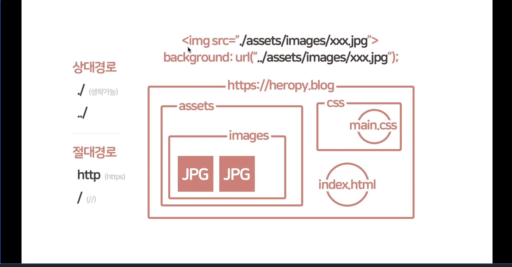
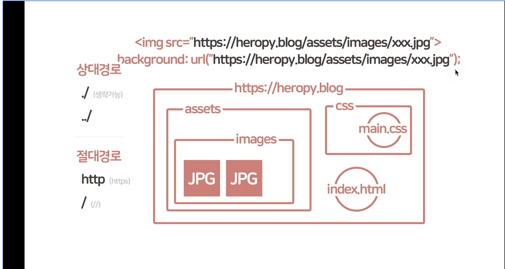

# **전역 속성**
- 모든 HTML 요소에서 공통적으로 사용 가능한 속성.

<br/>

### **전역 속성 - class**
- 공백으로 구분된 요소의 별칭을 지정.
CSS 혹은 JavaScript의 요소 선택기 `(CSS 선택자나 GetElementsByClassName, QuerySelector, QuerySelectorAll 같은)`를 통해서 요소를 선택하거나 접근합니다.
- 공백으로 구분하여 별명을 여러개 부여할 수 있습니다.

<br/>

### **전역 속성 - id**
- 문서에서 고유한 식별자(idenifier, ID)를 정의.
CSS 혹은 JavaScript의 요소 선택기 `(CSS 선택자나 GetElementsByID, QuerySelector, QuerySelectorAll 같은)`를 통해서 요소를 선택하거나 접근합니다.
- `id`는 `class`와 다르게 **`고유한 값`** 을 가져야 합니다.
- 한 곳에 한개의 `id`만 들어가야 합니다.

<br/>

### **전역 속성 - style**
- 요소에 적용할 CSS를 선언합니다.

<br/>

### **전역 속성 - title**
- 요소의 정보(설명)을 지정합니다.
- 요소에 마우스 hover를 하면, 팁으로써 표시가 됩니다.
- 많은 곳에서 사용 됩니다.

<br/>

### **전역 속성 - lang**
- 요소의 언어(<a href="https://ko.wikipedia.org/wiki/ISO_639-1_%EC%BD%94%EB%93%9C_%EB%AA%A9%EB%A1%9D" target="_blank">ISO 639-1</a>)를 지정합니다.
- 굉장히 많은 경우에 `<html>` 태그에 이 속성을 사용합니다.
- 최상위 루트 `<html>` 태그에 언어 설정을 해주면 나머지 부분에서 일일이 언어 설정을 해줄 필요가 없습니다 그래서 최상위 루트에 한번 설정한 후 반복을 최소화 하고, 하위 요소중 다른 언어가 나오는 요소인 경우만 부분적으로 설정해 주는 방법을 추천 드립니다.

```html
<p lang="en">This paragraph is English</p>
<p lang="ko">이 단락은 한글입니다.</p>
<p lang="fr">Ce paragraphe est défini en français.</p>
```

<br/>

### **전역 속성 - data-***
- 사용자 정의 데이터 속성을 지정합니다.
HTML에 JavaScript에서 이용할 수 있는 데이터(정보)를 저장하는 용도로 사용합니다.
- `data-` 뒤에 나오는 것이 이름입니다.
- 이 데이터는 HTML에서 보관하고 있다가 자바스크립트에서 활용할때 쓸 수 있습니다.
- javascript에서 데이터를 사용할때 html에서 사용한 `-` 하이푼은 바로 뒷글자를 대문자로 바꾸는 것으로 대체하여 사용합니다. 예를 들면 
HTML에서 `id:"me" data-my-name:"형동"` 이었다면, javascript에서 사용할때에 `me.dataset.myName` 으로써 활용합니다.
(HTML dash 표기법 -> javascript camel 표기법)

```html
<!-- data-custom-data-attributes -->
<div id="me" data-my-name="Heropy" data-my-age="851">Heropy</div>
```
```js
// dataset.customDataAttributes
const $me = document.getElementById('me');
console.log($me.dataset.myName); // "Heropy"
console.log($me.dataset.myAge); // "851"
```

<br/>

### **전역 속성 - draggable**
- 요소가 [Drag and Drop API](https://developer.mozilla.org/en-US/docs/Web/API/HTML_Drag_and_Drop_API) 를 사용 가능한지 여부를 지정합니다.

```html
<div draggable="true">The element to drag.</div>
```

<br/>

### **전역 속성 - hidden**
- 요소를 숨깁니다.

```html
<form id="hidden-form" action="/form-action" hidden>
  <!-- 숨겨진 양식들.. -->
</form>
<button form="hidden-form" type="submit">전송</button>
```

<br/>

### **전역 속성 - tabindex**
- Tab키를 이용해 요소를 순차적으로 포커스 탐색할 순서를 지정합니다.
- tab 키를 눌렀을때, 포커스 될 순서를 지정합니다.
- [대화형 콘텐츠(Interactive Content)](https://developer.mozilla.org/ko/docs/Web/Guide/HTML/Content_categories#%EB%8C%80%ED%99%94%ED%98%95_%EC%BD%98%ED%85%90%EC%B8%A0)는 기본적으로 코드 순서대로 탭 순서가 지정됩니다.
- 비대화형 콘텐츠에 `tabindex="0"` 을 지정하여 대화형 콘텐츠와 같이 탭 순서를 사용합니다.
- `tabindex="-1"` 을 통해 포커스는 가능하지만 탭 순서에서 제외 가능합니다. (tab을 사용하여 포커스를 할 수 없습니다.)
- `tabindex="1"` 이상의 양수 값은 논리적 흐름을 방해하기 때문에 사용을 추천하지 않습니다. 되도록이면 html이 작성되어 있는 순서대로 tab 이동이 가능하도록 두길 추천합니다.

```html
<h1 tabindex="0">Sign In</h1>
<label>Username: <input type="text"></label>
<label>Password: <input type="password"></label>
<label>PS: <input type="text" tabindex="-1"></label>
<input type="submit" value="Sign In">
```

<br/>

### **절대 경로와 상대 경로**
- 상대경로는 호출되는 시점에 따라 상대적으로 경로가 달라질 수 있다.


- 절대경로는 말 그대로 절대적으로 바뀌지 않는 경로 입니다.



<br/>

### **특수기호(Entities)**
- `&nbsp;` 기호를 사용하여 한번 혹은 여러번의 띄어쓰기를 삽입할 수 있습니다.
- 꺽쇠 열리는 부분의 기호는 `&lt;` 닫히는 부분의 기호는 `&gt;`
- [HTML Entity List](https://www.freeformatter.com/html-entities.html) 에서 다양한 특수기호를 확인할 수 있습니다.