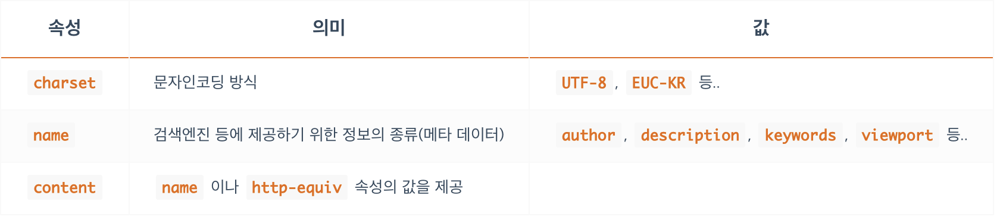

## **웹(Web)을 구성하는 HTML, CSS, JS**
---
HTML, CSS, JS의 이해와 학습은 단순히 기술을 배우는 것으로 그치지 않고 웹과 모바일 그리고 IT 전반의 과거, 현재, 미래를 이해하는 데 많은 도움을 줍니다.

HTML, CSS, JS 는 각각의 역할들이 다릅니다.

HTML(Hyper Text Markup Language)은 페이지에 제목, 문단, 표, 이미지, 동영상 등을 정의하고 그 구조와 의미를 부여하는 정적 언어로 웹의 구조를 담당합니다.
즉 `구조화 하는 역할`을 합니다.

일종의 튼튼한 구조(Semantic), 뼈대를 만드는 일이지, 화면을 꾸밀 수는 없습니다.


CSS(Cascading Style Sheets)는 마크업 언어(HTML, XML 등)가 실제 표시되는 방법(색상, 크기, 폰트, 레이아웃 등)을 지정하여 콘텐츠 구조를 꾸며주는 정적 언어로 웹의 시각적인 표현을 담당합니다. 
`예쁘게 만드는 용도`로만 사용됩니다.


JS(JavaScript)는 콘텐츠를 바꾸고 움직이는 등 페이지를 동적으로 꾸며주는 역할을 하는 프로그래밍 언어로 웹의 동적 처리를 담당합니다.
JS는 HTML과 CSS를 동원해서 그들의 업무(구조, 시각적 표현 등)도 담당할 수 있지만, 그들만큼 잘하진 못하기 때문에(성능적으로) 되도록 동적 처리에만 집중해야 합니다.


<br/><br/>

## **웹 표준**
---
웹 표준(Web Standard)이란 ‘웹에서 사용되는 표준 기술이나 규칙’을 의미하며 W3C의 권고안에서 나온 기술들이 여기에 해당합니다.

대부분의 경우 표준화 제정 단계의 ‘권고안(REC)’에 해당하는 기술을 표준이라고 생각하시면 쉽습니다.

## **크로스 브라우징**
---
내가 만든 홈페이지가, 각각의 브라우저에서 다르게 표현 될수가 있습니다.
이러한 문제는 사용자에게 각각 다른 경험을 주게 됩니다.
이런 문제를 최소화 하기 위해 크로스 브라우징 기술을 통하여 각각의 브라우저에서 동일한 결과를 볼수있게 합니다. 

**크로스 브라우징(Cross Browsing)** 은 위에서 설명한 것처럼 조금은 다르게 구동되는 여러 브라우저에서 동일한 사용자 경험(같은 화면, 같은 동작 등)을 줄 수 있도록 제작하는 기술, 방법 등을 말합니다.

 MSIE(마이크로소프트 인터넷 익스플로어) 브라우저는 제멋대로 만들어져 있기 때문에 여러 의미에서 표준화하기 쉽지 않은 브라우저입니다. 그래서 같은 사이트라도 다르게 표현되는 부분들이 상당히 많습니다.

 <br/><br/>

## **웹 접근성**
---
웹 접근성이란 정상적인 웹 콘텐츠 사용이 가능한 일반 사용자부터 고령자, 장애인 같은 신체적, 환경적 조건에 제한이 있는 사용자를 포함해 모든 사용자들이 동등하게 접근할 수 있는 웹 콘텐츠를 제작하는 방법을 말합니다.

ex) 청각 장애인을 위한 영상 자막, 키보드를 통한 웹 이용, 이미지에 대체 텍스트 제공


<br/><br/>

## **웹에서 사용하는 이미지**
---
이미지(그래픽)는 크게 **비트맵**과 **벡터**로 구분됩니다.

- 비트맵
    - 각 픽셀이 모여 만들어진 정보의 집합으로 **레스터(Raster)** 이미지라고도 부릅니다.
    - 픽셀 단위로 화면에 렌더링합니다.
    - jpeg, gif, png 등 대부분의 이미지가 비트맵 형식 입니다.

- 벡터
    - 이미지가 가지고 있는 점, 선, 면의 위치(좌표), 색상 등의 정보를 온전히 가지고 있으며 그를 화면에 렌더링합니다.
    - 좀 더 많은 연산을 해야 하지만, 대신 해상도(픽셀)에 영향을 비트맵 이미지와 달리 해상도로부터 자유롭게 렌더링할 수 있습니다.
    - 수학적 정보만을 가지고 있기 때문에 이미지 확대/축소에 따른 용량 변화가 없습니다.
    - .svg 등의 파일

<br/>


### **JPG**
- 손실 압축
- 저장할때마다 손실된다. 여러번 저장하면 원본보다 확실하게 손상되어 보입니다.
- 손실 압축 방법을 사용하여 용량이 적습니다.
- 높은 압축률!(적은 용량).

### **PNG**
- Gif의 대체 포맷.
- 비손실 압축.
- 비손실 압축이어서 용량을 획기적으로 줄이기에는 문제가 있습니다.
- Alpha Channel 지원(투명도) -> 가장 큰 장점중 하나.
- JPG는 투명한 부분 지원 X
- W3C 권장 포맷!

### **GIF**
- 이미지 파일 내에 이미지 및 문자열 같은 정보들을 저장할 수 있습니다.
- 비손실 압축
- 여러장의 이미지를 한 개의 파일에 담을 수 있음.(움짤, 애니메이션).

### **WEBP**
- JPG, PNG, GIF를 모두 대체할 수 있는 구글이 개발한 이미지 포맷입니다.
- 완벽한 손실/비손실 압축 지원 두가지 동시에 활용 가능.
- GIF 같은 움짤, 애니메이션 지원.
- Alpha Channel 지원(손실, 비손실 모두).
- 지원하는 브라우저에 한계가 있습니다.

### **SVG**
- SVG(Scalable Vector Graphics)는 마크업 언어(HTML/XML) 기반의 벡터 그래픽을 표현하는 포맷입니다.
- 해상도의 영향에서 자유로움.
- CSS로 Styling 가능. 완벽하게 만드는 것은 안되지만, 색상을 입히는 부분 등은 가능.
- JavaScript로 Event Handling 가능.
- 코드 혹은 파일로 사용 가능.

<br/><br/>
## **HTML**
---
### **태그**
태그는 각자의 의미를 가지고 있으며 다음과 같은 형태를 가집니다.
```html
<TAG></TAG>
<TAG>CONTENT</TAG>
```

또한 태그는 열리고(open) 닫히는(close) 태그 구조를 가지고 있으며 이는 한 쌍입니다.
(시작하고(start) 종료되는(end) 구조라고 부르기도 합니다)
이 구조는 태그의 범위를 만들어 줍니다.

태그와 CONTENT를 모두 포함하여 요소(Element) 라고 부릅니다.
<br/><br/>

### **부모와 자식 요소**
태그A가 태그B의 콘텐츠로 사용되면, 태그B는 태그A의 부모 요소, 태그A는 태그B의 자식 요소라고 합니다.
```html
<PARENT>
  <CHILD></CHILD>
</PARENT>
```
자식의 자식 등과 같이 자식의 이하 요소들을 후손 혹은 자손 혹은 하위요소 라고 부릅니다.

부모의 부모 등과 같이 부모의 이상 요소들은 조상 혹은 상위요소 라고 부릅니다.
<br/><br/>

### **빈 태그**
```html
<!-- `/`가 없는 빈 태그 -->
<TAG>

<!-- `/`가 있는 빈 태그 -->
<TAG/>
<TAG />
```
HTML5에서는 위 2가지 형태를 다 사용할 수 있습니다.
혼용 하여서만 사용하지 않으면 문제가 되지 않습니다.

빈 태그는 대부분의 경우에 속성과, 값이 사용됩니다.
<br/><br/><br/>

## **HTML 문서의 범위**
---
```html
<!DOCTYPE html>
<html>
  <head>
    문서의 정보
  </head>
  <body>
    문서의 구조
  </body>
</html>
```
<br/><br/>
### **html 태그**
- `<html>` 는 HTML 문서의 전체 범위를 지정합니다.
웹 브라우저가 해석해야 할 HTML 문서가 어디에서 시작하며, 어디에서 끝나는지 알려주는 역할을 합니다.
- 전체 범위

### **head 태그**
- 웹 브라우저가 해석해야 할 HTML 문서의 정보 범위를 지정합니다.
여기서 말하는 정보에는 웹 페이지의 제목, 웹 페이지의 문자 인코딩 방식, 연결할 외부 파일의 위치, 웹 페이지를 구조화하기 위한 기본 세팅 값 같은 것들을 말합니다.
다르게는 ‘화면을 구성하기 위한 기본 설정’이라고 표현할 수 있습니다
- 정보 범위

### **body 태그**
- 웹 브라우저가 해석해야 할 HTML 문서의 구조 범위를 지정합니다.
구조는 사용자가 화면을 통해서 볼 수 있는 내용(콘텐츠)의 형태나 레이아웃 등을 의미하며 로고, 헤더, 푸터, 내비게이션, 메뉴, 버튼, 입력창, 팝업, 광고 등 보이는 모든 것들이 구조에 해당합니다.
구조는 BODY 범위 안에서만 생성합니다.
- 구조 범위

### **DOCTYPE**
- DOCTYPE(DTD, Document Type Definition)은 마크업 언어에서 문서 형식을 정의합니다.
이는 웹 브라우저에 우리가 제공할 HTML 문서를 어떤 HTML 버전의 해석 방식으로 구조화하면 되는지를 알려줍니다.
(HTML은 크게 1, 2, 3, 4, X-, 5 버전이 있습니다)
현재의 표준 모드는 HTML5 입니다.
- 버전 지정


<br/><br/>
## **head 태그(title, meta, link, style, script)**
---
### **title**
- 웹 페이지의 제목
- HTML 문서의 제목을 정의합니다.
웹 브라우저의 각 사이트 탭에서 이름으로 표시됩니다.

### **meta**
- 웹 페이지의 정보
- HTML 문서(웹페이지)에 관한 정보(표시 방식, 제작자(소유자), 내용, 키워드 등)를 검색엔진이나 브라우저에 제공합니다.
- 빈(Empty) 태그입니다.



### **link**
- 외부 문서를 연결할 때 사용. 대표적으로 css문서를 가지고 온다.
- 특히 HTML 외부에서 작성된 CSS 문서(xxx.css 파일)를 불러와 연결할 때 사용합니다.
- 빈(Empty) 태그입니다.
- rel 속성은 **필수!!** 입니다.


### **style**
- CSS 작성하기.
- CSS를 외부 문서에서 작성하여 연결하는 것이 아니고 HTML 문서 내부에 작성할 때 사용합니다.

### **script**
- JS 불러오거나 작성하기.
- CSS의 경우 불러오는것은 `<link>`를 통해서, 직접 작성은 `<style>`을 통해서 했지만 JS는 `<script>`를 통해서 두가지 경우 모두 가능하다.

<br/><br/>
## **body 태그(div, img)**
---
### **div**
- 막쓰는 태그
- `<div></div>`의 ‘div’는 ‘division’으로 약자로 ‘분할’을 뜻하고 ‘문서의 부분이나 섹션을 정의’합니다.
명확한 의미를 가지지 않기 때문에 정말 많은 경우 단순히 특정 범위를 묶는(wrap) 용도로 사용합니다.
보통 이렇게 묶인 부분들에 CSS나 JS를 적용하게 됩니다.
- 아무런 의미가 없이 묶는 이유는 나중에 JS, CSS 를 가지고 동작을 제어하거나, 예쁘게 꾸미기 위해 묶습니다.

### **img**
- ``는 HTML에 이미지를 삽입할 때 사용합니다.
(웹 페이지에 이미지를 삽입하는 방식은 크게 2가지로, ‘HTML에서 삽입(IMG)’과 ‘CSS에서 삽입(background)’이 있습니다)
- src, alt 는 필수 속성 입니다.


<br/><br/>

## **CSS**
---

**예쁘게 꾸미기(스타일) 위해 CSS가 필요합니다.**
<br/>

### **선택자**
- 선택자는 HTML에 스타일(CSS)을 적용하기 위해 HTML의 특정한 요소를 선택하는 사인(sign)입니다.

### **속성(Properties)과 값(Value)**
- 속성과 값은 글자색은 무엇, 너비는 얼마, 여백은 얼마 같은 스타일을 지정할 때 사용합니다.

```css
div {
  font-size: 20px;
  color: red;
}

/* 다음과 같이 이해할 수 있습니다. */
선택자 {
  속성: 값;
  속성: 값;
}
```
<br/><br/>

## **CSS 선언 방식**
---

### **태그에 직접 작성하기(인라인)**
- 이 방법은 HTML 태그에 직접 작성하기 때문에 선택자가 필요하지 않습니다.
```html
<div style="color: red;">태그에 직접 작성1</div> <!-- red -->
<div style="color: red;">태그에 직접 작성2</div> <!-- red -->
<div style="color: red;">태그에 직접 작성3</div> <!-- red -->
<div style="color: red;">태그에 직접 작성4</div> <!-- red -->
```

- 단점
  - 직접 태그를 찾아서 속성,값을 넣어주어야 하는데 필요한 모든 태그를에 일일이 다 작성 해 주어야 함
  - 수정 시에도 일일이 다 찾아서 수정해야 한다.
  - **되도록이면 이 방법 (손으로 직접 작성하는)은 피하는 것이 좋다!**
  - 자바스크립트가 html에 css를 삽입할 때는 상관이 없을 수 있다.
  - 방식 자체가 나쁜것은 아님.

<br/><br/>

### **HTML에 포함하기(내장)**
- CSS만 따로 작성하기 때문에 선택자가 필요합니다.
CSS 코드가 HTML의 `<style></style> ` 안에 포함되어 있습니다.
- 하나의 HTML 에 한번만 적용 가능

```html
<head>
  <style>
    div {
      color: red;
    }
  </style>  
</head>
<body>
  <div>HTML에 포함1</div> <!-- red -->
  <div>HTML에 포함2</div> <!-- red -->
  <div>HTML에 포함3</div> <!-- red -->
</body>
```

<br/><br/>

### **HTML 외부에서 불러오기**
- CSS 코드를 완전히 분리할 수 있습니다.
분리된 하나의 CSS 파일을 여러 HTML 파일이 불러와서 사용할 수 있습니다.
- 여러 HTML파일에 적용이 가능하다.

```html
<head>
  <link rel="stylesheet" href="/css/main.css">
</head>
<body>
  <div>HTML에 외부에서 불러오기1</div> <!-- red -->
</body>
```
```css
/* main.css */
div {
  color: red;
}
```
<br/><br/>

## **선택자**
---
- 위에서 설명했듯 선택자는 HTML의 특정한 요소를 선택하는 사인(sign)입니다. 여러 종류가 있는데 우선 그중 2가지를 알아 보겠습니다.
 
### **태그로 찾기**
- 선택자를 입력하는 부분에 적용하려는(찾으려는) 태그의 이름을 입력합니다.

```css
/*<h1>은 글자색이 빨강이야!*/
h1 {
  color: red;
}
/*<p>는 글자색이 파랑이야!*/
p {
  color: blue;
}
```
```html
<h1>제목1</h1> <!--red-->
<h1>제목2</h1> <!--red-->
<p>본문1</p> <!--blue-->
<p>본문2</p> <!--blue-->
```

### **클래스로 찾기**
- 좀 더 명확하게 원하는 요소를 찾기 위해서 ‘클래스 선택자’라는 것이 존재합니다.
- 위 예시의 경우 제목1 과 제목2 를 구분해야 하는 경우가 될 수 있습니다.
- 주의할 점은 선택자에 앞에 `.`이 붙는다는 것입니다.
```css
/*class="title"은 글자색이 빨강이야!*/
.title {
  color: red;
}
/*class="main-text"는 글자색이 파랑이야!*/
.main-text {
  color: blue;
}
```
```html
<h1 class="title">제목1</h1> <!--red-->
<h1>제목2</h1>
<p class="main-text">본문1</p> <!--blue-->
<p>본문2</p>
```
선택자 앞의 `.`은 클래스를 나타내며 CSS의 `.title`은 HTML의 `class="title"`와 동일합니다.<br/>

`.`이 없는 선택자 title은 태그 `<title>`를 의미하게 되니 전혀 다른 뜻으로 인식됩니다.<br/>

이처럼 `.`과 같은 특수한 기호들을 이용해서 HTML과 CSS를 매칭하므로 누락하기 쉽습니다. 따라서 꼼꼼한 선택자 작성이 중요합니다.


<br/><br/>

## **속성1 - 크기**
---
많이 아는 것이 중요함! -> 속성이 의미하는 바와, 실제 결과로 어떻게 출력이 되는지 

### **width(가로 너비)**
- 요소의 가로 너비를 지정합니다.
```css
div {
  width: 300px;
  요소가로너비: 너비값;
}
```

### **height(세로 너비)**
- 요소의 세로 너비를 지정합니다.
```css
div {
  height: 150px;
  요소세로너비: 너비값;
}
```
### **font-size(글자 크기)**
- 요소 내용(Text)의 글자 크기를 지정합니다.
```css
div {
  font-size: 16px;
  글자크기: 크기값;
}
```
<br/><br/>

## **속성2 - 여백**
---
### **margin(요소의 바깥 여백)**
- 요소의 바깥 여백을 지정합니다.
- 바깥 여백은 요소와 요소 사이의 여백(거리, 공간)을 생성할 때 사용합니다.
```css
div {
  margin: 20px;
  요소바깥여백: 여백값;
}
```
- 위 코드는 margin은 요소의 위, 아래, 좌, 우 모두 20px의 여백을 지정하겠다는 의미입니다. **(단축속성)**

```css
div {
  margin-top: 20px;
  margin-right: 20px;
  margin-bottom: 20px;
  margin-left: 20px;
  요소바깥여백-위쪽: 여백값;
  요소바깥여백-오른쪽: 여백값;
  요소바깥여백-아래쪽: 여백값;
  요소바깥여백-왼쪽: 여백값;
}
```
- 세분화하기 위해 위와 같이 한 방향씩 지정할 수도 있습니다. **(개별속성)**


### **padding(요소의 내부 여백)**
- 요소의 내부 여백을 지정합니다.
- 내부 여백은 자식 요소를 감싸는 여백을 의미합니다.
- 코드 예시는 margin과 동일 합니다. **(단축속성, 개별속성)**
<br/><br/>


## **속성3 - 색상**
---
### **color(글자 색상)**
- 요소 내용(Text)의 글자 색상을 지정합니다.
- 정말 많은 입문자가 `font-color`, `text-color`로 실수를 합니다만 그런 속성은 없습니다.
```css
div {
  color: red;
  글자색상: 빨강;
}
```

### **background(요소 색상)**
- 요소의 배경 색상을 지정합니다.
- `color`는 글자의 색만 지정할 수 있으며, 요소의 (배경)색을 바꾸려면 `background-color`가 필요합니다.
- `background : ` 는 단축속성 입니다. (색상, 위치, 특성 ... 등 지정)
- `background-color` 는 색을 지정하는 개별속성 입니다.
```css
div {
  background-color: red;
  요소배경: 빨강;
}
```

